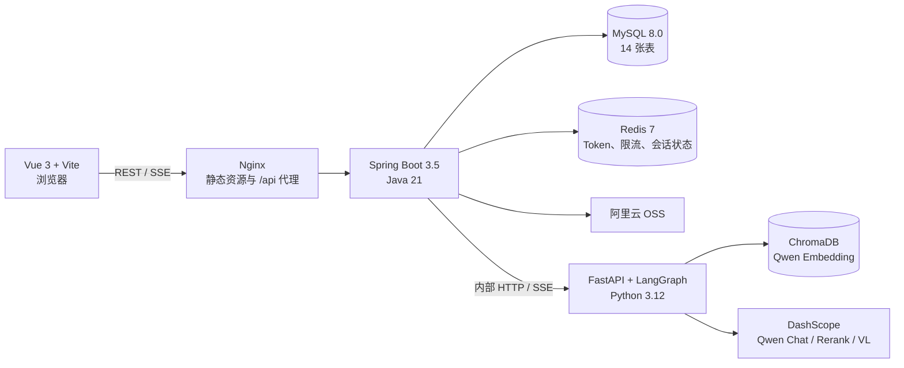
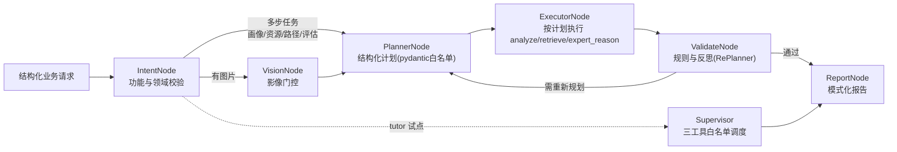
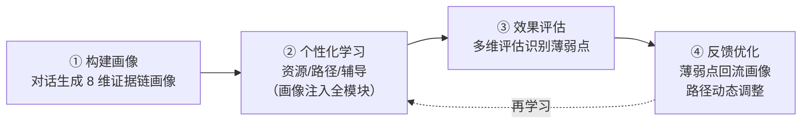

# LearnAgent

LearnAgent 是面向脑卒中医学教育的多智能体个性化学习系统。系统以学生画像为起点，形成「画像 → 个性化学习 → 效果评估 → 反馈优化」的完整学习闭环：专家间通过结构化消息会诊、共享黑板协作，画像贯穿资源生成、路径规划、循证辅导与学习评估，并通过 SSE 展示可审计的推理节点、专家对话与最终结果。

> 文档状态：已于 2026-08-23 按当前代码、Docker 编排和自动化测试核对。系统用于教学辅助，不替代教师指导或临床诊疗意见。

## 项目定位

LearnAgent 是一个以多智能体编排为 AI 内核的完整应用系统，兼具应用产品、多智能体系统与编排驱动三层属性：

| 视角 | 定位 |
|:---|:---|
| 项目性质 | 应用系统（脑卒中医学教育学习产品），非框架或平台 |
| AI 架构 | 多智能体系统（multi-agent system）：10 位领域专家 + 证据仲裁 + 监督者（Supervisor） |
| 智能核心 | 编排主导（orchestration-centric）：LangGraph 状态图 + 规划-执行-校验（RePlan）循环 + 专家间对话/黑板协作 |
| agent 形态 | 角色型领域专家 + 有界自主的监督者试点，非通用自主 agent 框架 |
| 自主程度 | 有界自主：RePlan 迭代上限、工具白名单、意图门控与医学红线保留在编排层外层 |

一句话概括：**编排为骨架、专家 agent 为能力单元**——编排层决定"怎么走"（规划 → 执行 → 校验 → 重规划），agent 层决定"谁来干"（10 位专家通过结构化消息会诊、共享黑板协作），外层再封装完整的业务产品（Vue 前端 / Spring Boot 后端 / FastAPI 模型服务），并以「画像 → 学习 → 评估 → 优化」闭环贯穿全部模块。画像遵循**证据纪律**：只记录有证据支撑的事实，推断与教学建议永不写入长期画像。

## 当前功能

| 模块 | 当前实现 |
|:---|:---|
| 学习总览 | 登录后默认首页：聚合画像完整度、路径进度、资源数、评估分数、辅导轮数，展示学习闭环阶段（未开始/学习中/已评估/完成） |
| 学习画像 | 对话构建 8 维证据链画像：每个维度携带 `source/confidence/evidence/updated_at` 与五态 `ev_status`（已确认/观测/推断/存疑/未知），知识基础细化为脑血管解剖 9 子主题（Willis环/ICA/MCA/ACA/PCA/椎基底/脑干/小脑/静脉）；**只记录有证据的事实，无证据字段一律"待评估"**；画像由证据渲染器确定性生成，杜绝模型二次推断污染；支持一键复制为 Markdown |
| 资源生成 | 统一生成入口支持课程讲解文档、思维导图、练习题、拓展阅读、临床案例、资源设计方案 6 种互斥类型 |
| 学习路径 | 生成路径、查询详情、更新步骤和任务进度、资源推荐、动态调整 |
| 智能辅导 | 多轮 SSE 问答、图片和代码片段上下文；tutor 意图由监督者 LLM（三工具白名单）试点调度；最终回答按「解答/关键要点/易错提示/拓展思考/下一步建议/学习激励」六章节结构化输出 |
| 学习评估 | 综合、知识、技能、进度等评估模式，五维雷达展示，行为记录与路径优化；评估薄弱点自动回流画像 |
| 代码辅助 | Python 执行；代码补全、错误诊断、优化建议、代码讲解四种互斥模式 |
| 医学多模态 | Qwen VL 影像分析、病例流式分析、多图对比、DICOM 元数据与预览、检验报告和处方 OCR |
| 质量控制 | 功能级输入守卫、Hybrid RAG、结构化规划与重规划（RePlan）、规则校验、反思修正、专家会诊（结构化消息 + 黑板，禁纯认同强制信息增量）、**Claim/Evidence 证据仲裁**、共享记忆、推理并发治理 |

## 系统架构



### 模型层分层

| 层 | 职责 | 关键组件 |
|:---|:---|:---|
| 接入层 | HTTP/SSE 路由与鉴权 | FastAPI 路由（stream/medical/code/profile/evaluation/admin）、`verify_token`（HS256+HS512 共享 JWT） |
| 治理层 | 并发与流式协议 | `InferenceSlot` 推理信号量（默认 10）、自实现 `EventSourceResponse`（心跳 + 帧编码） |
| 编排层 | 规划-执行-监督-会诊 | `PlannerNode` / `ExecutorNode` / `TutorSupervisor` / `DialogueOrchestrator`（专家对话+黑板） / LangGraph 状态图（RePlan 循环） |
| 能力层 | 领域能力 | 10 位专家（访谈/抽取/校验/需求/文档/题目/审核/激励/仲裁/影像，YAML 配置 + 规则/LM 选人）、Hybrid RAG（Chroma + 自实现 BM25 + 医学评分重排）、共享记忆、医学多模态（Qwen VL/OCR/DICOM） |
| 运行时 | 资源与外部依赖 | `runtime.resources`、ThreadPoolExecutor、AsyncTaskManager、DashScope Qwen、ChromaDB |

### 模型工作流



- **Planner 主链路**：多步任务（画像/资源/路径/评估）先由 `PlannerNode` 用轻量模型生成结构化执行计划（步骤类型白名单：analyze/retrieve/expert_reason/finalize，最多 6 步），`ExecutorNode` 按计划复用既有能力逐步执行；校验失败时反馈回到规划器**重新规划**（RePlan 循环），规划失败自动回退默认计划（等价于升级前固定管线）。
- **推理链全量流式打印**：外层运行器基于 `astream(stream_mode=["custom","updates","messages"])` 三通道——节点进入（node_start）、执行步骤进度、专家名单与逐位专家完整发言（完成即推）、专家间结构化对话、会诊黑板、辩论记录与仲裁裁决、综合提案与风险批判、质量校验反馈（含驳回原因）全部实时流式到达前端推理轨迹；最终报告逐字流式输出。
- **专家会诊（M2 结构化消息 + M3 黑板，Evidence-based）**：专家完成初稿后互见彼此观点，通过 `DialogueOrchestrator` 输出结构化消息（question/reply/revise/object/finding，**已取消"认同"类型**，硬规则要求每条消息产出信息增量——新证据/冲突/缺失信息/决策）定向提问互答（多轮、异议驱动提前收敛），并在黑板共享工作区写入/修订发现；教学总监从黑板提炼收敛结论，仲裁智能体改为 **Claim/Evidence Arbitration**：逐条判定每条主张的证据充分性（学生原话→ACCEPT / 测验表现→ACCEPT / 间接推断→ACCEPT AS INFERRED / 无证据→REJECT），明确"多方一致 ≠ 有证据"。对话消息经 `agent_msg` 事件、黑板快照经 `blackboard` 事件流式送达前端。
- **Supervisor 试点**：tutor 意图由监督者 LLM（qwen-turbo）在工具白名单内自主调度——`evidence_search`（循证检索）、`consult_experts`（多专家辩论仲裁）、`get_student_profile`（画像查询），迭代轮数受上限约束；意图门控与医学红线保留在监督者外层。可用 `SUPERVISOR_TUTOR_ENABLED=false` 切回 Planner 链路。
- **监督者自主点将**：`consult_experts(question, reason, roles)` 允许监督者从专家白名单（`expert_config.yaml` 动态生成菜单）自主选择 2~5 位专家并说明选人理由（reason 必填），工具内白名单过滤，留空回退意图+难度规则编排；点将名单、选人理由与各专家完整发言经 `experts` 事件流式送达前端推理轨迹。
- 模型层从 `model/app/config/expert_config.yaml` 加载 10 位专家：画像访谈（Interview，找缺失证据提问）、画像抽取（Extraction，提取 Claim+Evidence）、画像校验（Validation，逐条证据校验）、需求分析、文档撰写、题目生成、质量审核、学习激励（Learning Coach，不参与画像建模）、仲裁和医学影像分析智能体。
- **画像证据纪律（Evidence Discipline）**：画像维度携带证据链（`source/confidence/evidence/updated_at` + 五态 `ev_status`）；枚举/数值字段（level/type/errorType/weeklyHours 等）只在有用户原话或测验表现证据时保留，否则清空为"待评估"；**只从用户陈述提取事实**，助手报告的"建议/推荐"绝不作为画像事实来源。
- **画像报告 = 证据渲染器**：`profile_build` 的最终回答由 `profile_dimensions` 确定性渲染（已确认 ✅ / 待评估 ❓），不再由 LLM 自由生成，杜绝 Report Generator 二次推断污染 Profile。
- **Profile Update Candidate 闭环**：任意会话结束后提取"有证据支撑的画像更新候选"，经后端 `ProfileMergePolicy` 状态感知合并校验后写入（用户陈述可覆盖、已确认事实不被推断降级、测验观测不被高置信度推断覆盖），`done` 事件回传 `applied_profile_updates` 条数。

**推理链流式事件**（一次请求按到达顺序输出，前端"AI 推理与检索依据"面板实时展示）：

| 事件 | 含义 |
|:---|:---|
| `node_start` / `thinking` | 节点开始标签；执行步骤进度、专家发言、提案批判、校验反馈等中途内容 |
| `experts` | 本轮参与专家名单（先到达）与各专家完整发言（监督者/规划器点将，可审计），含选人理由 |
| `agent_msg` | 专家间结构化对话消息（谁 → 谁、轮次、类型：提问/回复/修订/异议/发现） |
| `blackboard` | 会诊黑板快照：各专家最终发现 + 教学总监收敛结论 + 仲裁裁决 |
| `debate` | 多专家辩论记录 + 仲裁裁决全文（回退路径） |
| `node_done` | 节点完成摘要（含 RAG 指南依据与来源页码） |
| `token` / `replace` | 最终报告逐字流 / 完整报告替换 |
| `done` | 流结束（画像模式携带 `profile_dimensions`） |
| `error` | 结构化错误（含错误码） |

## 学习闭环

系统以「画像 → 学习 → 评估 → 优化」四步闭环串联全部模块，画像贯穿始终：



- **画像注入**：后端从 `StudentProfile` 压缩画像摘要（薄弱知识点/认知风格/资源偏好等，仅取有证据字段）注入每个模型请求的 `profile_summary`，模型端全链路透传，专家推理时案例信息携带画像——资源/路径/辅导/评估均按学生个性化。
- **评估回流**：评估完成后提取的薄弱点增量合并进画像 `errorPattern.weakTopics`（标记 `source=case_performance`，去重、保留既有内容），供后续模块参考。
- **总览页**：`GET /api/user/overview` 聚合画像完整度、路径进度、资源数、评估分数、辅导轮数，并按状态推断闭环阶段（`not_started`/`learning`/`assessed`/`completed`），登录后默认展示于「学习总览」首页。

## 技术栈

| 层级 | 主要技术 |
|:---|:---|
| 前端 | Vue 3.5、Vite 7、Pinia 3、marked 17、DOMPurify、Nginx 1.27、Node 22 |
| 后端 | Java 21、Spring Boot 3.5.16、Spring MVC/WebFlux、MyBatis-Plus 3.5、jjwt 0.13、MySQL 8、Redis 7、阿里云 OSS |
| 模型 | Python 3.12、FastAPI 0.141、LangGraph 1.2、LangChain 1.3、ChromaDB 1.5 |
| 模型服务 | qwen-max、qwen-plus、qwen-turbo、qwen3.7-text-embedding、qwen3-rerank、qwen-vl-max |

具体版本以 [frontend/package.json](frontend/package.json)、[backend/server/pom.xml](backend/server/pom.xml) 和 [model/requirements.txt](model/requirements.txt) 为准。

前端构建采用路由级代码分割与 vendor 分包（首屏按需加载），Nginx 开启 gzip 与 `/assets` 静态资源强缓存；模型层 SSE 与 BM25 检索均为自实现组件（已移除 sse-starlette 与 langchain-community 依赖）。

## 快速启动

### Docker Compose

环境要求：Docker Desktop 或 Docker Engine，且本机可以访问 DashScope 与阿里云 OSS。

```powershell
Copy-Item .env.example .env
# 编辑 .env，填写真实密钥
docker compose up -d --build
docker compose ps
```

Linux/macOS：

```bash
cp .env.example .env
# 编辑 .env，填写真实密钥
docker compose up -d --build
docker compose ps
```

启动完成后访问 `http://127.0.0.1:5173`。Docker 默认只向宿主机暴露前端端口：

| 服务 | 容器端口 | 宿主机端口 | 说明 |
|:---|:---:|:---:|:---|
| frontend | 80 | 5173 | 页面和 `/api` 反向代理 |
| backend | 8080 | 不暴露 | 仅 Compose 网络访问 |
| model | 8000 | 不暴露 | 仅后端访问；健康检查使用 `/admin/report_modes` |
| mysql | 3306 | 不暴露 | 数据卷 `mysql-data` |
| redis | 6379 | 不暴露 | Token、限流等状态 |

模型服务首次启动需要加载 `model/data/documents/` 中的 PDF，并初始化 BM25（自实现，CJK 二元组分词）和向量库。查看状态：

```bash
docker compose logs -f model
docker compose ps
```

### 必需环境变量

| 变量 | 用途 |
|:---|:---|
| `DB_PASSWORD` | MySQL root 密码 |
| `DASHSCOPE_API_KEY` | Qwen Chat、Embedding、Rerank、VL 调用 |
| `AI_API_SHARED_JWT_SECRET` | 后端签发内部 JWT；Compose 将同一值映射为模型层 `SECRET_KEY` |
| `OSS_ACCESS_KEY_ID` / `OSS_ACCESS_KEY_SECRET` | 阿里云 OSS 上传 |
| `OSS_ENDPOINT` / `OSS_BUCKET` / `OSS_REGION` | OSS 地址、Bucket 和区域 |

所有变量和可选模型覆盖项见 [.env.example](.env.example)。不要提交真实 `.env`。

### 可选模型层变量

| 变量 | 默认 | 用途 |
|:---|:---|:---|
| `SUPERVISOR_TUTOR_ENABLED` | `true` | tutor 意图是否走监督者试点（`false` 切回 Planner 主链路） |
| `SUPERVISOR_MAX_TOOL_ROUNDS` | `6` | 监督者单轮问答的最大工具调用轮数 |
| `MAX_CONCURRENT_TASKS` | `10` | 模型推理并发上限，超出后新请求等待并返回 503 |
| `INFERENCE_SLOT_TIMEOUT` | `5` | 推理槽位获取超时（秒） |
| `QWEN_FORCE_TURBO` | `true` | 所有对话模型档位统一使用 qwen-turbo（省成本/提速）；`false` 恢复 max/plus/turbo 分档 |

### 手动启动

1. 初始化 MySQL：`backend/server/learningo_agents.sql`。
2. 启动模型：在 `model/` 执行 `pip install -r requirements.txt` 后运行 `python -m app.main`（运行测试还需 `pip install -r requirements-dev.txt`，含 pytest/pytest-asyncio）。
3. 启动后端：在 `backend/server/` 执行 `mvn spring-boot:run`。
4. 启动前端：在 `frontend/` 执行 `npm ci` 和 `npm run dev`。

手动启动时，模型层使用 `SECRET_KEY`，生产后端使用 `AI_API_SHARED_JWT_SECRET`；两者必须相同。后端通过 `AI_API_URL` 指向模型服务。

## 验证与测试

2026-08-23 升级后验证结果：模型层 215 项通过，前端 27 项通过，后端 21 项通过、1 项跳过；合计 263 项通过、1 项跳过。

Windows PowerShell 若默认代码页不是 UTF-8，运行模型测试前先执行
`$env:PYTHONUTF8 = "1"`，否则 `pytest.ini` 中的中文注释可能触发解码错误。

```bash
# 模型层
cd model
python -m pytest -q

# 前端
cd frontend
npm test
npm run build

# 后端
cd backend/server
mvn test
mvn package -DskipTests

# Docker 镜像与服务
docker compose build
docker compose up -d
docker compose ps
```

测试结果的范围和已知缺口见 [系统测试报告](docs/architecture/系统测试报告.md)。文档不再把历史压测数据当作本次自动化测试结果。

## API 概览

浏览器只应访问 Java 后端的 `/api/**`。Python `/model/**` 是内部接口，不应直接暴露到公网。

| 模块 | 主要接口 |
|:---|:---|
| 认证 | `POST /api/user/register`、`POST /api/user/login`、`POST /api/user/logOut` |
| 总览 | `GET /api/user/overview`（学习闭环聚合数据） |
| 画像 | `POST /api/profile/conversation`、`GET /api/profile`、`PUT /api/profile/dimensions` |
| 资源 | `POST /api/resources/generate`、`POST /api/resources/generate/{type}`、`GET /api/resources` |
| 路径 | `POST /api/learning-path/generate`、`PUT /api/learning-path/{pathId}/steps/{stepId}/progress` |
| 辅导 | `POST /api/tutor/chat` |
| 评估 | `POST /api/evaluation/generate`、`GET /api/evaluation/reports`、`POST /api/evaluation/optimize` |
| 代码 | `POST /api/code/execute`、`POST /api/code/assist` |
| 医学影像 | `/api/medical/**` |

非流式接口通常返回：

```json
{
  "code": 1,
  "msg": "success",
  "data": {}
}
```

SSE 可能包含 `init`、`meta`、`node_start`、`thinking`、`node_done`、`debate`、`experts`、`agent_msg`、`blackboard`、`token`、`replace`、`done` 和 `error`。`replace` 表示完整报告，应替换此前累计的 `token` 内容；画像模式下模型层发出的 `done` 事件携带 `profile_dimensions`（含证据链元数据与 topic 树）与 `profile_update_candidates`，后端按状态感知合并校验写入画像，并在 `done` 回传 `applied_profile_updates`（本轮写入的候选条数）。`debate` 携带多专家辩论记录与仲裁裁决；`experts` 携带本轮参与专家名单、选人理由与各专家完整发言（`active_experts` / `advices` / `selection_reason`）；`agent_msg` 携带专家间结构化对话消息（`from` / `to` / `round` / `kind` / `content`）；`blackboard` 携带会诊黑板快照（各专家发现 `entries`、教学总监收敛结论 `convergence`、仲裁裁决 `arbitration`），供前端推理轨迹可审计展示。

完整端点、请求字段和 SSE 约定见 [接口文档](docs/api/LearnAgent系统接口文档.md)。

## 前端路由

| 路由 | 功能 |
|:---|:---|
| `/login` | 登录与注册 |
| `/overview` | 学习总览（登录后默认首页） |
| `/profile` | 学习画像 |
| `/resources` | 学习资源 |
| `/learning-path` | 学习路径 |
| `/tutor` | 智能辅导 |
| `/assessment` | 学习评估 |
| `/code-assist` | 代码辅助 |

## 项目结构

```text
learning-multi-agent-system/
|-- frontend/                 Vue 前端、Nginx 配置和前端测试
|-- backend/server/           Spring Boot 后端、数据库脚本和后端测试
|-- model/                    FastAPI、LangGraph、RAG、模型服务和模型测试
|-- docs/
|   |-- api/                  权威接口文档
|   |-- architecture/         需求、设计、算法、数据库、测试专题
|   `-- competition/          竞赛说明与交付材料
|-- scripts/                  辅助脚本
|-- docker-compose.yml        本地容器编排
`-- .env.example              环境变量模板
```

## 当前边界

- 代码执行沙箱当前仅支持 Python；代码辅助的 `language` 字段尚未驱动多语言沙箱。
- `DocumentController.java` 为空，当前没有 `/api/documents/**` REST 接口；文献由模型层从本地 PDF 知识库加载。
- 模型层只有统一推理入口 `/model/get_result` 校验内部 JWT；其他专用路由依赖网络隔离，不应映射公网端口。
- 推理链中途事件（执行步骤/专家发言/专家对话/黑板/提案/校验反馈）经 `stream_mode="custom"` 实时推送；监督者（Supervisor）内部推理文本不外泄，其最终答案在节点完成时整体替换输出。
- 监督者（Supervisor）当前仅试点 tutor 意图，其他意图走 Planner 主链路；可通过 `SUPERVISOR_TUTOR_ENABLED=false` 关闭。
- 专家会诊（结构化消息 + 黑板）默认启用（`debate.dialogue_enabled=true`），可在 `expert_config.yaml` 关闭回退旧广播辩论；`agree` 认同消息类型已取消，专家发言必须产出信息增量。
- 画像写入遵循写边界：只有用户陈述、测验表现、校验通过的证据与仲裁结果可写入画像；Proposal / 教学建议 / 报告 / 激励文本 / LLM 推断均不写回画像（画像报告由证据渲染器确定性生成）。
- 会话列表/历史查询等面向用户的对话历史接口已移除（前端不再展示历史对话，每次进入默认新对话）；画像自动更新等内部机制依赖的消息持久化仍保留。
- 模型层任务状态与 SSE 事件缓存均在进程内存中，多实例部署前需改为共享存储（Redis/DB）。
- `backend/server/learningo_agents.sql` 同时包含结构和演示数据，生产部署前应审查并按需拆分。
- 性能会受外部模型配额、网络和首次向量库初始化影响；未经当次压测的数据不作为当前性能承诺。

## 文档

从 [文档总览](docs/README.md) 进入。主要文档：

- [接口文档](docs/api/LearnAgent系统接口文档.md)
- [模型层技术文档](docs/architecture/模型层技术文档.md)
- [需求规格说明书](docs/architecture/需求规格说明书.md)
- [系统设计说明书](docs/architecture/系统设计说明书.md)
- [核心算法设计文档](docs/architecture/核心算法设计文档.md)
- [数据库设计手册](docs/architecture/数据库设计手册.md)
- [系统测试报告](docs/architecture/系统测试报告.md)

## License

本项目采用 [MIT License](LICENSE)。
