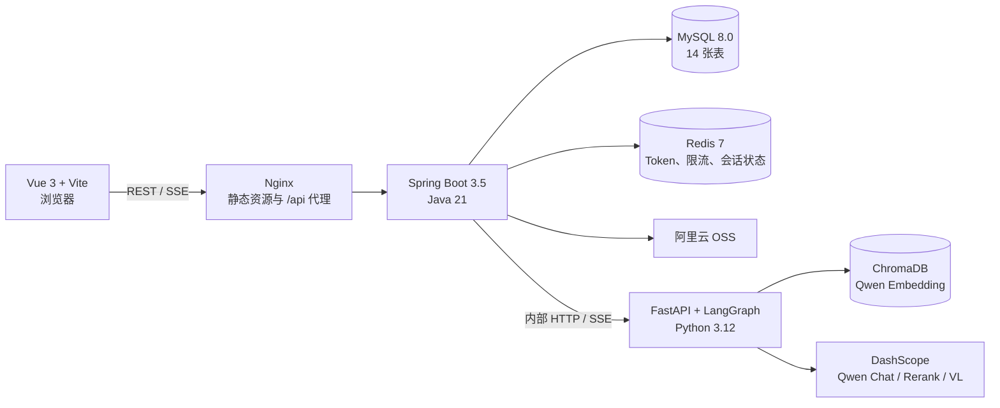
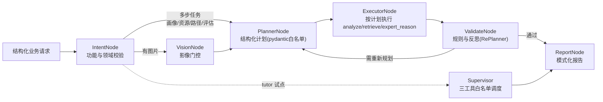

# LearnAgent

LearnAgent 是面向脑卒中医学教育的多智能体个性化学习系统。系统以学生画像为起点，提供学习资源生成、路径规划、循证辅导、学习评估、医学影像分析和代码辅助，并通过 SSE 展示可审计的推理节点与最终结果。

> 文档状态：已于 2026-08-16 按当前代码、Docker 编排和自动化测试核对。系统用于教学辅助，不替代教师指导或临床诊疗意见。

## 当前功能

| 模块 | 当前实现 |
|:---|:---|
| 学习画像 | 对话收集学习背景并维护 8 维画像；画像抽取在原画像对话完成后异步更新，不额外创建“画像生成”对话 |
| 资源生成 | 统一生成入口支持课程讲解文档、思维导图、练习题、拓展阅读、临床案例、学习方案、代码实操、评估报告 8 种互斥类型 |
| 学习路径 | 生成路径、查询详情、更新步骤和任务进度、资源推荐、动态调整 |
| 智能辅导 | 多轮 SSE 问答、历史记录、图片和代码片段上下文；tutor 意图由监督者 LLM（三工具白名单）试点调度 |
| 学习评估 | 综合、知识、技能、进度等评估模式，五维雷达展示，行为记录与路径优化 |
| 代码辅助 | Python 执行；代码补全、错误诊断、优化建议、代码讲解四种互斥模式 |
| 医学多模态 | Qwen VL 影像分析、病例流式分析、多图对比、DICOM 元数据与预览、检验报告和处方 OCR |
| 质量控制 | 功能级输入守卫、Hybrid RAG、结构化规划与重规划（RePlan）、规则校验、反思修正、辩论仲裁、共享记忆、推理并发治理 |

## 系统架构



### 模型工作流



- **Planner 主链路**：多步任务（画像/资源/路径/评估）先由 `PlannerNode` 用轻量模型生成结构化执行计划（步骤类型白名单：analyze/retrieve/expert_reason/finalize，最多 6 步），`ExecutorNode` 按计划复用既有能力逐步执行（步骤进度在节点摘要中展示）；校验失败时反馈回到规划器**重新规划**（RePlan 循环），规划失败自动回退默认计划（等价于升级前固定管线）。
- **Supervisor 试点**：tutor 意图由监督者 LLM（qwen-turbo）在工具白名单内自主调度——`evidence_search`（循证检索）、`consult_experts`（多专家辩论仲裁）、`get_student_profile`（画像查询），迭代轮数受上限约束；意图门控与医学红线保留在监督者外层。可用 `SUPERVISOR_TUTOR_ENABLED=false` 切回 Planner 链路。
- 模型层从 `model/app/config/expert_config.yaml` 加载 9 位专家：画像对话、特征抽取、需求分析、文档撰写、题目生成、质量审核、学习激励、仲裁和医学影像分析智能体。

## 技术栈

| 层级 | 主要技术 |
|:---|:---|
| 前端 | Vue 3.5、Vite 7、Pinia 3、marked 17、DOMPurify、Nginx 1.27、Node 22 |
| 后端 | Java 21、Spring Boot 3.5.16、Spring MVC/WebFlux、MyBatis-Plus 3.5、jjwt 0.13、MySQL 8、Redis 7、阿里云 OSS |
| 模型 | Python 3.12、FastAPI 0.141、LangGraph 1.2、LangChain 1.3、ChromaDB 1.5 |
| 模型服务 | qwen-max、qwen-plus、qwen-turbo、qwen3.7-text-embedding、qwen3-rerank、qwen-vl-max |

具体版本以 [frontend/package.json](frontend/package.json)、[backend/server/pom.xml](backend/server/pom.xml) 和 [model/requirements.txt](model/requirements.txt) 为准。

前端构建采用路由级代码分割与 vendor 分包（首屏按需加载），Nginx 开启 gzip 与 `/assets` 静态资源强缓存；模型层 SSE 与 BM25 检索均为自实现组件（已移除 sse-starlette 与 langchain-community 依赖）。

## 快速启动

### Docker Compose

环境要求：Docker Desktop 或 Docker Engine，且本机可以访问 DashScope 与阿里云 OSS。

```powershell
Copy-Item .env.example .env
# 编辑 .env，填写真实密钥
docker compose up -d --build
docker compose ps
```

Linux/macOS：

```bash
cp .env.example .env
# 编辑 .env，填写真实密钥
docker compose up -d --build
docker compose ps
```

启动完成后访问 `http://127.0.0.1:5173`。Docker 默认只向宿主机暴露前端端口：

| 服务 | 容器端口 | 宿主机端口 | 说明 |
|:---|:---:|:---:|:---|
| frontend | 80 | 5173 | 页面和 `/api` 反向代理 |
| backend | 8080 | 不暴露 | 仅 Compose 网络访问 |
| model | 8000 | 不暴露 | 仅后端访问；健康检查使用 `/admin/report_modes` |
| mysql | 3306 | 不暴露 | 数据卷 `mysql-data` |
| redis | 6379 | 不暴露 | Token、限流等状态 |

模型服务首次启动需要加载 `model/data/documents/` 中的 PDF，并初始化 BM25（自实现，CJK 二元组分词）和向量库。查看状态：

```bash
docker compose logs -f model
docker compose ps
```

### 必需环境变量

| 变量 | 用途 |
|:---|:---|
| `DB_PASSWORD` | MySQL root 密码 |
| `DASHSCOPE_API_KEY` | Qwen Chat、Embedding、Rerank、VL 调用 |
| `AI_API_SHARED_JWT_SECRET` | 后端签发内部 JWT；Compose 将同一值映射为模型层 `SECRET_KEY` |
| `OSS_ACCESS_KEY_ID` / `OSS_ACCESS_KEY_SECRET` | 阿里云 OSS 上传 |
| `OSS_ENDPOINT` / `OSS_BUCKET` / `OSS_REGION` | OSS 地址、Bucket 和区域 |

所有变量和可选模型覆盖项见 [.env.example](.env.example)。不要提交真实 `.env`。

### 可选模型层变量

| 变量 | 默认 | 用途 |
|:---|:---|:---|
| `SUPERVISOR_TUTOR_ENABLED` | `true` | tutor 意图是否走监督者试点（`false` 切回 Planner 主链路） |
| `SUPERVISOR_MAX_TOOL_ROUNDS` | `6` | 监督者单轮问答的最大工具调用轮数 |
| `MAX_CONCURRENT_TASKS` | `10` | 模型推理并发上限，超出后新请求等待并返回 503 |
| `INFERENCE_SLOT_TIMEOUT` | `5` | 推理槽位获取超时（秒） |

### 手动启动

1. 初始化 MySQL：`backend/server/learningo_agents.sql`。
2. 启动模型：在 `model/` 执行 `pip install -r requirements.txt` 后运行 `python -m app.main`（运行测试还需 `pip install -r requirements-dev.txt`，含 pytest/pytest-asyncio）。
3. 启动后端：在 `backend/server/` 执行 `mvn spring-boot:run`。
4. 启动前端：在 `frontend/` 执行 `npm ci` 和 `npm run dev`。

手动启动时，模型层使用 `SECRET_KEY`，生产后端使用 `AI_API_SHARED_JWT_SECRET`；两者必须相同。后端通过 `AI_API_URL` 指向模型服务。

## 验证与测试

2026-08-16 升级后验证结果：模型层 161 项通过，前端 20 项通过，后端 11 项通过、1 项跳过；合计 192 项通过、1 项跳过。

Windows PowerShell 若默认代码页不是 UTF-8，运行模型测试前先执行
`$env:PYTHONUTF8 = "1"`，否则 `pytest.ini` 中的中文注释可能触发解码错误。

```bash
# 模型层
cd model
python -m pytest -q

# 前端
cd frontend
npm test
npm run build

# 后端
cd backend/server
mvn test
mvn package -DskipTests

# Docker 镜像与服务
docker compose build
docker compose up -d
docker compose ps
```

测试结果的范围和已知缺口见 [系统测试报告](docs/architecture/系统测试报告.md)。文档不再把历史压测数据当作本次自动化测试结果。

## API 概览

浏览器只应访问 Java 后端的 `/api/**`。Python `/model/**` 是内部接口，不应直接暴露到公网。

| 模块 | 主要接口 |
|:---|:---|
| 认证 | `POST /api/user/register`、`POST /api/user/login`、`POST /api/user/logOut` |
| 画像 | `POST /api/profile/conversation`、`GET /api/profile`、`PUT /api/profile/dimensions` |
| 资源 | `POST /api/resources/generate`、`POST /api/resources/generate/{type}`、`GET /api/resources` |
| 路径 | `POST /api/learning-path/generate`、`PUT /api/learning-path/{pathId}/steps/{stepId}/progress` |
| 辅导 | `POST /api/tutor/chat`、`GET /api/tutor/conversations` |
| 评估 | `POST /api/evaluation/generate`、`GET /api/evaluation/reports`、`POST /api/evaluation/optimize` |
| 代码 | `POST /api/code/execute`、`POST /api/code/assist` |
| 医学影像 | `/api/medical/**` |

非流式接口通常返回：

```json
{
  "code": 1,
  "msg": "success",
  "data": {}
}
```

SSE 可能包含 `init`、`meta`、`node_start`、`thinking`、`node_done`、`debate`、`token`、`replace`、`done` 和 `error`。`replace` 表示完整报告，应替换此前累计的 `token` 内容；画像模式下模型层发出的 `done` 事件携带 `profile_dimensions`，由后端透传给前端保存画像。

完整端点、请求字段和 SSE 约定见 [接口文档](docs/api/LearnAgent系统接口文档.md)。

## 前端路由

| 路由 | 功能 |
|:---|:---|
| `/login` | 登录与注册 |
| `/profile` | 学习画像 |
| `/resources` | 学习资源 |
| `/learning-path` | 学习路径 |
| `/tutor` | 智能辅导 |
| `/assessment` | 学习评估 |
| `/code-assist` | 代码辅助 |

## 项目结构

```text
learning-multi-agent-system/
|-- frontend/                 Vue 前端、Nginx 配置和前端测试
|-- backend/server/           Spring Boot 后端、数据库脚本和后端测试
|-- model/                    FastAPI、LangGraph、RAG、模型服务和模型测试
|-- docs/
|   |-- api/                  权威接口文档
|   |-- architecture/         需求、设计、算法、数据库、测试专题
|   `-- competition/          竞赛说明与交付材料
|-- scripts/                  辅助脚本
|-- docker-compose.yml        本地容器编排
`-- .env.example              环境变量模板
```

## 当前边界

- 代码执行沙箱当前仅支持 Python；代码辅助的 `language` 字段尚未驱动多语言沙箱。
- `DocumentController.java` 为空，当前没有 `/api/documents/**` REST 接口；文献由模型层从本地 PDF 知识库加载。
- 模型层只有统一推理入口 `/model/get_result` 校验内部 JWT；其他专用路由依赖网络隔离，不应映射公网端口。
- 执行计划的逐步骤实时事件当前聚合在 `execute_plan` 节点摘要中展示；langgraph 1.x 的 `astream_events` 不透传自定义流事件，需迁移到 `stream_mode="custom"` 后才可逐步骤实时推送。
- 监督者（Supervisor）当前仅试点 tutor 意图，其他意图走 Planner 主链路；可通过 `SUPERVISOR_TUTOR_ENABLED=false` 关闭。
- 模型层任务状态与 SSE 事件缓存均在进程内存中，多实例部署前需改为共享存储（Redis/DB）。
- `backend/server/learningo_agents.sql` 同时包含结构和演示数据，生产部署前应审查并按需拆分。
- 性能会受外部模型配额、网络和首次向量库初始化影响；未经当次压测的数据不作为当前性能承诺。

## 文档

从 [文档总览](docs/README.md) 进入。主要文档：

- [接口文档](docs/api/LearnAgent系统接口文档.md)
- [需求规格说明书](docs/architecture/需求规格说明书.md)
- [系统设计说明书](docs/architecture/系统设计说明书.md)
- [核心算法设计文档](docs/architecture/核心算法设计文档.md)
- [数据库设计手册](docs/architecture/数据库设计手册.md)
- [系统测试报告](docs/architecture/系统测试报告.md)

## License

本项目采用 [MIT License](LICENSE)。
