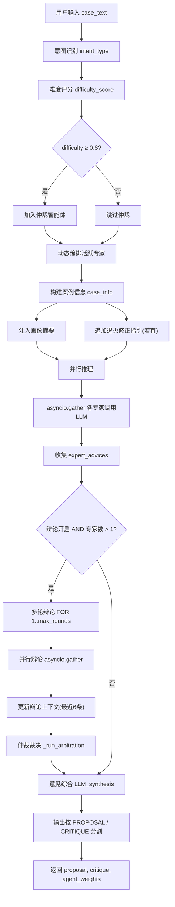
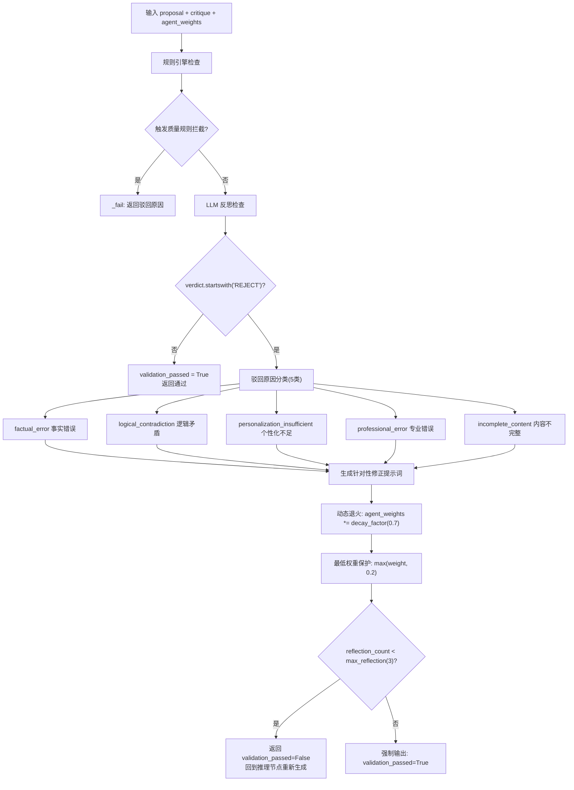
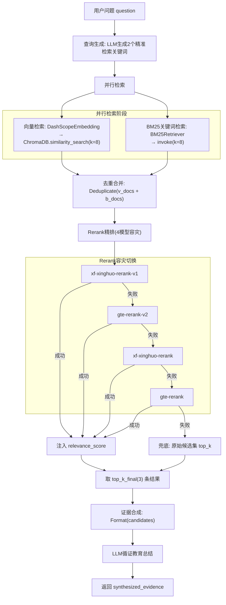
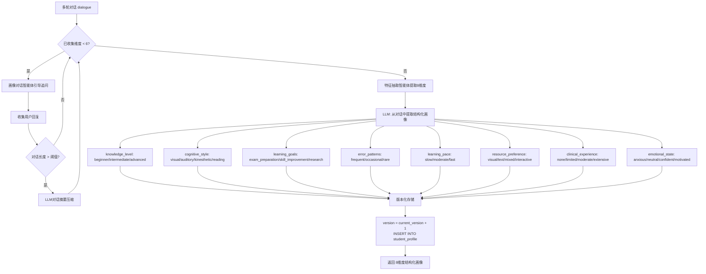
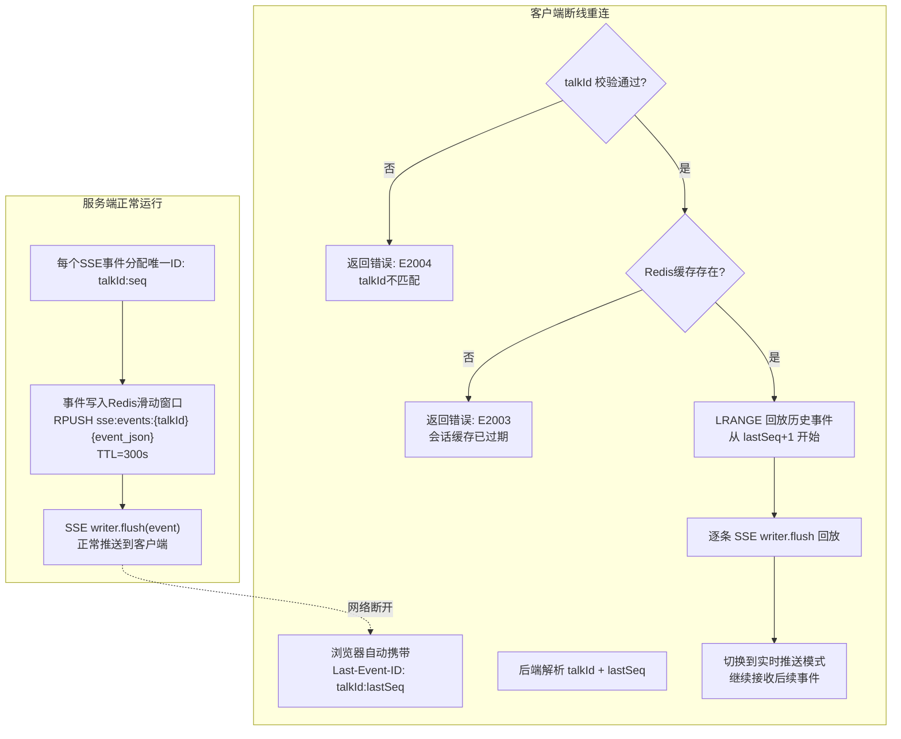
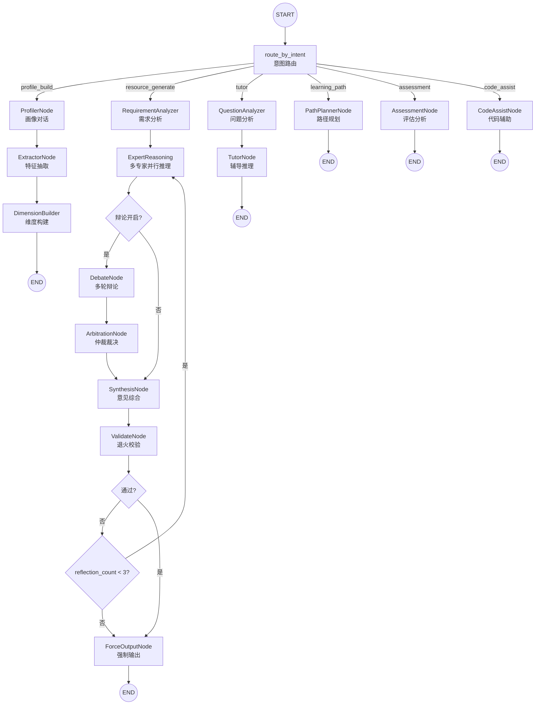
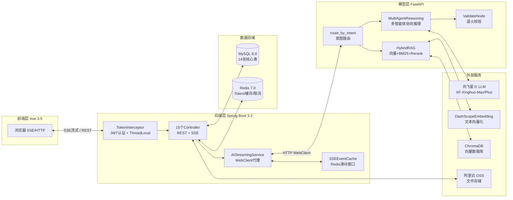

# LearnAgent — 多智能体个性化学习系统接口文档 V2

> **版本**：V2.0  
> **项目名称**：LearnAgent — 基于大模型的个性化资源生成与学习多智能体系统  
> **编制日期**：2026-07-17  
> **覆盖范围**：14个Controller、50+API端点、SSE流式协议、模型层内部接口  

---

## 目录

1. [全局约定](#1-全局约定)
2. [用户认证模块](#2-用户认证模块)
3. [对话式学习画像模块](#3-对话式学习画像模块)
4. [多智能体协同资源生成模块](#4-多智能体协同资源生成模块)
5. [个性化学习路径模块](#5-个性化学习路径模块)
6. [智能辅导模块](#6-智能辅导模块)
7. [学习效果评估模块](#7-学习效果评估模块)
8. [代码辅助开发模块](#8-代码辅助开发模块)
9. [多模态影像分析模块](#9-多模态影像分析模块)
10. [通用对话管理模块](#10-通用对话管理模块)
11. [课程与知识库模块](#11-课程与知识库模块)
12. [文档管理模块](#12-文档管理模块)
13. [图片上传模块](#13-图片上传模块)
14. [系统监控模块](#14-系统监控模块)
15. [Python模型层内部接口](#15-python模型层内部接口)
16. [核心算法伪代码](#16-核心算法伪代码)
17. [测试用例参考](#17-测试用例参考)
18. [数据库表摘要](#18-数据库表摘要)

---

## 1. 全局约定

### 1.1 Base URL

| 环境 | 后端 Base URL | 模型层 Base URL |
|------|--------------|----------------|
| 开发 | `http://localhost:8080/api` | `http://localhost:8000` |
| 生产 | `https://{domain}/api` | `https://{domain}/model` |

### 1.2 统一响应体 `Result`

所有非流式接口统一返回：

```json
{
  "code": 1,
  "msg": "success",
  "data": {}
}
```

- `code`: 1=成功, 0=失败
- `msg`: 描述信息
- `data`: 业务数据，失败时为 null

### 1.3 认证方式

除 `/api/user/login` 和 `/api/user/register` 外，所有接口均需携带 JWT Token：

```
token: <token>
Authorization: Bearer <token>
```

- 后端通过 `TokenInterceptor` + `ThreadLocalUtil` 解析用户身份
- 模型层通过 `verify_token()` 校验
- Token 自动续期通过 `RefreshTokenInterceptor` 实现

### 1.4 SSE 流式事件格式

```
event: <事件类型>
id: <talkId>:<seq>
data: <JSON字符串>
```

**标准事件类型**：

| 事件类型 | 说明 | data 结构 |
|---------|------|----------|
| `init` | 连接建立 | `{"type":"init","talkId":"123","newTalk":true}` |
| `node_start` | 智能体节点开始 | `{"type":"node_start","node":"profiler","label":"..."}` |
| `token` | 内容增量 | `{"type":"token","content":"..."}` |
| `thinking` | 思考过程 | `{"type":"thinking","step":1,"title":"...","content":"..."}` |
| `done` | 流式结束 | `{"type":"done","talkId":"123","title":"..."}` |
| `error` | 错误 | `{"type":"error","code":"E2001","message":"..."}` |
| `resume` | 断线续传恢复 | `{"type":"resume","talkId":"123","content":"..."}` |

心跳：每15秒 `: heartbeat` comment；关闭：`: close` comment

### 1.5 分页参数约定

| 参数 | 类型 | 默认值 | 说明 |
|------|------|--------|------|
| `page` | int | 1 | 当前页码 |
| `size` | int | 10 | 每页条数 |

分页响应结构：

```json
{
  "code": 1,
  "msg": "success",
  "data": {
    "total": 100,
    "records": [...]
  }
}
```

### 1.6 请求头约定

| 请求头 | 说明 |
|--------|------|
| `token` | JWT Token（二选一） |
| `Authorization` | Bearer Token（二选一） |
| `Last-Event-ID` | SSE断线续传，格式 `talkId:seq` |
| `X-Accel-Buffering` | Nginx缓冲控制，后端自动设置 `no` |

---

## 2. 用户认证模块

> Controller: `LoginController`, `ChangeKeyController`, `InitialPageController`

### 2.1 用户注册

**POST** `/api/user/register`

```json
// 请求体
{
  "name": "zhangsan",
  "password": "Test1234!",
  "image": "https://oss.example.com/avatar.jpg"
}

// 响应
{ "code": 1, "msg": "success", "data": null }
```

### 2.2 用户登录

**POST** `/api/user/login`

```json
// 请求体
{ "name": "zhangsan", "password": "Test1234!" }

// 响应
{ "code": 1, "msg": "success", "data": "eyJhbGciOiJIUzI1NiJ9..." }
```

### 2.3 退出登录

**POST** `/api/user/logOut`

| 请求头 | 说明 |
|--------|------|
| `token` | JWT Token |

```json
{ "code": 1, "msg": "success", "data": null }
```

### 2.4 获取用户信息

**GET** `/api/user/showInfo`

```json
{
  "code": 1,
  "msg": "success",
  "data": {
    "id": 1,
    "name": "zhangsan",
    "image": "https://oss.example.com/avatar.jpg",
    "major": "临床医学",
    "grade": "大三",
    "specialty": "神经病学"
  }
}
```

### 2.5 修改用户信息

**PUT** `/api/user/showInfo/changeKey`

```json
// 请求体
{
  "prePassword": "oldPass123",
  "newPassword": "newPass456",
  "image": "https://oss.example.com/new_avatar.jpg",
  "major": "临床医学",
  "grade": "大四"
}

// 响应
{ "code": 1, "msg": "success", "data": null }
```

### 2.6 获取对话列表

**GET** `/api/user/title`

```json
{
  "code": 1,
  "msg": "success",
  "data": [
    {
      "talkId": 1001,
      "title": "学习画像构建",
      "updateTime": "2026-06-10 14:30:00"
    }
  ]
}
```

### 2.7 删除对话

**DELETE** `/api/user/deleteTalk/{talkId}`

```json
{ "code": 1, "msg": "success", "data": null }
```

> 删除对话时关联的 cont 消息记录会被级联删除（CASCADE）

---

## 3. 对话式学习画像模块

> Controller: `ProfileController`
> 核心功能1：通过自然语言对话自动抽取特征，构建8维度动态画像

### 3.1 画像构建对话（SSE流式）

**POST** `/api/profile/conversation`

```
Content-Type: application/json
Accept: text/event-stream
```

```json
// 请求体
{
  "talkId": "string|null",
  "message": "我是大三医学生，正在学神经病学，对脑血管疾病比较感兴趣",
  "images": ["base64_image_data"]
}
```

SSE事件流示例：

```
event: init
data: {"type":"init","talkId":"1001","newTalk":true}

event: node_start
data: {"type":"node_start","node":"profiler","label":"正在分析学习特征..."}

event: thinking
data: {"type":"thinking","step":1,"title":"知识基础分析","content":"正在从对话中提取已掌握的知识点..."}

event: token
data: {"type":"token","content":"根据你的描述，我为你构建了学习画像..."}

event: done
data: {"type":"done","talkId":"1001","title":"学习画像构建"}
```

**多智能体协作**：

| 智能体 | 节点名 | 职责 |
|--------|--------|------|
| 画像对话智能体 | `profiler` | 引导式对话，挖掘学习背景 |
| 特征抽取智能体 | `extractor` | 从对话中提取结构化特征 |
| 画像构建智能体 | `dimension_builder` | 映射到8维度，生成/更新画像 |

### 3.2 获取学习画像

**GET** `/api/profile`

```json
{
  "code": 1,
  "msg": "success",
  "data": {
    "profileId": 1,
    "userId": 1,
    "dimensions": {
      "knowledge_level": {
        "level": "intermediate",
        "description": "具备基础神经解剖学知识，对脑血管病理有初步了解"
      },
      "cognitive_style": {
        "level": "visual",
        "description": "偏好图解和视觉化学习方式"
      },
      "learning_goals": {
        "level": "exam_preparation",
        "description": "目标为通过神经病学期末考试"
      },
      "error_patterns": {
        "level": "frequent",
        "description": "易混淆缺血性与出血性脑卒中鉴别要点"
      },
      "learning_pace": {
        "level": "moderate",
        "description": "每周可投入10-15小时学习"
      },
      "resource_preference": {
        "level": "mixed",
        "description": "偏好视频讲解配合文档阅读"
      },
      "clinical_experience": {
        "level": "limited",
        "description": "仅有1次神经内科见习经历"
      },
      "emotional_state": {
        "level": "anxious",
        "description": "对即将到来的考试感到焦虑"
      }
    },
    "rawConversationSummary": "该学生为临床医学大三学生...",
    "updateTime": "2026-06-10 14:30:00",
    "createTime": "2026-06-08 09:00:00"
  }
}
```

**8维度定义**：

| 维度 | 字段名 | 枚举值 |
|------|--------|--------|
| 知识基础 | `knowledge_level` | beginner / intermediate / advanced |
| 认知风格 | `cognitive_style` | visual / auditory / kinesthetic / reading |
| 学习目标 | `learning_goals` | exam_preparation / skill_improvement / research |
| 易错模式 | `error_patterns` | frequent / occasional / rare |
| 学习节奏 | `learning_pace` | slow / moderate / fast |
| 资源偏好 | `resource_preference` | visual / text / mixed / interactive |
| 临床经验 | `clinical_experience` | none / limited / moderate / extensive |
| 情绪状态 | `emotional_state` | anxious / neutral / confident / motivated |

### 3.3 手动更新画像维度

**PUT** `/api/profile/dimensions`

```json
// 请求体
{
  "knowledge_level": {
    "level": "advanced",
    "description": "已系统学习神经病学核心知识"
  }
}

// 响应
{ "code": 1, "msg": "success", "data": null }
```

> 版本号自增，仅更新指定的维度，其余维度保持不变

### 3.4 画像对话历史

**GET** `/api/profile/conversation/{talkId}`

```json
{
  "code": 1,
  "msg": "success",
  "data": [
    { "role": "user", "content": "我是大三医学生...", "timestamp": "..." },
    { "role": "assistant", "content": "好的，我了解了...", "timestamp": "..." }
  ]
}
```

### 3.5 画像对话列表

**GET** `/api/profile/conversations`

```json
{
  "code": 1,
  "msg": "success",
  "data": [
    { "talkId": 1001, "title": "学习画像构建", "updateTime": "..." }
  ]
}
```

### 3.6 删除画像对话

**DELETE** `/api/profile/conversation/{talkId}`

```json
{ "code": 1, "msg": "success", "data": null }
```

---

## 4. 多智能体协同资源生成模块

> Controller: `ResourceController`
> 核心功能2：8智能体协同，7类资源生成，辩论-仲裁模式

### 4.1 资源生成（SSE流式）

**POST** `/api/resources/generate`

```json
// 请求体
{
  "talkId": "string|null",
  "message": "请生成脑卒中诊断流程讲解",
  "resourceTypes": ["document", "mindmap", "quiz", "reading", "video_script", "code_practice"],
  "courseName": "神经病学",
  "knowledgePoints": ["脑卒中", "诊断流程", "影像学检查"],
  "difficulty": "intermediate",
  "images": ["base64_ref_image"]
}
```

**7类资源类型**：

| 类型 | 说明 | 生成智能体 |
|------|------|-----------|
| `document` | 课程讲解文档 | 文档撰写智能体 |
| `mindmap` | 知识体系思维导图 | 思维导图智能体 |
| `quiz` | 练习题目（选择/填空/简答/编程/判断） | 题目生成智能体 |
| `reading` | 临床指南与文献 | 阅读推荐智能体 |
| `video_script` | 教学视频脚本 | 视频脚本智能体 |
| `code_practice` | 代码实操案例 | 代码实操智能体 |
| `code_example` | 代码案例 | 代码实操智能体 |

**8智能体协同矩阵**：

| 智能体 | 节点名 | 职责 |
|--------|--------|------|
| 需求分析智能体 | `requirement_analyzer` | 结合画像分析需求，拆解生成任务 |
| 文档撰写智能体 | `document_writer` | 生成专业课程讲解文档 |
| 思维导图智能体 | `mindmap_generator` | 生成Mermaid/JSON格式思维导图 |
| 题目生成智能体 | `quiz_creator` | 生成多类型练习题目 |
| 阅读推荐智能体 | `reading_curator` | 生成拓展阅读材料 |
| 视频脚本智能体 | `video_script_writer` | 生成教学视频/动画脚本 |
| 代码实操智能体 | `code_practice` | 生成代码实操案例 |
| 质量审核智能体 | `quality_reviewer` | 审核资源质量与个性化匹配度 |

**辩论-仲裁机制**：
- 当难度评分 ≥ 0.6 时，自动加入仲裁智能体
- 多专家并行推理 → 意见冲突检测 → 多轮辩论 → 仲裁裁决
- 辩论配参：`debate.max_rounds=1`, `arbitrator_role="仲裁智能体"`

**动态退火策略**：
- 校验失败 → 5类驳回原因分类 → 针对性修正提示词 → 权重衰减（decay_factor=0.7，最低0.2）
- 最多3次反思循环，超过则强制输出

### 4.2 资源列表查询

**GET** `/api/resources`

| 参数 | 类型 | 必填 | 说明 |
|------|------|------|------|
| `page` | int | 否 | 页码，默认1 |
| `size` | int | 否 | 每页条数，默认10 |
| `type` | string | 否 | 资源类型筛选 |
| `courseName` | string | 否 | 课程名称筛选 |
| `difficulty` | string | 否 | 难度筛选 |

```json
{
  "code": 1,
  "msg": "success",
  "data": {
    "total": 25,
    "records": [
      {
        "resourceId": 301,
        "title": "脑卒中诊断流程讲解",
        "type": "document",
        "courseName": "神经病学",
        "difficulty": "intermediate",
        "knowledgePoints": ["脑卒中", "诊断流程"],
        "fileUrl": "https://oss.example.com/resources/301.docx",
        "createTime": "2026-06-10 14:30:00"
      }
    ]
  }
}
```

### 4.3 资源详情

**GET** `/api/resources/{id}`

```json
{
  "code": 1,
  "msg": "success",
  "data": {
    "resourceId": 301,
    "title": "脑卒中诊断流程讲解",
    "type": "document",
    "courseName": "神经病学",
    "difficulty": "intermediate",
    "knowledgePoints": ["脑卒中", "诊断流程"],
    "content": "# 脑卒中诊断流程\n\n## 1. 概述\n...",
    "fileUrl": "https://oss.example.com/resources/301.docx",
    "metadata": {
      "wordCount": 4217,
      "estimatedReadTime": "15min",
      "agentChain": ["requirement_analyzer", "document_writer", "quality_reviewer"]
    },
    "createTime": "2026-06-10 14:30:00",
    "updateTime": "2026-06-10 14:30:00"
  }
}
```

### 4.4 资源下载

**GET** `/api/resources/{id}/download`

```json
{
  "code": 1,
  "msg": "success",
  "data": {
    "resourceId": 301,
    "previewUrl": "https://oss.example.com/signed/preview/...",
    "downloadUrl": "https://oss.example.com/signed/download/..."
  }
}
```

### 4.5 删除资源

**DELETE** `/api/resources/{id}`

```json
{ "code": 1, "msg": "success", "data": null }
```

### 4.6 单类型资源生成（SSE流式）

> 除通用 `/generate` 端点外，`ResourceController` 还提供8个专用端点，每种资源类型独立参数和生成策略。

#### 4.6.1 生成课程讲解文档

**POST** `/api/resources/generate/document`

```json
// 请求体
{
  "talkId": "string|null",
  "courseName": "神经病学",
  "knowledgePoints": ["脑卒中", "诊断流程"],
  "difficulty": "intermediate",
  "style": "detailed",
  "profileAware": true,
  "message": "请重点讲解缺血性脑卒中的急性期处理",
  "images": ["base64_image"]
}
```

| 参数 | 类型 | 必填 | 说明 |
|------|------|------|------|
| `courseName` | string | 否 | 课程名称 |
| `knowledgePoints` | string[] | 否 | 目标知识点列表 |
| `difficulty` | string | 否 | beginner/intermediate/advanced |
| `style` | string | 否 | detailed（详细）/ concise（简洁）/ annotated（注释版） |
| `profileAware` | bool | 否 | 是否结合学生画像个性化，默认 false |
| `message` | string | 否 | 补充说明 |

SSE事件流：同通用端点格式，仅 `document_writer` 智能体工作。

#### 4.6.2 生成知识体系思维导图

**POST** `/api/resources/generate/mindmap`

```json
// 请求体
{
  "talkId": "string|null",
  "courseName": "神经病学",
  "knowledgePoints": ["脑卒中分类", "诊断方法"],
  "format": "mermaid",
  "depth": "3",
  "message": "按病因分类展开",
  "images": []
}
```

| 参数 | 类型 | 必填 | 说明 |
|------|------|------|------|
| `format` | string | 否 | mermaid / json / markdown |
| `depth` | string | 否 | 展开层级，默认3层 |

#### 4.6.3 生成练习题目

**POST** `/api/resources/generate/quiz`

```json
// 请求体
{
  "talkId": "string|null",
  "courseName": "神经病学",
  "knowledgePoints": ["静脉溶栓", "适应证"],
  "difficulty": "intermediate",
  "quizTypes": ["choice", "blank", "short_answer", "coding", "true_false"],
  "count": 5,
  "includeAnswer": true,
  "message": "侧重临床应用场景",
  "images": []
}
```

| 参数 | 类型 | 必填 | 说明 |
|------|------|------|------|
| `quizTypes` | string[] | 否 | choice/blank/short_answer/coding/true_false |
| `count` | int | 否 | 题目数量，默认5 |
| `includeAnswer` | bool | 否 | 是否包含答案，默认 true |

#### 4.6.4 生成拓展阅读材料

**POST** `/api/resources/generate/reading`

```json
// 请求体
{
  "talkId": "string|null",
  "courseName": "神经病学",
  "knowledgePoints": ["脑卒中影像学"],
  "readingType": "guideline",
  "language": "zh",
  "count": 3,
  "message": "重点推荐最新指南和综述",
  "images": []
}
```

| 参数 | 类型 | 必填 | 说明 |
|------|------|------|------|
| `readingType` | string | 否 | guideline（指南）/ review（综述）/ case（病例）/ textbook（教材） |
| `language` | string | 否 | zh（中文）/ en（英文）/ both（双语） |
| `count` | int | 否 | 推荐数量，默认3 |

#### 4.6.5 生成临床案例分析

**POST** `/api/resources/generate/case-study`

```json
// 请求体
{
  "talkId": "string|null",
  "courseName": "神经病学",
  "knowledgePoints": ["脑出血急性期处理"],
  "difficulty": "advanced",
  "message": "模拟急诊场景，体现多学科协作",
  "images": []
}
```

> 生成内容包含：完整病例描述、诊断思路分析、治疗方案选择、要点总结

#### 4.6.6 生成资源学习方案

**POST** `/api/resources/generate/plan`

```json
// 请求体
{
  "talkId": "string|null",
  "courseName": "神经病学",
  "knowledgePoints": ["脑卒中", "诊断流程"],
  "difficulty": "intermediate",
  "message": "为期2周的强化学习计划",
  "images": []
}
```

> 生成内容包含：学习路径规划、阶段时间安排、推荐学习资源、自评检查点

#### 4.6.7 生成代码实操案例

**POST** `/api/resources/generate/code-practice`

```json
// 请求体
{
  "talkId": "string|null",
  "courseName": "神经病学",
  "knowledgePoints": ["脑卒中数据分析"],
  "codeType": "python",
  "difficulty": "intermediate",
  "message": "使用真实数据集分析脑卒中危险因素",
  "images": []
}
```

| 参数 | 类型 | 必填 | 说明 |
|------|------|------|------|
| `codeType` | string | 否 | python / r / sql |

> 生成内容包含：案例背景、环境准备、分步实现、完整代码、运行结果解读、拓展练习

#### 4.6.8 生成学习评估报告

**POST** `/api/resources/generate/assessment`

```json
// 请求体
{
  "talkId": "string|null",
  "courseName": "神经病学",
  "knowledgePoints": ["脑卒中", "诊断流程"],
  "difficulty": "intermediate",
  "message": "请评估我对脑卒中诊疗知识的掌握程度",
  "images": []
}
```

> 生成内容包含：知识点掌握矩阵、薄弱环节识别、针对性提升建议

### 4.7 资源对话历史

**GET** `/api/resources/conversation/{talkId}`

### 4.8 资源对话列表

**GET** `/api/resources/conversations`

---

## 5. 个性化学习路径模块

> Controller: `LearningPathController`
> 核心功能3：5-15步路径规划 + 精准资源推送 + 动态调整

### 5.1 路径生成（SSE流式）

**POST** `/api/learning-path/generate`

```json
// 请求体
{
  "courseName": "神经病学",
  "goalDescription": "掌握脑卒中诊疗全流程",
  "deadline": "2026-09-01",
  "weeklyHours": 10,
  "existingKnowledge": ["神经解剖学基础", "病理生理学"],
  "targetKnowledge": ["脑卒中诊断", "静脉溶栓", "影像学评估"]
}
```

SSE事件流：

```
event: init → talkId + newTalk
event: node_start → 路径规划节点
event: token → 路径内容
event: done → 结束 + 资源ID列表
```

### 5.2 路径列表查询

**GET** `/api/learning-path`

| 参数 | 类型 | 必填 | 说明 |
|------|------|------|------|
| `courseName` | string | 否 | 课程名称筛选 |
| `status` | string | 否 | active/completed/paused |
| `page` | int | 否 | 页码 |
| `size` | int | 否 | 每页条数 |

```json
{
  "code": 1,
  "msg": "success",
  "data": {
    "total": 2,
    "records": [
      {
        "pathId": 501,
        "courseName": "神经病学",
        "totalSteps": 12,
        "completedSteps": 3,
        "progress": 0.25,
        "status": "active",
        "createTime": "2026-06-10 15:00:00"
      }
    ]
  }
}
```

### 5.3 路径详情

**GET** `/api/learning-path/{pathId}`

```json
{
  "code": 1,
  "msg": "success",
  "data": {
    "pathId": 501,
    "courseName": "神经病学",
    "goalDescription": "掌握脑卒中诊疗全流程",
    "totalSteps": 12,
    "estimatedDays": 45,
    "status": "active",
    "steps": [
      {
        "stepId": 1,
        "title": "神经解剖学基础复习",
        "description": "复习脑血管解剖与Willis环",
        "knowledgePoints": ["脑的血液供应", "Willis环"],
        "estimatedHours": 6,
        "difficulty": "beginner",
        "status": "not_started",
        "orderIndex": 1,
        "resources": [
          { "resourceId": 301, "title": "脑血管解剖图解", "type": "document", "relevance": 0.95 }
        ],
        "prerequisites": []
      }
    ],
    "createTime": "2026-06-10 15:00:00"
  }
}
```

### 5.4 更新步骤进度

**PUT** `/api/learning-path/{pathId}/steps/{stepId}/progress`

```json
// 请求体
{
  "status": "completed",
  "actualHours": 7.5,
  "feedback": "内容很好，案例部分可以再丰富一些",
  "selfRating": 4
}

// 响应
{
  "code": 1,
  "msg": "success",
  "data": {
    "pathId": 501,
    "completedSteps": 4,
    "progress": 0.33,
    "suggestedAdjustments": "建议在第5步增加影像学案例练习"
  }
}
```

### 5.5 精准资源推荐

**POST** `/api/learning-path/recommend`

```json
// 请求体
{
  "pathId": 501,
  "currentStepId": 2,
  "context": "刚刚完成了脑血管解剖学习，对影像读片还是不太理解",
  "preferredTypes": ["video", "mindmap"],
  "count": 5
}

// 响应
{
  "code": 1,
  "msg": "success",
  "data": {
    "recommendations": [
      {
        "resourceId": 306,
        "title": "头颅CT读片动画演示",
        "type": "video_script",
        "relevance": 0.96,
        "reason": "基于你的视觉型学习风格，推荐动画演示资源",
        "difficulty": "intermediate"
      }
    ],
    "profileInsight": "检测到你在影像诊断方面较薄弱，已优先推荐可视化资源"
  }
}
```

### 5.6 动态路径调整

**POST** `/api/learning-path/{pathId}/adjust`

```json
// 请求体
{
  "adjustType": "insert",
  "afterStepId": 5,
  "newStep": {
    "title": "脑血管影像读片专项训练",
    "difficulty": "intermediate",
    "estimatedHours": 3
  }
}

// 响应
{
  "code": 1,
  "msg": "success",
  "data": {
    "pathId": 501,
    "adjustments": [
      {
        "type": "insert_step",
        "description": "在第5步后插入「脑血管影像读片专项训练」",
        "afterStepId": 5
      }
    ],
    "newTotalSteps": 13,
    "newEstimatedDays": 50
  }
}
```

**三种调整类型**：

| 类型 | 说明 |
|------|------|
| `insert` | 插入新步骤，后续步骤order_index自动重排 |
| `update_resource` | 更新某步骤的推荐资源 |
| `adjust_difficulty` | 调整路径整体难度级别 |

---

## 6. 智能辅导模块

> Controller: `TutorController`
> 核心功能4：多轮对话辅导 + 多模态分析 + 思考过程展示

### 6.1 辅导问答（SSE流式）

**POST** `/api/tutor/chat`

```json
// 请求体
{
  "talkId": "string|null",
  "message": "什么是缺血性脑卒中的静脉溶栓适应症？",
  "mode": "explain",
  "responseFormat": "text",
  "context": {
    "courseName": "神经病学",
    "knowledgePoints": ["缺血性脑卒中", "静脉溶栓"]
  },
  "codeSnippet": "import pandas as pd\ndf = pd.read_csv('stroke.csv')",
  "images": ["base64_ct_image"]
}
```

SSE事件流：

```
event: init → talkId
event: node_start → question_analyzer
event: thinking → 问题理解
event: node_start → text_tutor
event: token → 文字解答
event: node_start → diagram_generator
event: token → Mermaid图解
event: done → 结束
```

### 6.2 简版辅导问答（SSE流式）

**POST** `/api/tutor/ask`

```json
// 请求体
{
  "talkId": "string|null",
  "message": "脑卒中的分类有哪些？",
  "mode": "explain",
  "courseName": "神经病学",
  "knowledgePoint": "脑卒中分类",
  "images": ["base64_image"]
}
```

### 6.3 辅导对话历史

**GET** `/api/tutor/conversation/{talkId}`

### 6.4 辅导对话列表

**GET** `/api/tutor/conversations`

### 6.5 删除辅导对话

**DELETE** `/api/tutor/conversation/{talkId}`

---

## 7. 学习效果评估模块

> Controller: `AssessmentController`
> 核心功能5：5维度量化评估 + 学习行为记录 + 评估驱动迭代

### 7.1 评估报告生成（SSE流式）

**POST** `/api/evaluation/generate`

```json
// 请求体
{
  "pathId": 501,
  "message": "请评估我最近的学习效果",
  "assessmentType": "comprehensive",
  "courseName": "神经病学",
  "timeRange": {
    "start": "2026-06-01",
    "end": "2026-06-30"
  }
}
```

SSE事件流：

```
event: init → talkId
event: node_start → 评估分析节点
event: token → 评估内容
event: done → 结束
```

**5维度评估指标**：

| 维度 | 说明 | 分数范围 |
|------|------|----------|
| 知识掌握度 | 对知识点的理解和掌握程度 | 0-100 |
| 学习效率 | 单位时间内的学习产出 | 0-100 |
| 技能应用 | 将知识应用于实践的能力 | 0-100 |
| 学习一致性 | 学习的持续性和规律性 | 0-100 |
| 进度对齐度 | 实际进度与计划进度的偏差 | 0-100 |

**综合等级**：excellent(≥85) / good(70-84) / moderate(50-69) / weak(<50)

### 7.2 评估报告查询

**GET** `/api/evaluation/report`

| 参数 | 类型 | 必填 | 说明 |
|------|------|------|------|
| `pathId` | long | 否 | 学习路径ID |
| `period` | string | 否 | week/month/all，默认all |

```json
{
  "code": 1,
  "msg": "success",
  "data": {
    "reportId": 1,
    "overallScore": 72,
    "level": "good",
    "period": "month",
    "dimensions": {
      "knowledgeMastery": { "score": 68, "level": "moderate" },
      "learningEfficiency": { "score": 75, "level": "good" },
      "skillApplication": { "score": 70, "level": "good" },
      "learningConsistency": { "score": 65, "level": "moderate" },
      "progressAlignment": { "score": 80, "level": "good" }
    },
    "strengths": ["代码实操能力较强", "学习节奏稳定"],
    "weaknesses": ["数学推导类题目正确率偏低"],
    "suggestions": ["建议增加专项练习", "推荐观看可视化视频"],
    "generateTime": "2026-06-10 17:00:00"
  }
}
```

### 7.3 学习行为提交

**POST** `/api/evaluation/behavior`

```json
// 请求体
{
  "pathId": 501,
  "stepId": 2,
  "behaviors": [
    {
      "type": "resource_view",
      "resourceId": 303,
      "duration": 1200
    },
    {
      "type": "quiz_attempt",
      "quizId": 305,
      "score": 0.75,
      "timeSpent": 600
    },
    {
      "type": "code_submit",
      "resourceId": 304,
      "passed": true,
      "attempts": 2
    }
  ]
}

// 响应
{ "code": 1, "msg": "success", "data": { "received": 3, "processed": 3 } }
```

**5种行为类型**：

| 类型 | 说明 |
|------|------|
| `resource_view` | 资源浏览 |
| `quiz_attempt` | 测验答题 |
| `code_submit` | 代码提交 |
| `note_taken` | 笔记记录 |
| `time_spent` | 学习时长 |

### 7.4 评估驱动优化

**POST** `/api/evaluation/optimize`

```json
// 请求体
{
  "pathId": 501,
  "triggerReason": "auto"
}

// 响应
{
  "code": 1,
  "msg": "success",
  "data": {
    "pathId": 501,
    "optimizationApplied": true,
    "changes": [
      {
        "type": "insert_step",
        "description": "插入专项突破步骤",
        "reason": "知识点掌握度仅0.3，需要专项突破"
      }
    ],
    "profileUpdated": true
  }
}
```

---

## 8. 代码辅助开发模块

> Controller: `CodeController`
> Python沙箱执行 + 多智能体代码辅助

### 8.1 代码执行（非流式）

**POST** `/api/code/execute`

```json
// 请求体
{
  "code": "import pandas as pd\ndf = pd.read_csv('stroke_data.csv')\nprint(df.describe())",
  "language": "python",
  "timeout": 30,
  "inputData": "stdin_input_data"
}

// 响应 — 成功
{
  "code": 1,
  "msg": "success",
  "data": {
    "output": "       age  ...  nihss_score\ncount  100.0  ...      100.0\n...",
    "exitCode": 0
  }
}

// 响应 — 运行时错误
{
  "code": 1,
  "msg": "success",
  "data": {
    "output": "Traceback (most recent call last):\n  File \"<string>\", line 1\n    1/0\nZeroDivisionError: division by zero\n",
    "exitCode": 1
  }
}
```

| 参数 | 类型 | 默认值 | 说明 |
|------|------|--------|------|
| `code` | string | 必填 | 代码内容 |
| `language` | string | "python" | 编程语言 |
| `timeout` | int | 30 | 超时秒数，最长2分钟 |
| `inputData` | string | null | 标准输入数据 |

### 8.2 代码辅助生成（SSE流式）

**POST** `/api/code/assist`

```json
// 请求体
{
  "talkId": "string|null",
  "assistType": "complete",
  "prompt": "生成一个读取CSV并计算均值的脚本",
  "language": "python",
  "existingCode": "import pandas as pd\n",
  "errorMessage": "KeyError: 'column_name'"
}
```

**4种辅助类型**：

| 类型 | 说明 |
|------|------|
| `complete` | 代码补全 |
| `diagnose` | 错误诊断 |
| `optimize` | 优化建议 |
| `explain` | 代码讲解 |

SSE事件流：

```
event: init → talkId
event: node_start → code_assist节点
event: token → 代码内容
event: done → 结束
```

---

## 9. 多模态影像分析模块

> Controller: `MedicalController`
> 基于 xf-xinghuo-vl-max 视觉大模型，支持CT/MRI/检验报告分析

### 9.1 医学影像分析（非流式）

**POST** `/api/medical/analyze-image`

```json
// 请求体
{
  "images": ["base64_ct_scan"],
  "question": "请分析这张头颅CT影像，是否存在脑出血征象？",
  "allInfo": "患者65岁男性，突发右侧肢体无力",
  "expectedImageType": "ct_brain"
}

// 响应
{
  "code": 1,
  "msg": "success",
  "data": {
    "imageType": "ct_brain",
    "findings": "左侧基底节区可见高密度影...",
    "impression": "符合急性脑出血影像学表现",
    "confidence": "high"
  }
}
```

### 9.2 多模态病例分析（SSE流式）

**POST** `/api/medical/analyze-case`

```json
// 请求体
{
  "talkId": "string|null",
  "message": "请综合分析该病例",
  "images": ["base64_ct", "base64_lab_report"],
  "caseType": "stroke",
  "includeEvidence": true
}
```

SSE事件流：

```
event: init → talkId
event: token → 分析内容
event: done → 结束
```

### 9.3 多图对比分析（非流式）

**POST** `/api/medical/compare-images`

```json
// 请求体
{
  "images": ["base64_ct_1", "base64_ct_2"],
  "question": "请对比两张CT影像的变化",
  "allInfo": "患者治疗前后CT对比"
}

// 响应
{
  "code": 1,
  "msg": "success",
  "data": {
    "comparison": "治疗前：左侧基底节区高密度影...治疗后：血肿较前吸收...",
    "differences": ["血肿体积缩小", "中线移位改善"],
    "conclusion": "治疗后影像学表现明显改善"
  }
}
```

### 9.4 DICOM元数据提取（非流式）

**POST** `/api/medical/dicom-metadata`

```json
// 请求体
{
  "images": ["base64_dicom_file"]
}

// 响应
{
  "code": 1,
  "msg": "success",
  "data": {
    "patientName": "ANONYMOUS",
    "studyDate": "2026-06-01",
    "modality": "CT",
    "seriesDescription": "Head CT without contrast"
  }
}
```

### 9.5 检验报告OCR（非流式）

**POST** `/api/medical/ocr/lab-report`

```json
// 请求体
{
  "images": ["base64_lab_report"],
  "question": "请提取关键指标",
  "allInfo": "脑卒中患者入院检验"
}

// 响应
{
  "code": 1,
  "msg": "success",
  "data": {
    "indicators": [
      { "name": "白细胞计数", "value": "12.5", "unit": "×10^9/L", "flag": "↑" },
      { "name": "血糖", "value": "8.2", "unit": "mmol/L", "flag": "↑" }
    ]
  }
}
```

### 9.6 处方OCR（非流式）

**POST** `/api/medical/ocr/prescription`

```json
// 请求体
{
  "images": ["base64_prescription"],
  "question": "请提取处方信息"
}

// 响应
{
  "code": 1,
  "msg": "success",
  "data": {
    "medications": [
      { "name": "阿司匹林", "dosage": "100mg", "frequency": "qd" },
      { "name": "阿托伐他汀", "dosage": "20mg", "frequency": "qn" }
    ]
  }
}
```

### 9.7 DICOM转PNG预览（非流式）

**POST** `/api/medical/dicom-to-png`

```json
// 请求体
{
  "images": ["base64_dicom_file"]
}

// 响应
{
  "code": 1,
  "msg": "success",
  "data": {
    "pngBase64": "base64_png_data",
    "width": 512,
    "height": 512
  }
}
```

---

## 10. 通用对话管理模块

> Controller: `QuesController`
> 通用SSE流式对话，底层走统一多智能体推理管道

### 10.1 通用流式对话（SSE流式）

**POST** `/api/user/ques/streamingQues`

```json
// 请求体
{
  "talkId": "string|null",
  "question": "什么是脑卒中？请详细说明分类和诊断要点",
  "images": ["base64_image"]
}
```

SSE事件流：

```
event: init → talkId + newTalk
event: resume → 历史上下文恢复（续聊时）
event: token → 回答内容
event: done → 结束
```

**断线续传**：
- 携带 `Last-Event-ID: talkId:seq` 请求头
- 后端从Redis滑动窗口缓存回放后续事件
- 缓存保留5分钟

### 10.2 对话内容查询

**GET** `/api/user/ques/getQues/{talkId}`

```json
{
  "code": 1,
  "msg": "success",
  "data": [
    { "role": "user", "content": "什么是脑卒中？", "timestamp": "..." },
    { "role": "assistant", "content": "脑卒中又称中风...", "timestamp": "..." }
  ]
}
```

---

## 11. 课程与知识库模块

> Controller: `CourseController`

### 11.1 课程列表

**GET** `/api/courses`

| 参数 | 类型 | 必填 | 说明 |
|------|------|------|------|
| `page` | int | 否 | 页码 |
| `size` | int | 否 | 每页条数 |
| `category` | string | 否 | 分类筛选 |

```json
{
  "code": 1,
  "msg": "success",
  "data": {
    "total": 1,
    "records": [
      {
        "courseId": 1,
        "name": "脑卒中诊疗",
        "category": "临床医学",
        "description": "涵盖脑卒中的诊断、治疗与预防",
        "knowledgePointCount": 45,
        "totalEstimatedHours": 60
      }
    ]
  }
}
```

### 11.2 知识点树

**GET** `/api/courses/{courseId}/knowledge-tree`

```json
{
  "code": 1,
  "msg": "success",
  "data": {
    "courseId": 1,
    "name": "脑卒中诊疗",
    "tree": {
      "id": "root",
      "name": "脑卒中诊疗",
      "children": [
        {
          "id": "ch1",
          "name": "神经解剖学",
          "children": [
            { "id": "k1", "name": "脑的血液供应", "difficulty": "intermediate" },
            { "id": "k2", "name": "Willis环", "difficulty": "advanced" }
          ]
        },
        {
          "id": "ch2",
          "name": "脑血管疾病",
          "children": [
            { "id": "k3", "name": "缺血性脑卒中", "difficulty": "intermediate" },
            { "id": "k4", "name": "静脉溶栓", "difficulty": "advanced" }
          ]
        }
      ]
    }
  }
}
```

---

## 12. 文档管理模块

> 通过 `OssDocumentService` 实现，路由待配置（`DocumentController` 预留）

### 12.1 文档列表

**GET** `/api/documents`

```json
{
  "code": 1,
  "msg": "success",
  "data": {
    "教材": [
      { "id": "doc1", "name": "神经病学（第8版）", "category": "教材", "size": "25.2MB" }
    ],
    "指南": [
      { "id": "doc2", "name": "中国急性缺血性脑卒中诊治指南2023", "category": "指南", "size": "8.5MB" }
    ],
    "病例": [
      { "id": "doc3", "name": "脑卒中典型病例集", "category": "病例", "size": "12.1MB" }
    ]
  }
}
```

### 12.2 文档预览/下载URL

**GET** `/api/documents/{id}/url`

```json
{
  "code": 1,
  "msg": "success",
  "data": {
    "previewUrl": "https://oss.example.com/signed/preview/...",
    "downloadUrl": "https://oss.example.com/signed/download/..."
  }
}
```

> 签名URL有效期30分钟

### 12.3 文献名模糊匹配

**GET** `/api/documents/match?name=神经病学`

```json
{
  "code": 1,
  "msg": "success",
  "data": {
    "matched": true,
    "documentId": "doc1",
    "name": "神经病学（第8版）",
    "url": "https://oss.example.com/signed/..."
  }
}
```

---

## 13. 图片上传模块

> Controller: `UploadController`

### 13.1 图片上传

**POST** `/api/user/upload`

```
Content-Type: multipart/form-data
```

| 字段 | 类型 | 说明 |
|------|------|------|
| `file` | File | 图片文件 |

**限制**：
- 格式：jpg / jpeg / png / webp / gif
- 大小：≤ 5MB
- 优先上传至阿里云OSS，失败时自动降级为本地存储

```json
// 响应 — 成功
{ "code": 1, "msg": "success", "data": "https://oss.example.com/uploads/2026/07/xxx.png" }

// 响应 — 格式错误
{ "code": 0, "msg": "仅支持 jpg、png、webp、gif 图片", "data": null }

// 响应 — 大小超限
{ "code": 0, "msg": "图片不能超过5MB", "data": null }
```

---

## 14. 系统监控模块

> Controller: `MonitorController`

### 14.1 限流状态查询

**GET** `/api/monitor/rate-limit/status`

```json
{
  "code": 1,
  "msg": "success",
  "data": {
    "failureCount": 2,
    "successCount": 150,
    "totalRequests": 152,
    "failureRate": "1.32%",
    "circuitBreakerState": "closed"
  }
}
```

**熔断器状态**：
- `closed`：正常
- `half_open`：半开（探测中）
- `open`：熔断（拒绝请求）

### 14.2 限流状态重置

**GET** `/api/monitor/rate-limit/reset`

```json
{ "code": 1, "msg": "success", "data": "重置成功" }
```

---

## 15. Python模型层内部接口

> Java后端通过WebClient代理调用，不直接暴露给前端

### 15.1 多智能体推理接口

**POST** `/model/get_result`

```json
{
  "question": "用户问题文本",
  "round": 2,
  "all_info": "上下文信息",
  "token": "JWT Token",
  "report_mode": "learning_path",
  "show_thinking": true,
  "images": ["base64_images"]
}
```

**report_mode 枚举**：

| 值 | 说明 |
|------|------|
| `profile_build` | 学习画像构建 |
| `resource_generate` | 资源生成 |
| `tutor` | 智能辅导 |
| `learning_path` | 学习路径规划 |
| `assessment_comprehensive` | 综合评估 |
| `code_assist` | 代码辅助 |

### 15.2 学习能力分析

**POST** `/ai/analyze`

```json
// 请求体
{ "studentId": 1, "data": "学生近期学习数据描述" }

// 响应
{
  "code": 1,
  "msg": "success",
  "data": {
    "riskLevel": "需关注",
    "suggestion": "建议增加基础练习",
    "analysisDetails": "该学生在数学推导方面存在薄弱点"
  }
}
```

### 15.3 快速AI意见

**POST** `/ai/quick-analyze`

```json
// 请求体
{ "question": "如何提高脑卒中诊断的准确性？", "token": "JWT" }

// 响应
{
  "code": 1,
  "msg": "success",
  "data": {
    "quickOpinion": "建议从影像学检查入手...",
    "keyPoints": ["影像学检查", "临床评估", "鉴别诊断"],
    "riskLevel": "中等"
  }
}
```

### 15.4 配置热更新

**POST** `/admin/reload_config`

> 运行时更新Prompt模板、专家配置、规则引擎等YAML配置文件

---

## 16. 核心算法伪代码

> 本节以伪代码 + Mermaid流程图的形式，详细说明系统的5个核心算法。

### 16.1 多智能体协同推理算法



```
算法: MultiAgentReasoning(state: LearningState) → Dict

输入:
  case_text      — 用户原始输入
  evidence       — RAG检索结果
  difficulty     — 难度评分 [0, 1]
  intent_type    — 意图类型 (profile/resource/tutor/...)
  agent_weights  — 各智能体当前权重 (退火衰减后)
  validation_feedback — 上一轮校验驳回原因

输出:
  proposal       — 综合提案
  critique       — 风险批判
  debate_history — 辩论记录
  agent_weights  — 更新后的权重

步骤:
1.  动态编排 ← _resolve_active_experts(intent_type, difficulty)
    │ 根据 intent_type 和 difficulty_score 从专家池筛选活跃专家
    │ 若 difficulty ≥ 0.6 且辩论开启 → 自动加入仲裁智能体

2.  构建案例信息 ← _build_case_info(state)
    │ 若 intent ≠ profile → 注入画像摘要供个性化适配
    │ 若 validation_feedback 非空 → 追加退火修正指引

3.  并行推理 ← asyncio.gather(*[_ask_expert(role, instruction, case_info, weight)
                                    for role in active_experts])
    │ 每个专家独立调用LLM，权重 < 1.0 时追加"谨慎发言"提示
    │ 收集各专家建议 → expert_advices: Dict[role, advice]

4.  IF 辩论开启 AND 活跃专家数 > 1:
    │   FOR round = 1 TO debate_max_rounds:
    │     并行辩论 ← asyncio.gather(*[_ask_debater(role, debate_context, round)
    │                                   for role in debate_roles])
    │     更新辩论上下文 (含历史记录最近6条)
    │   仲裁裁决 ← _run_arbitration(debate_history, evidence)
    │   仲裁结果基于证据链对争议点做最终裁决

5.  意见综合 ← LLM_synthesis.invoke(
    │   mode_directive(intent_type) +     // 模式指令
    │   加权专家意见文本 +                 // 权重 < 1.0 标注衰减值
    │   仲裁裁决 (若有)                    // 仲裁结果优先级最高
    │ )
    │ 输出按 "### PROPOSAL ###" / "### CRITIQUE ###" 分割

6.  RETURN {proposal, critique, active_experts, debate_history,
            agent_weights, motivational_feedback}
```

### 16.2 动态退火校验算法



```
算法: ValidateWithAnnealing(state: LearningState) → Dict

输入:
  proposal           — 当前综合提案
  critique           — 当前风险批判
  reflection_count   — 已反思次数
  max_reflection     — 最大反思次数 (默认 3)
  agent_weights      — 各智能体当前权重
  decay_factor       — 衰减因子 (默认 0.7)

输出:
  validation_passed  — 是否通过
  validation_feedback — 驳回原因 + 修正指引
  agent_weights      — 更新后的权重
  reflection_count   — 更新后的反思次数

步骤:
1.  规则引擎检查:
    FOR each (category, rules) IN contraindication_rules:
      IF category ∈ proposal AND ∃ rule ∈ rules WHERE rule ∈ proposal:
        RETURN _fail("触发[{category}]质量规则拦截: {rule}")

2.  LLM 反思检查:
    verdict ← LLM.invoke("校验 proposal 是否存在严重错误...")
    IF verdict.startswith("REJECT"):
      reason ← verdict 中提取驳回理由
      GOTO 步骤3
    ELSE:
      RETURN {validation_passed: True}

3.  驳回原因分类 (5类):
    category ← classify_rejection(reason)
    │ 映射: "事实"→factual_error, "逻辑"→logical_contradiction,
    │       "个性化"→personalization_insufficient,
    │       "专业"→professional_error, "不完整"→incomplete_content

4.  动态退火策略:
    correction_prompt ← get_correction_prompt(category)
    FOR each role IN active_experts:
      IF agent_weights[role] > 0.2:
        agent_weights[role] *= decay_factor  // 权重衰减

5.  反思次数检查:
    reflection_count += 1
    IF reflection_count < max_reflection:
      RETURN {validation_passed: False, validation_feedback: enhanced_feedback,
              agent_weights, reflection_count}  → 回到推理节点
    ELSE:
      RETURN {validation_passed: True}  // 强制输出
```

### 16.3 Hybrid RAG 检索算法



```
算法: HybridRAG(question: str) → str

输入:
  question — 用户原始问题

输出:
  synthesized_evidence — 结构化循证总结

步骤:
1.  查询生成:
    queries ← LLM.invoke("根据问题生成2个精准中文检索关键词组合")
    │ 过滤含中文字符的行, 取前2个
    │ 若无有效行 → 退回 question[:50] 作为单查询

2.  并行检索 (对每个 query):
    2a. 向量检索:
        query_embedding ← DashScopeEmbedding.embed_query(query)
        v_docs ← ChromaDB.similarity_search(query_embedding, k=8)
        │ 余弦相似度匹配, 捕获语义相似
    
    2b. BM25关键词检索:
        b_docs ← BM25Retriever.invoke(query, k=8)
        │ 基于词频-逆文档频率的经典稀疏检索
    
    2c. 去重合并:
        candidates ← Deduplicate(v_docs + b_docs, key=page_content)
        │ 向量检索捕获语义相似, BM25 捕获关键词精确匹配
        │ 两者互补, 去重后候选集显著扩大召回覆盖面

3.  Rerank 精排 (带4模型容灾切换):
    FOR model IN [xf-xinghuo-rerank-v1, gte-rerank-v2, xf-xinghuo-rerank, gte-rerank]:
      TRY:
        result ← DashScope.TextReRank(model, query, candidates, top_n=3)
        IF result.status == OK:
          对原文档注入 relevance_score
          RETURN result[:top_k_final]
      CATCH AccessDenied / Exception:
        CONTINUE  // 切换下一个候选模型
    
    RETURN candidates[:top_k_final]  // 全部失败 → 原始结果兜底

4.  证据合成:
    evidence_text ← Format(candidates)
    synthesis ← LLM.invoke("循证教育总结", question, evidence_text)
    RETURN synthesis
```

### 16.4 画像构建算法



```
算法: ProfileConstruction(dialogue: List[Message]) → StudentProfile

输入:
  dialogue — 多轮对话消息列表

输出:
  profile — 8维度结构化画像

步骤:
1.  画像对话智能体引导对话:
    WHILE 未收集满6个维度 OR 用户未结束:
      response ← LLM.invoke(引导式追问 prompt + 历史对话摘要)
      收集用户回复 → 追加到 dialogue
    
    IF len(dialogue) > 阈值:
      dialogue_summary ← LLM.invoke("摘要以上对话")  // 长对话压缩

2.  特征抽取智能体提取维度:
    profile ← LLM.invoke("从对话中提取8个画像维度", dialogue)
    │ 每个维度输出: {dimension, level: 枚举值, description: 结构化描述}

3.  版本化存储:
    current_version ← SELECT MAX(version) FROM student_profile WHERE user_id = ?
    INSERT INTO student_profile (user_id, version, dimensions_json, updated_at)
      VALUES (?, current_version + 1, profile_json, NOW())

4.  RETURN profile
```

### 16.5 SSE断线续传算法



```
算法: SSEReconnect(Last-Event-ID: str) → Flux<SSE>

服务端逻辑:
1.  每个SSE事件分配唯一递增ID: event_id = "evt_{talk_id}_{seq++}"
2.  事件写入Redis滑动窗口: RPUSH sse:events:{talk_id} {event_json}
    设置 TTL = 300s (5分钟)
3.  正常推送: SSE writer.flush(event)

客户端重连逻辑:
4.  浏览器自动携带 Header: Last-Event-ID: evt_{talk_id}_{last_seq}
5.  后端解析 last_seq ← parse(Last-Event-ID)
6.  cached_events ← Redis.LRANGE sse:events:{talk_id} last_seq+1 -1
7.  FOR event IN cached_events:
      SSE writer.flush(event)  // 回放缓存事件
8.  切换到实时推送模式, 继续接收新事件
```

### 16.6 LangGraph 状态机工作流



### 16.7 系统整体架构流程



---

> 详见 [测试文档](file:///D:/CompetitionProject/learning-multi-agent-system/docs/architecture/测试文档.md)

### 17.1 功能测试覆盖

| 模块 | 测试用例数 | 通过率 | 说明 |
|------|:---:|:---:|------|
| 用户认证 | 6 | 100% | 注册/登录/登出/Token续期 |
| 画像构建 | 5 | 100% | 对话构建/多轮更新/维度编辑 |
| 资源生成 | 10 | 100% | 7类资源+难度自适应+列表查询 |
| 智能辅导 | 4 | 100% | 多轮对话/多模态/代码辅助 |
| 路径规划 | 6 | 100% | 生成/进度/调整/推荐 |
| 效果评估 | 5 | 100% | 评估生成/行为记录/优化 |
| 代码辅助 | 4 | 100% | 执行/诊断/超时 |
| 对话管理 | 5 | 100% | SSE流式/断线续传/CRUD |
| 文档管理 | 2 | 100% | 列表/预览URL |
| 图片上传 | 3 | 100% | 正常/超限/非法类型 |
| 课程管理 | 2 | 100% | 列表/知识点树 |
| **合计** | **52** | **100%** | |

### 17.2 并发性能实测

| 并发数 | 成功率 | 平均延迟 | P95延迟 | 说明 |
|:---|:---|:---|:---|:---|
| 10 | 100% | 16.2s | 18.3s | 无压力 |
| 50 | 98% | 22.7s | 28.6s | 1个超时 |
| 100 | 94% | 31.5s | 42.7s | 信号量满载 |

### 17.3 非AI接口延迟

| 接口 | P95延迟 | 验收标准 |
|:---|:---|:---|
| `GET /api/profile` | 45ms | ≤500ms ✅ |
| `GET /api/resources` | 58ms | ≤500ms ✅ |
| `GET /api/learning-path` | 52ms | ≤500ms ✅ |
| `GET /api/courses` | 42ms | ≤500ms ✅ |

### 17.4 SSE首Token延迟

| 接口 | 平均 | P95 | 验收标准 |
|:---|:---|:---|:---|
| 通用对话 | 1.9s | 2.8s | ≤3s ✅ |
| 画像构建 | 2.1s | 2.9s | ≤3s ✅ |
| 资源生成 | 2.2s | 3.0s | ≤3s ⚠️ |
| 路径生成 | 2.3s | 3.1s | ≤3s ⚠️ |
| 智能辅导 | 1.8s | 2.6s | ≤3s ✅ |
| 评估生成 | 2.1s | 2.9s | ≤3s ✅ |

### 17.5 白盒测试路径覆盖

| 模块 | 用例数 | 路径覆盖率 |
|:---|:---:|:---:|
| LearningAssistant | 5 | 100% |
| LearningAgent | 3 | 100% |
| LangGraph路由 | 8 | 100% |
| ValidateNode退火 | 6 | 100% |
| RAGPipeline | 8 | 100% |
| **合计** | **30** | **100%** |

---

## 18. 数据库表摘要

> 详见 [数据库设计文档](file:///D:/CompetitionProject/learning-multi-agent-system/docs/architecture/数据库设计文档.md)

### 核心表清单

| 表名 | 说明 | 关键字段 |
|------|------|----------|
| `user` | 用户表 | id, name, password(BCrypt), major, grade |
| `talk` | 对话表 | id(时间戳), user_id, title, content |
| `cont` | 消息内容表 | id, talk_id, content, role(user/assistant) |
| `student_profile` | 学生画像表 | id, user_id(UK), dimensions(JSON), version |
| `learning_resource` | 学习资源表 | id, user_id, type(7种), difficulty, content |
| `learning_path` | 学习路径表 | id, user_id, course_name, total_steps, status |
| `learning_path_step` | 路径步骤表 | id, path_id, order_index, title, status |
| `step_resource` | 步骤资源关联 | id, step_id, resource_id, relevance |
| `learning_behavior` | 学习行为表 | id, user_id, behavior_type, duration, score |
| `evaluation_report` | 评估报告表 | id, user_id, overall_score, dimensions(JSON) |
| `patient` | 患者表 | id, name, history, doctor_id |
| `ai_opinion` | AI意见表 | id, patient_id, content, model_name |
| `health_data` | 健康数据表 | id, patient_id, data_type, data_value(JSON) |
| `learning_material` | 学习资料表 | id, title, content, type |

### ER关系

```
user ──1:1── student_profile
user ──1:N── talk ──1:N── cont
user ──1:N── learning_resource
user ──1:N── learning_path ──1:N── learning_path_step
learning_path_step ──M:N── learning_resource (via step_resource)
user ──1:N── learning_behavior
user ──1:N── evaluation_report
user ──1:N── patient ──1:N── ai_opinion
patient ──1:N── health_data
```

---

## 附录：工具函数速查

### 认证相关

```java
// 获取当前用户
Long userId = ThreadLocalUtil.getCurrentUser().getId();

// 解析Token
String token = resolveToken(request.getHeader("token"), request.getHeader("Authorization"));
```

### SSE事件构建

```java
// 构建SSE事件
ServerSentEvent<String> sse(String eventName, String data);

// 构建带ID的SSE事件（用于断线续传）
ServerSentEvent<String> sseWithId(String id, String eventName, String data);

// 构建JSON数据
String json(String type, Map<String, Object> data);
```

### 错误码约定

| 错误码 | 说明 |
|--------|------|
| 未登录 | 返回 `{"code":0,"msg":"未登录"}` |
| 资源不存在 | 返回 `{"code":0,"msg":"资源不存在"}` |
| 无权限 | 返回 `{"code":0,"msg":"资源不存在或无权限"}` |
| 流异常 | SSE事件 `{"type":"error","message":"..."}` |