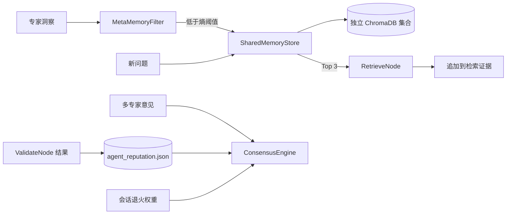

# LearnAgent 共享记忆系统

> **版本**：V2.0
> **核对日期**：2026-07-29
> **实现入口**：`model/app/agents/core/shared_memory.py`

共享记忆用于在不同推理会话之间保存高价值专家洞察，并把历史信誉引入当前会话的
专家冲突处理。它与医学文献 Hybrid RAG 是两套独立集合，不应混为同一个知识库。

## 1. 组成



| 组件 | 职责 |
|:---|:---|
| `MetaMemoryFilter` | 计算综合熵分，过滤低价值文本 |
| `SharedMemoryStore` | 使用 Qwen Embedding 写入和检索 ChromaDB |
| `AgentReputationStore` | 以 JSON 文件保存跨会话专家正确率 |
| `ConsensusEngine` | 检测意见冲突并融合信誉权重与会话权重 |
| `SharedMemorySystem` | 向编排节点提供统一调用入口 |

## 2. 元记忆过滤

### 2.1 评分

过滤器计算四个信号：

| 信号 | 默认权重 | 含义 |
|:---|:---:|:---|
| 字符级 Shannon 熵 | 0.2 | 字符分布是否分散 |
| 领域关键词密度 | 0.3 | 是否包含医学或学习领域词汇 |
| 唯一 Token 密度 | 0.3 | 文本是否具有信息量；少于 5 个 Token 时惩罚 |
| 长度得分 | 0.2 | 过短或过长文本的质量信号 |

综合分计算为：

```text
score = 0.2 * shannon
      + 0.3 * (1 - keyword_density)
      + 0.3 * (1 - token_density)
      + 0.2 * (1 - length_score)
```

默认 `score < 0.85` 才允许持久化。这里的“低熵”是项目自定义的综合质量分，
不是单独的 Shannon 熵。

### 2.2 写入内容

`ReasonNode` 会截取每个有效专家建议的前 500 个字符，以默认置信度 `0.8` 写入。
元数据包括：

- 来源专家；
- 时间戳；
- 综合熵分；
- 意图类型；
- 知识点；
- 难度和置信度。

空文本、未通过熵过滤的文本、向量服务不可用或集合模型元数据不兼容时，写入返回
`None`，主推理链继续执行。

## 3. 向量存储

### 3.1 集合隔离

集合名包含 Embedding 模型和维度，例如：

```text
shared-memory-qwen3-7-text-embedding-1024
```

集合元数据同时记录 provider、model 和 dimension。已存在集合的元数据与当前配置
不一致时，初始化失败，避免把不同维度的向量写入同一集合。

默认模型配置：

| 项目 | 值 |
|:---|:---|
| Embedding | `qwen3.7-text-embedding` |
| 维度 | 1024 |
| 距离 | cosine |
| 配置路径 | `model/app/config/shared_memory_config.yaml` |

### 3.2 检索

`RetrieveNode` 使用原始问题和当前 `intent_type` 查询共享记忆，默认取 3 条，格式化后
追加到普通 RAG 证据。

主路径先显式计算查询向量。失败后代码会使用 Chroma 集合的 `query_texts` 接口重试；
该接口仍调用相同的 Qwen embedding function，并不是真正的 BM25 关键词检索。
二次失败时返回空列表，不阻断后续推理。

### 3.3 当前容器持久化边界

共享记忆 YAML 使用相对目录 `chroma_db_shared_memory`。模型容器工作目录是 `/app`，
而当前 Compose 只把 `chroma-data` 挂载到 `/app/app/chroma_db_unified`。

因此普通 RAG 集合有命名卷，共享记忆集合在容器重建时可能丢失。生产部署应把共享记忆
目录也挂载到命名卷，或把 `persist_dir` 指向已挂载路径。

## 4. 冲突与信誉

### 4.1 冲突检测

当至少两个专家返回有效建议时，`ConsensusEngine` 对每对文本执行按空白分词的
Jaccard 重叠度计算：

```text
jaccard(A, B) = |tokens(A) ∩ tokens(B)| / |tokens(A) ∪ tokens(B)|
```

所有成对分数的平均值低于 `0.4` 时视为冲突。

当前实现使用 `str.split()`，对没有空格的中文长句区分能力有限。它是轻量启发式规则，
不是语义冲突分类器。

### 4.2 组合权重

```text
combined_weight(agent) = reputation_weight * session_weight
normalized_weight = combined_weight / sum(all combined weights)
```

最高归一化权重达到 `0.6` 时标记为达成共识，并选择该专家意见作为胜出意见。
当前实现比较的是单个专家权重，不会先把语义相同的多个意见聚为一个投票组。

### 4.3 信誉更新

信誉记录保存在 `data/agent_reputation.json`，写入时使用进程内线程锁。

- 首次出现的专家初始分为 `1.0`；
- 校验通过：所有参与专家记录一次正确；
- 校验失败：按当前会话权重排序，最低的约三分之一记录错误，其余记录正确；
- 分数为累计 `correct / total`。

JSON 文件只提供单进程写入保护。多模型实例共享同一文件时仍可能出现竞争，生产环境
需要数据库或分布式锁。

## 5. 编排集成

| 节点 | 集成行为 |
|:---|:---|
| `RetrieveNode` | 取共享记忆 Top 3，并追加到证据文本 |
| `ReasonNode` | 检测专家冲突、计算共识、计算熵分并写入洞察 |
| `ValidateNode` | 根据最终校验结果更新专家信誉 |
| `LearningState` | 传递 `shared_memory_hits`、`memory_entropy_scores`、`consensus_result` |

初始化顺序位于 `model/app/main.py`：先加载 Qwen 和 RAG，再创建
`SharedMemorySystem`，最后注入 `LearningAgent` 的检索、推理和校验节点。

## 6. 配置

```yaml
store:
  persist_dir: "chroma_db_shared_memory"
  meta_filter:
    entropy_threshold: 0.85
    keyword_weight: 0.3
    density_weight: 0.3
    shannon_weight: 0.2
    length_weight: 0.2
    min_length: 20

consensus:
  conflict_threshold: 0.4
  min_agreement_ratio: 0.6
  reputation_file: "data/agent_reputation.json"
```

配置文件还定义了 `auto_store_high_value`、`min_confidence` 和
`max_memories_per_session`。配置管理器可以读取这些值，但当前
`SharedMemorySystem` 和 `ReasonNode` 尚未用它们控制写入，因此它们不能作为已生效的
容量或置信度限制。

另外，`SharedMemorySystem.store_insight()` 的 `force` 参数当前没有继续传递到存储层，
调用该入口仍会经过熵过滤。

## 7. 测试与观测

当前自动化测试只直接覆盖了 Qwen 共享记忆集合的模型/维度隔离：

```text
model/tests/test_qwen_models.py::test_shared_memory_uses_isolated_qwen_collection
```

运行时可从日志和 `get_stats()` 观察初始化状态、记忆总数、写入熵分、检索命中数、
冲突分数和信誉变化。

仍需补充的测试：

1. 四维熵评分边界与中文样例；
2. Chroma 初始化、写入、筛选和失败重试；
3. 中文专家意见的冲突检测；
4. 校验失败后的信誉更新；
5. 多进程并发写信誉文件；
6. 容器重建后的记忆持久化。

## 8. 相关文档

- [核心算法设计文档](核心算法设计文档.md)
- [系统设计说明书](系统设计说明书.md)
- [系统测试报告](系统测试报告.md)
