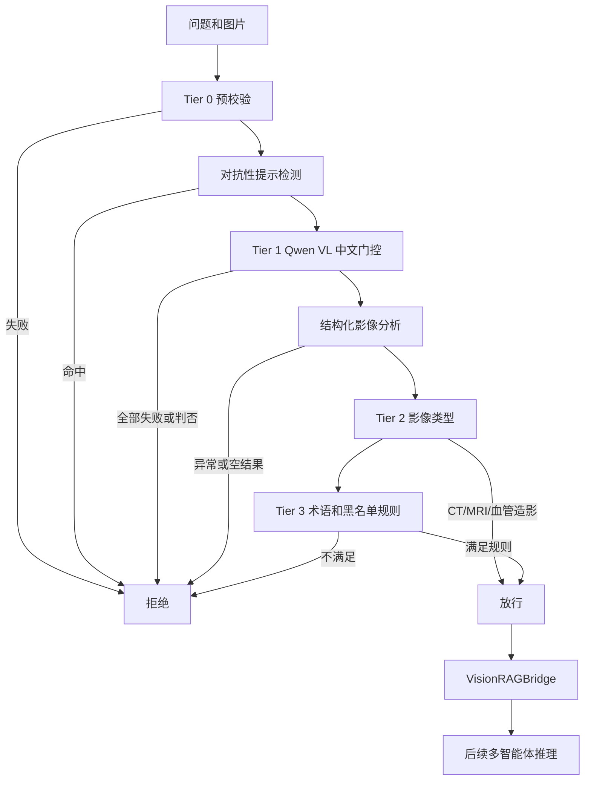

# LearnAgent 医学影像识别与拦截系统

> **版本**：V2.0
> **核对日期**：2026-07-29
> **视觉模型**：Qwen VL，默认 `qwen-vl-max`

本文档描述图片进入统一多智能体推理链时的脑卒中相关性门控，以及医学专用接口的
能力边界。实现集中在：

- `model/app/agents/orchestrators/nodes/vision_node.py`；
- `model/app/services/medical_vision_service.py`；
- `model/app/routers/medical.py`；
- `backend/server/src/main/java/com/learnagent/controller/MedicalController.java`。

## 1. 适用范围

`VisionAnalysisNode` 只在统一多智能体链路收到图片时执行：

```text
intent -> analysis -> vision -> retrieve -> reason -> validate -> report
```

专用接口 `/api/medical/analyze-image`、`compare-images`、OCR 和 DICOM 工具直接调用
医学服务，不经过同一套 `VisionAnalysisNode` 门控。它们假设用户已明确进入医学功能，
但仍需要 Java 层登录鉴权和模型服务网络隔离。

## 2. 门控流程



系统采用默认拒绝策略。缺少 Qwen API Key、门控调用异常、结构化分析失败或规则证据
不足都会拒绝图片，不会默认放行。

## 3. Tier 0：输入预校验

| 检查 | 当前规则 |
|:---|:---|
| 图片数量 | 最多 5 张 |
| 单张编码长度 | 最多 14 MiB Base64，约对应 10 MiB 原图 |
| 最小数据 | Data URI 少于 200 字节时拒绝 |
| MIME | JPEG、PNG、WebP、GIF、BMP、TIFF、DICOM |
| 非图片 MIME | 文本、PDF、ZIP、JSON、视频、音频直接拒绝 |
| 空图片 | 拒绝 |

普通 `/api/user/upload` 的单文件上限是 5 MB，与模型层 Base64 预校验上限不同。

Tier 0 会记录问题中的非医学关键词，但单个关键词不会在这一层直接拒绝；最终结合
结构化分析结果继续判断。

## 4. 对抗性提示检测

系统在调用视觉模型前检查用户问题，主要覆盖：

- 要求忽略、绕过或关闭门控；
- 要求把非医学图片假装成 CT、MRI 或脑卒中影像；
- 以测试、调试或专家身份要求强制放行；
- 重复堆砌卒中关键词干扰分类；
- 极短文本中出现“放行”“绕过”等强制词。

命中任一正则规则即返回 `rejected_by_adversarial_detection`。

## 5. Tier 1：Qwen VL 中文门控

门控向视觉模型提出二分类问题，要求只回答“是”或“否”，并在 Prompt 中强调
“不确定时拒绝”。

当前执行规则：

1. 最多检查前 3 张图片；
2. 任意一张明确通过即进入结构化分析；
3. 所有图片判否或调用失败则拒绝；
4. 未配置 `DASHSCOPE_API_KEY` 时直接拒绝。

该层使用 DashScope `MultiModalConversation` 的流式接口收集完整门控回答。

## 6. Tier 2：影像类型

结构化分析结果属于以下类型时直接放行：

- `neuroimaging_ct`；
- `neuroimaging_mri`；
- `neuroimaging_angiography`。

以下类型属于潜在相关类型，需要 Tier 3 继续判断：

- 病理切片、临床照片；
- 化验单、影像报告、心电图；
- 医学插图。

课件图片和未知类型使用更严格的组合阈值。

## 7. Tier 3：硬规则

系统把影像类型、解剖区域、关键发现、异常描述、鉴别诊断、原始模型描述和用户问题
合并为判定文本。

### 7.1 优先拒绝

若文本命中非医学指标，直接拒绝。词库覆盖：

- 数学、考试、代码和普通文档；
- 人像、日常场景、社交媒体和娱乐内容；
- 非脑卒中相关专科影像；
- 空白、纯色或严重模糊图片描述。

### 7.2 放行阈值

| 场景 | 放行条件 |
|:---|:---|
| 通用强医学证据 | 医学解剖术语不少于 5 个 |
| 卒中组合证据 | 卒中关键词不少于 3 个，且医学术语不少于 2 个 |
| 潜在相关类型 | 医学术语不少于 3 个，且置信度大于 0.3 |
| 课件图片 | 卒中关键词不少于 2 个、医学术语不少于 3 个、置信度大于 0.4 |
| 未知类型规则一 | 医学术语不少于 4 个 |
| 未知类型规则二 | 卒中关键词不少于 2 个，且医学术语不少于 2 个 |

没有命中任何放行条件时默认拒绝。若用户问题命中至少 3 个非医学意图关键词，也会拒绝。

## 8. 放行后的处理

`MedicalVisionService` 根据问题关键词选择医学专用 Prompt，支持：

- CT、MRI、血管造影；
- 病理切片、临床照片、心电图；
- 化验单、影像报告、医学图解和课件；
- 单图结构化结果与多图比较；
- DICOM 元数据和 PNG 预览；
- 化验单、处方和通用医学 OCR。

结构化结果包括影像类型、解剖区域、关键发现、异常、正常结构、鉴别诊断、建议检查、
置信度和原始描述。JSON 解析失败时保留原始模型文本作为回退结果。

`VisionRAGBridge` 再从本地文献中检索最多 3 条相关证据，把影像发现和文献证据合并到
后续专家推理状态。

## 9. 接口边界

| Java 接口 | SSE | 是否经过统一门控 |
|:---|:---:|:---:|
| `/api/medical/analyze-image` | 否 | 否 |
| `/api/medical/analyze-case` | 是 | 是 |
| `/api/medical/compare-images` | 否 | 否 |
| `/api/medical/dicom-metadata` | 否 | 否 |
| `/api/medical/ocr/lab-report` | 否 | 否 |
| `/api/medical/ocr/prescription` | 否 | 否 |
| `/api/medical/dicom-to-png` | 否 | 否 |

通用辅导或其他统一推理入口只要携带图片，也会进入 `VisionAnalysisNode`。

## 10. 错误与安全行为

| 场景 | 行为 |
|:---|:---|
| 无图片 | 跳过影像节点或返回 422，取决于接口 |
| 无 API Key | 统一门控拒绝；专用分析接口返回受控错误 |
| Qwen VL 门控异常 | 该图片视为未通过；全部异常则拒绝 |
| 结构化分析异常 | 拒绝，不把空发现注入 RAG |
| DICOM 依赖缺失 | 返回空元数据或转换失败，不伪造结果 |
| 非医学/对抗输入 | 返回拒绝状态，不进入专家报告生成 |

医学输出用于学习和教学辅助。前端和报告不得把模型结果表达为已确诊结论，涉及真实患者
时必须由具备资质的临床人员复核。

## 11. 测试现状

当前直接相关的自动化测试只验证无 API Key 时门控默认拒绝：

```text
model/tests/test_agent_runner_input_order.py
```

尚需补充：

1. Tier 0 数量、大小和 MIME 边界；
2. 对抗性 Prompt 正反样例；
3. Tier 1 “是/否”解析和三图上限；
4. Tier 2/3 各阈值边界；
5. 专用接口与统一门控的差异；
6. DICOM、OCR 依赖缺失和错误响应；
7. 真实匿名医学影像的误拒率与误放率评估。

## 12. 相关文档

- [接口文档](../api/LearnAgent系统接口文档.md)
- [核心算法设计文档](核心算法设计文档.md)
- [系统测试报告](系统测试报告.md)
