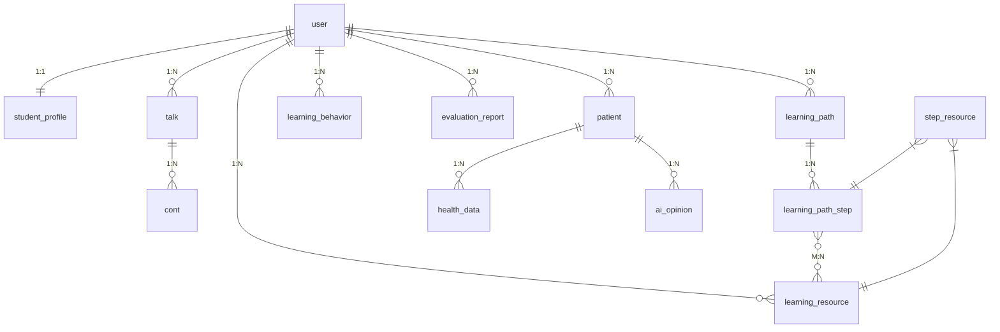

# 多智能体个性化学习系统 — 数据库设计手册

> **版本**：V2.0  
> **项目名称**：LearnAgent  
> **数据库**：MySQL 8.0 (兼容 5.7)  
> **字符集**：utf8mb4  
> **编制日期**：2026-07-17  

---

## 1. 数据库概述

### 1.1 基本信息

| 属性 | 值 |
|:---|:---|
| 数据库名 | medai |
| 引擎 | InnoDB |
| 字符集 | utf8mb4 |
| 排序规则 | utf8mb4_general_ci |
| 主键策略 | BIGINT UNSIGNED AUTO_INCREMENT |
| 时间字段 | DATETIME，默认 CURRENT_TIMESTAMP |
| 软删除 | 未采用，使用 ON DELETE CASCADE |

### 1.2 表清单

| 序号 | 表名 | 中文名 | 记录类型 | 外键关系 |
|:---:|:---|:---|:---|:---|
| 1 | user | 用户表 | 主数据 | 根表 |
| 2 | student_profile | 学生画像表 | 主数据 | user_id FK |
| 3 | talk | 对话记录表 | 事务数据 | user_id FK |
| 4 | cont | 消息内容表 | 事务数据 | talk_id FK |
| 5 | learning_resource | 学习资源表 | 主数据 | user_id FK |
| 6 | learning_path | 学习路径表 | 主数据 | user_id FK |
| 7 | learning_path_step | 路径步骤表 | 主数据 | path_id FK |
| 8 | step_resource | 步骤资源关联表 | 关联数据 | step_id + resource_id FK |
| 9 | learning_behavior | 学习行为表 | 事务数据 | user_id + path_id FK |
| 10 | evaluation_report | 评估报告表 | 主数据 | user_id FK |
| 11 | patient | 患者信息表 | 主数据 | doctor_id FK |
| 12 | health_data | 健康数据表 | 事务数据 | patient_id FK |
| 13 | ai_opinion | AI意见表 | 事务数据 | patient_id FK |
| 14 | learning_material | 学习资料表 | 参考数据 | 无 |

---

## 2. ER 关系图



---

## 3. 表结构详细设计

### 3.1 user — 用户表

```sql
CREATE TABLE user (
    id          BIGINT UNSIGNED AUTO_INCREMENT PRIMARY KEY,
    name        VARCHAR(50)  NOT NULL UNIQUE COMMENT '用户名',
    password    VARCHAR(255) NOT NULL        COMMENT 'BCrypt哈希密码',
    image       VARCHAR(500) DEFAULT NULL    COMMENT '头像URL',
    major       VARCHAR(100) DEFAULT NULL    COMMENT '专业',
    grade       VARCHAR(20)  DEFAULT NULL    COMMENT '年级',
    specialty   VARCHAR(200) DEFAULT NULL    COMMENT '专长',
    create_time DATETIME DEFAULT CURRENT_TIMESTAMP,
    update_time DATETIME DEFAULT CURRENT_TIMESTAMP ON UPDATE CURRENT_TIMESTAMP,
    INDEX idx_name (name)
) ENGINE=InnoDB DEFAULT CHARSET=utf8mb4 COMMENT='用户表';
```

| 字段 | 类型 | 约束 | 说明 |
|:---|:---|:---|:---|
| id | BIGINT | PK, AUTO_INCREMENT | 用户ID |
| name | VARCHAR(50) | NOT NULL, UNIQUE | 用户名 |
| password | VARCHAR(255) | NOT NULL | BCrypt加密 |
| image | VARCHAR(500) | NULL | OSS头像URL |
| major | VARCHAR(100) | NULL | 专业 (如: 临床医学) |
| grade | VARCHAR(20) | NULL | 年级 (如: 大三) |
| specialty | VARCHAR(200) | NULL | 专长方向 |
| create_time | DATETIME | DEFAULT NOW() | 注册时间 |
| update_time | DATETIME | ON UPDATE | 最后修改时间 |

### 3.2 student_profile — 学生画像表

```sql
CREATE TABLE student_profile (
    id          BIGINT UNSIGNED AUTO_INCREMENT PRIMARY KEY,
    user_id     BIGINT UNSIGNED NOT NULL UNIQUE COMMENT '用户ID',
    dimensions  JSON            DEFAULT NULL COMMENT '8维度画像JSON',
    raw_summary TEXT            DEFAULT NULL COMMENT '对话摘要',
    version     INT             DEFAULT 1 COMMENT '版本号',
    create_time DATETIME DEFAULT CURRENT_TIMESTAMP,
    update_time DATETIME DEFAULT CURRENT_TIMESTAMP ON UPDATE CURRENT_TIMESTAMP,
    FOREIGN KEY (user_id) REFERENCES user(id) ON DELETE CASCADE,
    INDEX idx_user_id (user_id)
) ENGINE=InnoDB DEFAULT CHARSET=utf8mb4 COMMENT='学生画像表';
```

**dimensions JSON 结构**:

```json
{
  "learning_style": "视觉型(70%) + 动手型(30%)",
  "knowledge_level": "中级: 掌握基础知识, 临床经验不足",
  "learning_goal": "通过期末考试, 准备执业医师考试",
  "time_availability": "每周10-15小时, 周末集中",
  "weak_points": "脑血管解剖, 脑卒中影像鉴别",
  "strengths": "神经系统查体, 神经病理生理",
  "preferred_resources": "视频讲解, 思维导图, 临床案例",
  "learning_progress": "已完成脑血管病60%, 癫痫30%"
}
```

### 3.3 talk — 对话记录表

```sql
CREATE TABLE talk (
    id          BIGINT UNSIGNED AUTO_INCREMENT PRIMARY KEY,
    user_id     BIGINT UNSIGNED NOT NULL COMMENT '用户ID',
    title       TEXT            DEFAULT NULL COMMENT '对话标题',
    content     LONGTEXT        DEFAULT NULL COMMENT '对话内容',
    create_time DATETIME DEFAULT CURRENT_TIMESTAMP,
    update_time DATETIME DEFAULT CURRENT_TIMESTAMP ON UPDATE CURRENT_TIMESTAMP,
    FOREIGN KEY (user_id) REFERENCES user(id) ON DELETE CASCADE,
    INDEX idx_user_id (user_id),
    INDEX idx_create_time (create_time)
) ENGINE=InnoDB DEFAULT CHARSET=utf8mb4 COMMENT='对话记录表';
```

### 3.4 cont — 消息内容表

```sql
CREATE TABLE cont (
    id          BIGINT UNSIGNED AUTO_INCREMENT PRIMARY KEY,
    user_id     BIGINT UNSIGNED NOT NULL COMMENT '用户ID',
    talk_id     BIGINT UNSIGNED NOT NULL COMMENT '对话ID',
    content     LONGTEXT        DEFAULT NULL COMMENT '消息内容',
    role        VARCHAR(20)     DEFAULT 'user' COMMENT '角色: user/assistant',
    images      TEXT            DEFAULT NULL COMMENT '图片JSON数组',
    create_time DATETIME DEFAULT CURRENT_TIMESTAMP,
    FOREIGN KEY (talk_id) REFERENCES talk(id) ON DELETE CASCADE,
    INDEX idx_talk_id (talk_id),
    INDEX idx_create_time (create_time)
) ENGINE=InnoDB DEFAULT CHARSET=utf8mb4 COMMENT='消息内容表';
```

### 3.5 learning_resource — 学习资源表

```sql
CREATE TABLE learning_resource (
    id               BIGINT UNSIGNED AUTO_INCREMENT PRIMARY KEY,
    user_id          BIGINT UNSIGNED NOT NULL COMMENT '用户ID',
    title            VARCHAR(500) DEFAULT NULL COMMENT '资源标题',
    type             VARCHAR(50)  DEFAULT NULL COMMENT '资源类型',
    course_name      VARCHAR(200) DEFAULT NULL COMMENT '课程名',
    knowledge_points JSON         DEFAULT NULL COMMENT '知识点JSON',
    difficulty       VARCHAR(20)  DEFAULT NULL COMMENT '难度',
    content          LONGTEXT     DEFAULT NULL COMMENT '资源内容',
    file_url         VARCHAR(500) DEFAULT NULL COMMENT '文件URL',
    metadata         JSON         DEFAULT NULL COMMENT '元数据',
    talk_id          BIGINT UNSIGNED DEFAULT NULL COMMENT '关联对话ID',
    create_time      DATETIME DEFAULT CURRENT_TIMESTAMP,
    update_time      DATETIME DEFAULT CURRENT_TIMESTAMP ON UPDATE CURRENT_TIMESTAMP,
    FOREIGN KEY (user_id) REFERENCES user(id) ON DELETE CASCADE,
    INDEX idx_user_id (user_id),
    INDEX idx_type (type),
    INDEX idx_course_name (course_name)
) ENGINE=InnoDB DEFAULT CHARSET=utf8mb4 COMMENT='学习资源表';
```

**资源类型枚举**:

| type值 | 含义 |
|:---|:---|
| document | 课程讲解文档 |
| mindmap | 思维导图 |
| quiz | 练习题目 |
| reading | 拓展阅读 |
| case_study | 临床案例 |
| code_practice | 代码实操 |
| code_example | 代码示例 |

### 3.6 learning_path — 学习路径表

```sql
CREATE TABLE learning_path (
    id               BIGINT UNSIGNED AUTO_INCREMENT PRIMARY KEY,
    user_id          BIGINT UNSIGNED NOT NULL COMMENT '用户ID',
    course_name      VARCHAR(200) DEFAULT NULL COMMENT '课程名',
    goal_description TEXT         DEFAULT NULL COMMENT '目标描述',
    total_steps      INT          DEFAULT 0 COMMENT '总步数',
    completed_steps  INT          DEFAULT 0 COMMENT '已完成步数',
    estimated_days   INT          DEFAULT NULL COMMENT '预估天数',
    deadline         DATE         DEFAULT NULL COMMENT '截止日期',
    status           VARCHAR(20)  DEFAULT 'active' COMMENT '状态',
    create_time      DATETIME DEFAULT CURRENT_TIMESTAMP,
    update_time      DATETIME DEFAULT CURRENT_TIMESTAMP ON UPDATE CURRENT_TIMESTAMP,
    FOREIGN KEY (user_id) REFERENCES user(id) ON DELETE CASCADE,
    INDEX idx_user_id (user_id),
    INDEX idx_status (status)
) ENGINE=InnoDB DEFAULT CHARSET=utf8mb4 COMMENT='学习路径表';
```

### 3.7 learning_path_step — 路径步骤表

```sql
CREATE TABLE learning_path_step (
    id               BIGINT UNSIGNED AUTO_INCREMENT PRIMARY KEY,
    path_id          BIGINT UNSIGNED NOT NULL COMMENT '路径ID',
    order_index      INT          NOT NULL COMMENT '排序序号',
    title            VARCHAR(500) NOT NULL COMMENT '步骤标题',
    description      TEXT         DEFAULT NULL COMMENT '步骤描述',
    knowledge_points JSON         DEFAULT NULL COMMENT '知识点',
    estimated_hours  DECIMAL(5,1) DEFAULT NULL COMMENT '预估学时',
    difficulty       VARCHAR(20)  DEFAULT NULL COMMENT '难度',
    status           VARCHAR(20)  DEFAULT 'pending' COMMENT '状态',
    actual_hours     DECIMAL(5,1) DEFAULT NULL COMMENT '实际学时',
    feedback         TEXT         DEFAULT NULL COMMENT '学习反馈',
    self_rating      TINYINT      DEFAULT NULL COMMENT '自评(1-5)',
    prerequisites    JSON         DEFAULT NULL COMMENT '前置步骤',
    create_time      DATETIME DEFAULT CURRENT_TIMESTAMP,
    update_time      DATETIME DEFAULT CURRENT_TIMESTAMP ON UPDATE CURRENT_TIMESTAMP,
    FOREIGN KEY (path_id) REFERENCES learning_path(id) ON DELETE CASCADE,
    INDEX idx_path_id (path_id),
    INDEX idx_order_index (path_id, order_index)
) ENGINE=InnoDB DEFAULT CHARSET=utf8mb4 COMMENT='路径步骤表';
```

### 3.8 step_resource — 步骤资源关联表

```sql
CREATE TABLE step_resource (
    id             BIGINT UNSIGNED AUTO_INCREMENT PRIMARY KEY,
    step_id        BIGINT UNSIGNED NOT NULL COMMENT '步骤ID',
    resource_id    BIGINT UNSIGNED NOT NULL COMMENT '资源ID',
    relevance      DECIMAL(3,2) DEFAULT 0.00 COMMENT '关联度',
    is_recommended TINYINT      DEFAULT 0 COMMENT '是否推荐',
    create_time    DATETIME DEFAULT CURRENT_TIMESTAMP,
    FOREIGN KEY (step_id) REFERENCES learning_path_step(id) ON DELETE CASCADE,
    FOREIGN KEY (resource_id) REFERENCES learning_resource(id) ON DELETE CASCADE,
    UNIQUE KEY uk_step_resource (step_id, resource_id),
    INDEX idx_step_id (step_id),
    INDEX idx_resource_id (resource_id)
) ENGINE=InnoDB DEFAULT CHARSET=utf8mb4 COMMENT='步骤资源关联表';
```

### 3.9 learning_behavior — 学习行为表

```sql
CREATE TABLE learning_behavior (
    id            BIGINT UNSIGNED AUTO_INCREMENT PRIMARY KEY,
    user_id       BIGINT UNSIGNED NOT NULL COMMENT '用户ID',
    path_id       BIGINT UNSIGNED DEFAULT NULL COMMENT '路径ID',
    step_id       BIGINT UNSIGNED DEFAULT NULL COMMENT '步骤ID',
    resource_id   BIGINT UNSIGNED DEFAULT NULL COMMENT '资源ID',
    behavior_type VARCHAR(50)  NOT NULL COMMENT '行为类型',
    duration      INT           DEFAULT 0 COMMENT '时长(秒)',
    score         DECIMAL(5,2)  DEFAULT NULL COMMENT '得分',
    detail        JSON          DEFAULT NULL COMMENT '详情',
    create_time   DATETIME DEFAULT CURRENT_TIMESTAMP,
    FOREIGN KEY (user_id) REFERENCES user(id) ON DELETE CASCADE,
    FOREIGN KEY (path_id) REFERENCES learning_path(id) ON DELETE SET NULL,
    INDEX idx_user_id (user_id),
    INDEX idx_behavior_type (behavior_type),
    INDEX idx_create_time (create_time)
) ENGINE=InnoDB DEFAULT CHARSET=utf8mb4 COMMENT='学习行为表';
```

**行为类型枚举**: view_resource / complete_step / take_quiz / start_path / complete_path / ask_question

### 3.10 evaluation_report — 评估报告表

```sql
CREATE TABLE evaluation_report (
    id             BIGINT UNSIGNED AUTO_INCREMENT PRIMARY KEY,
    user_id        BIGINT UNSIGNED NOT NULL COMMENT '用户ID',
    path_id        BIGINT UNSIGNED DEFAULT NULL COMMENT '路径ID',
    period         VARCHAR(50)  DEFAULT NULL COMMENT '评估周期',
    overall_score  INT           DEFAULT NULL COMMENT '综合评分',
    level          VARCHAR(20)  DEFAULT NULL COMMENT '等级',
    dimensions     JSON          DEFAULT NULL COMMENT '维度评分',
    strengths      JSON          DEFAULT NULL COMMENT '优势',
    weaknesses     JSON          DEFAULT NULL COMMENT '薄弱点',
    suggestions    JSON          DEFAULT NULL COMMENT '建议',
    create_time    DATETIME DEFAULT CURRENT_TIMESTAMP,
    FOREIGN KEY (user_id) REFERENCES user(id) ON DELETE CASCADE,
    INDEX idx_user_id (user_id)
) ENGINE=InnoDB DEFAULT CHARSET=utf8mb4 COMMENT='评估报告表';
```

### 3.11 patient — 患者信息表

```sql
CREATE TABLE patient (
    id          BIGINT UNSIGNED AUTO_INCREMENT PRIMARY KEY,
    name        VARCHAR(100) NOT NULL COMMENT '患者姓名',
    history     TEXT         DEFAULT NULL COMMENT '病史',
    notes       TEXT         DEFAULT NULL COMMENT '备注',
    doctor_id   BIGINT UNSIGNED NOT NULL COMMENT '医生ID',
    create_time DATETIME DEFAULT CURRENT_TIMESTAMP,
    update_time DATETIME DEFAULT CURRENT_TIMESTAMP ON UPDATE CURRENT_TIMESTAMP,
    FOREIGN KEY (doctor_id) REFERENCES user(id) ON DELETE CASCADE,
    INDEX idx_doctor_id (doctor_id)
) ENGINE=InnoDB DEFAULT CHARSET=utf8mb4 COMMENT='患者信息表';
```

### 3.12 health_data — 健康数据表

```sql
CREATE TABLE health_data (
    id          BIGINT UNSIGNED AUTO_INCREMENT PRIMARY KEY,
    patient_id  BIGINT UNSIGNED NOT NULL COMMENT '患者ID',
    data_type   VARCHAR(50)  NOT NULL COMMENT '数据类型',
    data_value  JSON          DEFAULT NULL COMMENT '数据值',
    record_time DATETIME DEFAULT NULL COMMENT '记录时间',
    FOREIGN KEY (patient_id) REFERENCES patient(id) ON DELETE CASCADE,
    INDEX idx_patient_id (patient_id),
    INDEX idx_data_type (data_type)
) ENGINE=InnoDB DEFAULT CHARSET=utf8mb4 COMMENT='健康数据表';
```

### 3.13 ai_opinion — AI意见表

```sql
CREATE TABLE ai_opinion (
    id          BIGINT UNSIGNED AUTO_INCREMENT PRIMARY KEY,
    patient_id  BIGINT UNSIGNED NOT NULL COMMENT '患者ID',
    content     TEXT         NOT NULL COMMENT 'AI意见内容',
    model_name  VARCHAR(50)  DEFAULT NULL COMMENT '模型名',
    create_time DATETIME DEFAULT CURRENT_TIMESTAMP,
    FOREIGN KEY (patient_id) REFERENCES patient(id) ON DELETE CASCADE,
    INDEX idx_patient_id (patient_id)
) ENGINE=InnoDB DEFAULT CHARSET=utf8mb4 COMMENT='AI意见表';
```

### 3.14 learning_material — 学习资料表

```sql
CREATE TABLE learning_material (
    id      BIGINT UNSIGNED AUTO_INCREMENT PRIMARY KEY,
    title   VARCHAR(500) NOT NULL COMMENT '资料标题',
    content LONGTEXT     DEFAULT NULL COMMENT '资料内容',
    type    VARCHAR(50)  DEFAULT NULL COMMENT '资料类型',
    INDEX idx_type (type)
) ENGINE=InnoDB DEFAULT CHARSET=utf8mb4 COMMENT='学习资料表';
```

---

## 4. 索引策略

### 4.1 索引清单

| 表名 | 索引名 | 字段 | 类型 | 用途 |
|:---|:---|:---|:---|:---|
| user | idx_name | name | 普通 | 登录查询 |
| student_profile | idx_user_id | user_id | 普通 | 画像查询 |
| talk | idx_user_id | user_id | 普通 | 对话列表 |
| talk | idx_create_time | create_time | 普通 | 时间排序 |
| cont | idx_talk_id | talk_id | 普通 | 消息查询 |
| cont | idx_create_time | create_time | 普通 | 时间排序 |
| learning_resource | idx_user_id | user_id | 普通 | 资源列表 |
| learning_resource | idx_type | type | 普通 | 类型筛选 |
| learning_resource | idx_course_name | course_name | 普通 | 课程筛选 |
| learning_path | idx_user_id | user_id | 普通 | 路径列表 |
| learning_path | idx_status | status | 普通 | 状态筛选 |
| learning_path_step | idx_path_id | path_id | 普通 | 步骤查询 |
| learning_path_step | idx_order_index | path_id, order_index | 联合 | 排序查询 |
| step_resource | uk_step_resource | step_id, resource_id | 唯一 | 防重复关联 |
| step_resource | idx_step_id | step_id | 普通 | 步骤关联 |
| step_resource | idx_resource_id | resource_id | 普通 | 资源关联 |
| learning_behavior | idx_user_id | user_id | 普通 | 行为查询 |
| learning_behavior | idx_behavior_type | behavior_type | 普通 | 类型筛选 |
| learning_behavior | idx_create_time | create_time | 普通 | 时间排序 |
| evaluation_report | idx_user_id | user_id | 普通 | 报告查询 |
| patient | idx_doctor_id | doctor_id | 普通 | 医生患者 |
| health_data | idx_patient_id | patient_id | 普通 | 数据查询 |
| health_data | idx_data_type | data_type | 普通 | 类型筛选 |
| ai_opinion | idx_patient_id | patient_id | 普通 | 意见查询 |
| learning_material | idx_type | type | 普通 | 类型筛选 |

### 4.2 索引设计原则

| 原则 | 说明 |
|:---|:---|
| 外键必建索引 | 所有外键字段均建立索引，加速 JOIN 查询 |
| 高频查询字段 | 用户ID、状态、类型等高频 WHERE 字段 |
| 联合索引左前缀 | 符合最左前缀原则，如 (path_id, order_index) |
| 唯一约束 | step_resource 的 (step_id, resource_id) 联合唯一 |

---

## 5. 外键约束与级联策略

| 父表 | 子表 | 外键字段 | 删除策略 | 更新策略 |
|:---|:---|:---|:---|:---|
| user | student_profile | user_id | CASCADE | CASCADE |
| user | talk | user_id | CASCADE | CASCADE |
| user | learning_resource | user_id | CASCADE | CASCADE |
| user | learning_path | user_id | CASCADE | CASCADE |
| user | learning_behavior | user_id | CASCADE | CASCADE |
| user | evaluation_report | user_id | CASCADE | CASCADE |
| user | patient | doctor_id | CASCADE | CASCADE |
| talk | cont | talk_id | CASCADE | CASCADE |
| learning_path | learning_path_step | path_id | CASCADE | CASCADE |
| learning_path_step | step_resource | step_id | CASCADE | CASCADE |
| learning_resource | step_resource | resource_id | CASCADE | CASCADE |
| patient | health_data | patient_id | CASCADE | CASCADE |
| patient | ai_opinion | patient_id | CASCADE | CASCADE |
| learning_path | learning_behavior | path_id | SET NULL | CASCADE |

---

## 6. 数据字典

### 6.1 状态枚举

| 表 | 字段 | 枚举值 | 说明 |
|:---|:---|:---|:---|
| learning_path | status | active / completed / paused / abandoned | 路径状态 |
| learning_path_step | status | pending / in_progress / completed / skipped | 步骤状态 |
| cont | role | user / assistant | 消息角色 |
| learning_resource | type | document / mindmap / quiz / reading / case_study / code_practice / code_example | 资源类型 |
| learning_behavior | behavior_type | view_resource / complete_step / take_quiz / start_path / complete_path / ask_question | 行为类型 |
| evaluation_report | level | A / B / C / D / E | 评估等级 |

### 6.2 字段规范

| 规范 | 说明 |
|:---|:---|
| 主键 | BIGINT UNSIGNED AUTO_INCREMENT，统一命名 id |
| 时间 | DATETIME，create_time 默认 CURRENT_TIMESTAMP，update_time ON UPDATE |
| 布尔 | TINYINT(1)，0/1 表示 false/true |
| JSON | JSON 类型存储维度数据、知识点、元数据 |
| 文本 | VARCHAR 用于短文本，TEXT/LONGTEXT 用于长文本 |
| 字符集 | 所有表统一 utf8mb4 |

---

## 7. 性能优化建议

| 建议 | 说明 |
|:---|:---|
| 分页优化 | 使用 MyBatis-Plus 分页插件，避免全表扫描 |
| 慢查询监控 | 开启 MySQL slow_query_log，阈值 2s |
| 连接池 | HikariCP maximum-pool-size=15，匹配 2核4G |
| JSON 查询 | 对 JSON 字段使用 MySQL 8.0 JSON_EXTRACT 函数 |
| 定期归档 | learning_behavior 表按月归档，保留最近 6 个月 |
| 读写分离 | 后续可扩展 MySQL 主从复制 |

---

> **关联文档**: [系统设计说明书](系统设计说明书.md) | [核心算法设计文档](核心算法设计文档.md) | [测试报告](系统测试报告.md) | [需求规格说明书](需求规格说明书.md)