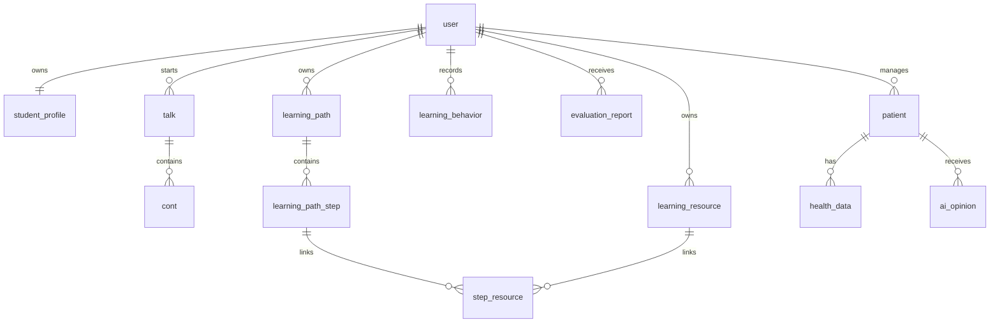

# LearnAgent 数据库设计手册

> **版本**：V3.0
> **核对日期**：2026-07-29
> **运行基线**：MySQL 8.0、InnoDB、utf8mb4
> **结构来源**：`backend/server/learningo_agents.sql`

本文档描述当前代码实际使用的数据模型。字段、索引和外键的最终事实以初始化 SQL
和 Java 实体为准，本文重点说明表职责、关系、初始化风险与维护规则。

## 1. 数据库基线

| 项目 | 当前值 |
|:---|:---|
| Docker 数据库名 | `learningo-agents` |
| 数据库镜像 | `mysql:8.0` |
| 存储引擎 | InnoDB |
| 字符集 | utf8mb4 |
| 主键 | `BIGINT UNSIGNED AUTO_INCREMENT` |
| ORM | MyBatis-Plus |
| 初始化脚本 | `backend/server/learningo_agents.sql` |

初始化 SQL 的转储注释仍写有旧库名 `medai` 和 MySQL 5.7 来源信息，但脚本没有
`USE medai`。Docker 会把它导入 `MYSQL_DATABASE=learningo-agents` 指定的数据库。

`backend/server/src/main/resources/db/schema_additions.sql` 是历史增量脚本，包含
`USE medai` 和旧字段命名，不在 Docker Compose 初始化链路中。不要在完整初始化脚本
之后再次执行它。

## 2. 表清单

当前共 14 张表。

| 分类 | 表 | 主要职责 |
|:---|:---|:---|
| 用户 | `user` | 登录凭据、头像、专业、年级和专长 |
| 画像 | `student_profile` | 用户的一份八维画像、摘要和版本号 |
| 对话 | `talk` | 对话归属、标题、摘要和更新时间 |
| 对话 | `cont` | 用户/助手消息、文本和图片 JSON |
| 资源 | `learning_resource` | AI 生成的学习资源及其元数据 |
| 路径 | `learning_path` | 学习目标、状态、进度和截止日期 |
| 路径 | `learning_path_step` | 路径内有序步骤和步骤状态 |
| 路径 | `step_resource` | 步骤与资源的多对多关联 |
| 评估 | `learning_behavior` | 浏览、完成、测验、提问等行为事件 |
| 评估 | `evaluation_report` | 评估分数、等级、建议和知识点数据 |
| 医疗 | `patient` | 当前用户管理的患者资料 |
| 医疗 | `health_data` | 患者健康数据文本 |
| 医疗 | `ai_opinion` | 病例或对话派生的 AI 意见 |
| 资料 | `learning_material` | 医学学习资料元数据和内容 |

## 3. 关系模型



实线关系代表初始化 SQL 中存在的外键。以下字段只有业务关联，没有数据库外键：

- `learning_resource.talk_id`；
- `learning_behavior.path_id`、`step_id`、`resource_id`；
- `evaluation_report.path_id`；
- `ai_opinion.source_id`，其含义由 `source_type` 决定。

删除这些业务对象时，服务层必须自行维护弱关联数据，不能依赖数据库级联。

## 4. 核心表设计

### 4.1 用户与画像

#### `user`

关键字段：

| 字段 | 说明 |
|:---|:---|
| `id` | 用户主键 |
| `name` | 唯一登录名 |
| `password` | BCrypt 密码哈希；旧数据可能由兼容逻辑升级 |
| `image` | 头像 URL |
| `major` / `grade` / `specialty` | 学业背景 |
| `create_time` / `update_time` | 创建和更新时间 |

#### `student_profile`

`user_id` 有唯一约束，因此一个用户只有一条当前画像记录。`dimensions` 保存八维 JSON，
`raw_summary` 保存提取摘要，`version` 每次自动或手动更新时递增。

### 4.2 对话与消息

#### `talk`

每条对话归属一个用户。`content` 当前同时承担对话标题/业务类型标记，
`summary` 用于列表摘要。业务代码会校验对话所有者和对话类型后再复用 `talkId`。

#### `cont`

| 字段 | 说明 |
|:---|:---|
| `user_id` | 冗余记录用户，便于查询 |
| `talk_id` | 所属对话，删除对话时级联删除消息 |
| `content` | 消息正文 |
| `role` | `user` 或 `assistant` |
| `images` | 用户图片的 JSON 数组，可能为空 |

AI 流式过程事件不逐条入库；结束后只保存最终聚合回答。

### 4.3 学习资源与路径

`learning_resource` 保存资源类型、标题、正文、难度、课程、知识点和生成参数。
`learning_path` 保存目标、步骤统计、预计天数、截止日期和整体状态。

`learning_path_step` 通过 `(path_id, order_index)` 索引维持步骤顺序。
`step_resource` 使用两个外键连接步骤和资源；当前 SQL 没有
`(step_id, resource_id)` 唯一约束，服务层应避免重复插入。

### 4.4 行为与评估

`learning_behavior` 是事件表，常用类型包括：

- `view_resource`；
- `complete_step`；
- `take_quiz`；
- `start_path` / `complete_path`；
- `ask_question`。

`evaluation_report` 保存总分、等级、五维指标、知识点掌握、优势、薄弱项、建议和
原始报告内容。列表查询应按 `user_id` 过滤，详情查询还要检查记录所有权。

### 4.5 医疗扩展

`patient.doctor_id` 指向当前系统用户。`health_data` 与 `ai_opinion` 通过
`patient_id` 归属患者。`ai_opinion.source_type` 可区分健康数据分析和对话同步，
`source_id` 保存相应来源 ID。

这些表可能包含健康信息和模型建议，生产环境必须配置访问审计、备份加密和最小权限。

## 5. 外键与删除行为

| 父表 | 子表 | 删除行为 |
|:---|:---|:---|
| `user` | `student_profile` | CASCADE |
| `user` | `talk` | CASCADE |
| `talk` | `cont` | CASCADE |
| `user` | `learning_resource` | CASCADE |
| `user` | `learning_path` | CASCADE |
| `learning_path` | `learning_path_step` | CASCADE |
| `learning_path_step` | `step_resource` | CASCADE |
| `learning_resource` | `step_resource` | CASCADE |
| `user` | `learning_behavior` | CASCADE |
| `user` | `evaluation_report` | CASCADE |
| `user` | `patient` | 默认限制行为 |
| `patient` | `health_data` / `ai_opinion` | CASCADE |

删除用户前应先评估 `patient` 的限制关系，否则数据库可能拒绝删除。

## 6. 初始化与迁移

### 6.1 Docker 初始化

`docker-compose.yml` 将完整 SQL 挂载为：

```text
/docker-entrypoint-initdb.d/01-init.sql
```

MySQL 只会在数据卷首次创建时执行该脚本。修改 SQL 后重启容器不会自动迁移已有数据库。

### 6.2 当前脚本风险

`learningo_agents.sql` 是完整转储，包含：

- `DROP TABLE` 和建表语句；
- 演示用户及密码哈希；
- 对话、患者信息和较长的医学分析样例；
- 显式自增起始值。

因此它适合本地演示环境，不应原样用于生产升级。

### 6.3 生产建议

1. 把纯结构、基础字典和演示数据拆成三个文件；
2. 使用 Flyway 或 Liquibase 管理只向前的版本化迁移；
3. 为弱关联字段补充外键或明确的清理任务；
4. 为 `step_resource` 增加联合唯一约束；
5. 对演示医疗数据做匿名化，生产种子数据不得含真实身份信息；
6. 每次迁移前备份，并在同版本副本上验证回滚方案。

## 7. 查询与索引约定

- 所有用户数据查询必须带 `user_id` 或通过父对象校验所有权；
- 对话内容按主键或创建时间升序读取；
- 列表查询按更新时间或创建时间降序；
- 高频筛选优先使用已有 `user_id`、`path_id`、`patient_id` 索引；
- JSON 字段只用于低频结构化数据，不替代需要检索和约束的关系字段；
- 分页接口必须设置上限，避免把对话或行为表一次性全部载入内存。

## 8. 关联文档

- [系统设计说明书](系统设计说明书.md)
- [接口文档](../api/LearnAgent系统接口文档.md)
- [系统测试报告](系统测试报告.md)
- [需求规格说明书](需求规格说明书.md)
