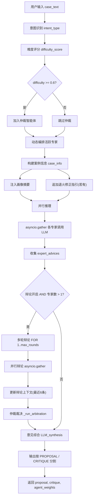
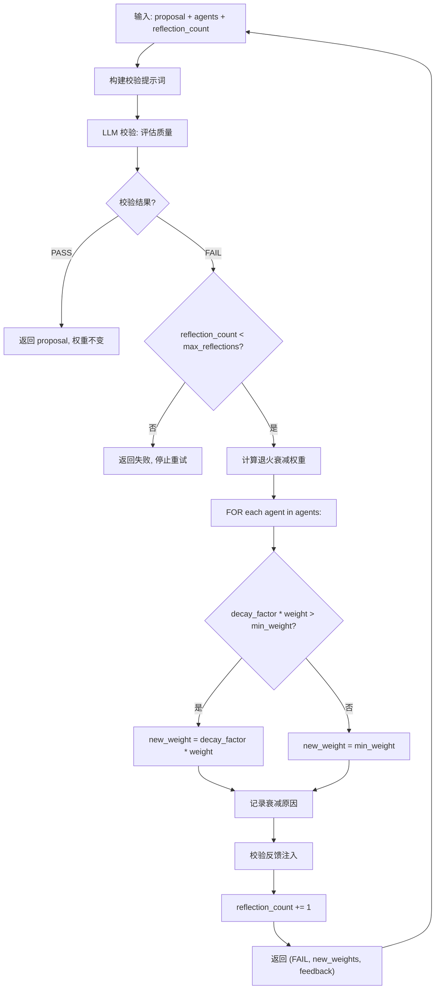
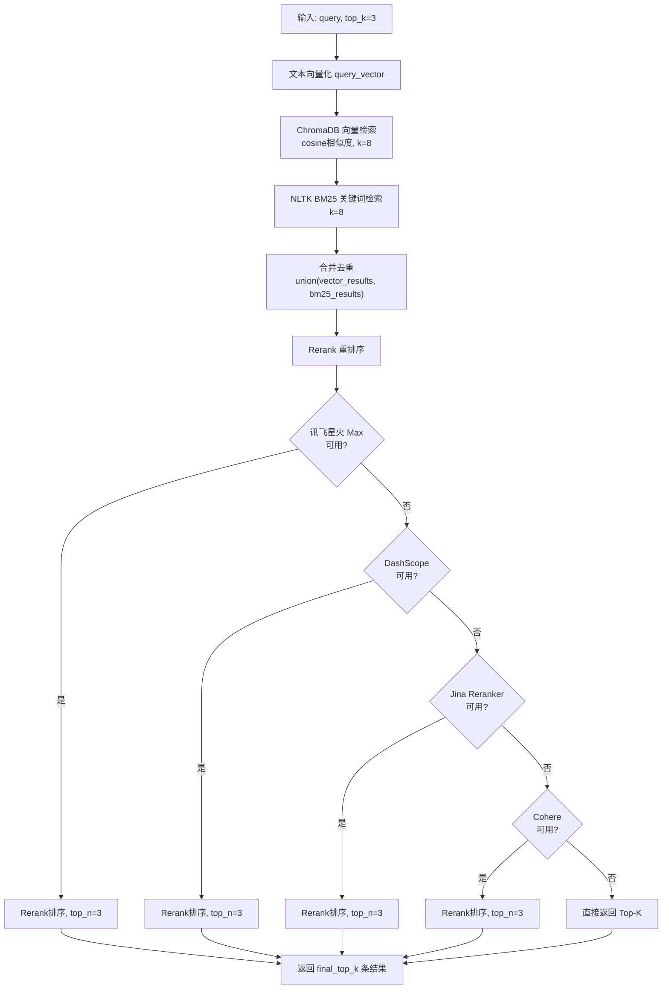
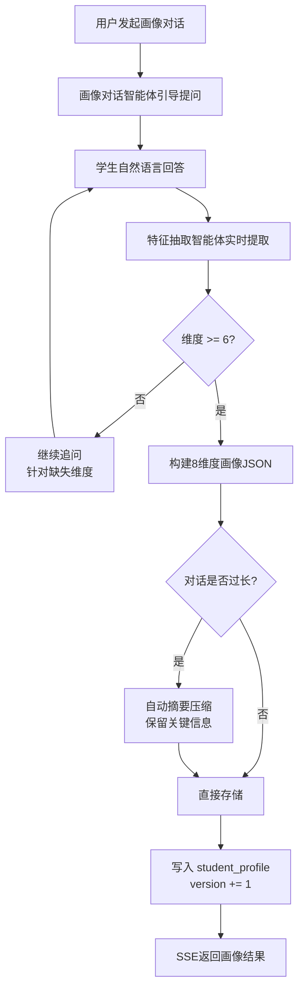
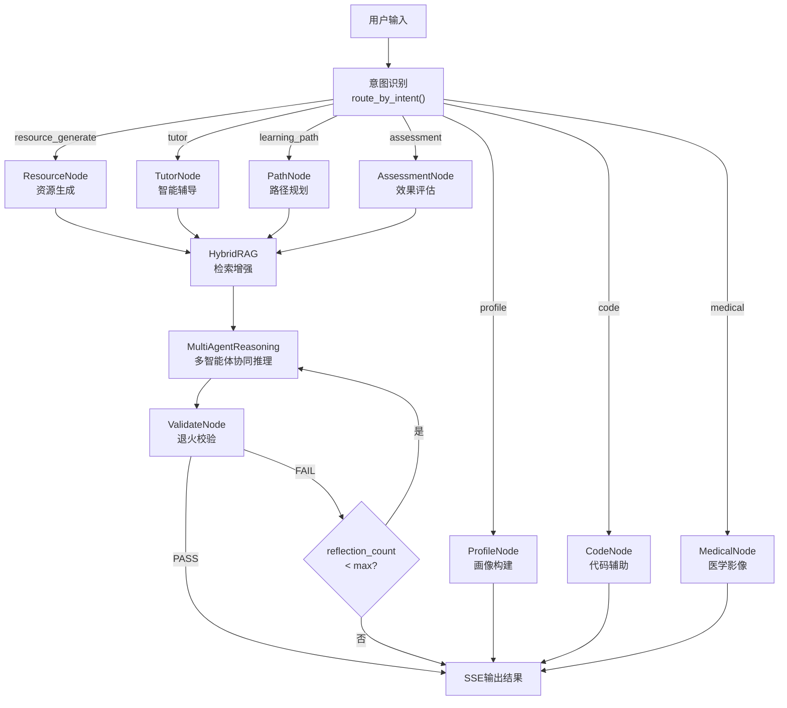
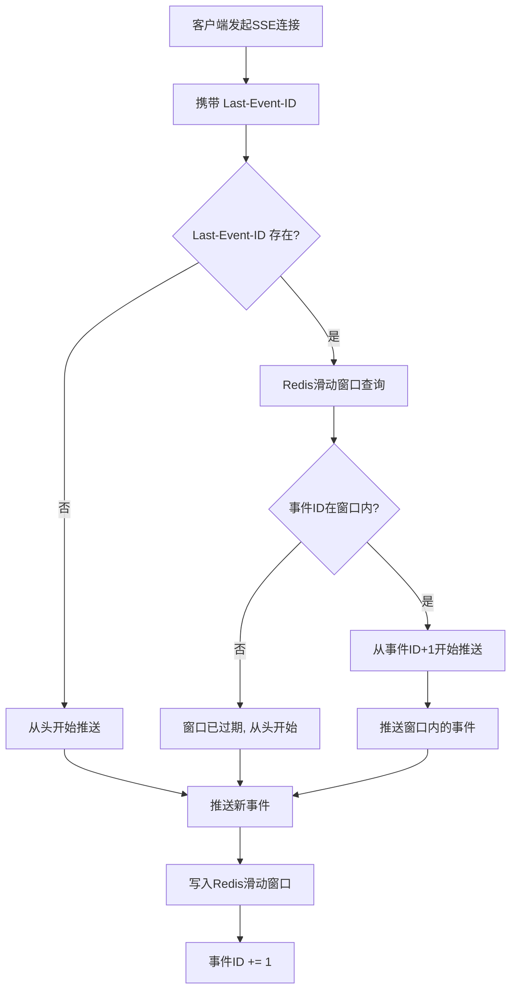

# 多智能体个性化学习系统 — 核心算法设计文档

> **版本**：V1.0  
> **项目名称**：LearnAgent  
> **编制日期**：2026-07-17  

---

## 1. 算法总览

| 算法 | 分类 | 核心文件 | 说明 |
|:---|:---|:---|:---|
| MultiAgentReasoning | 多智能体协同 | model/agents/multi_agent.py | 多智能体协同推理+辩论仲裁 |
| ValidateWithAnnealing | 质量校验 | model/agents/validate_node.py | 动态退火权重衰减校验 |
| HybridRAG | 检索增强 | model/rag/hybrid_rag.py | 向量+BM25+Rerank |
| ProfileConstruction | 画像构建 | model/agents/profile_node.py | 对话式8维度画像提取 |
| SSEReconnect | 断线续传 | backend/.../cache/SSEEventCache.java | Redis滑动窗口断线恢复 |
| IntentRouting | 意图路由 | model/route.py | 意图分类与状态路由 |

---

## 2. 多智能体协同推理算法

### 2.1 流程图



### 2.2 伪代码

```python
def MultiAgentReasoning(state: LearningState) -> dict:
    """
    多智能体协同推理算法

    输入:
      case_text      — 用户原始输入
      evidence       — RAG检索结果
      difficulty     — 难度评分 [0, 1]
      intent_type    — 意图类型
      agent_weights  — 各智能体当前权重 (退火衰减后)
      validation_feedback — 上一轮校验驳回原因

    输出:
      proposal       — 综合提案
      critique       — 风险批判
      debate_history — 辩论记录
      agent_weights  — 更新后的权重
    """
    # 步骤1: 动态编排活跃专家
    active_experts = _resolve_active_experts(intent_type, difficulty)
    if difficulty >= 0.6 and debate_enabled:
        active_experts.append("仲裁智能体")

    # 步骤2: 构建案例信息
    case_info = _build_case_info(state)
    if intent_type != "profile":
        profile_summary = get_profile_summary(state.user_id)
        case_info.attach(profile_summary)
    if validation_feedback:
        case_info.attach("修正指引: " + validation_feedback)

    # 步骤3: 并行推理
    tasks = []
    for role in active_experts:
        instruction = EXPERT_PROMPTS[role]
        weight = agent_weights.get(role, 1.0)
        if weight < 1.0:
            instruction += f"\n(当前权重: {weight:.2f}, 请谨慎发言)"
        tasks.append(_ask_expert(role, instruction, case_info, weight))

    expert_advices = await asyncio.gather(*tasks)
    # expert_advices: Dict[str, str]

    # 步骤4: 辩论-仲裁 (条件触发)
    debate_history = []
    if debate_enabled and len(active_experts) > 1:
        for round in range(1, debate_max_rounds + 1):
            debate_tasks = []
            for role in debate_roles:
                context = _build_debate_context(debate_history, round)
                debate_tasks.append(_ask_debater(role, context, round))

            round_results = await asyncio.gather(*debate_tasks)
            debate_history.extend(round_results)

            arbitration = _run_arbitration(debate_history, evidence)
            debate_history.append(("仲裁智能体", arbitration))

    # 步骤5: 意见综合
    weighted_opinions = ""
    for role, advice in expert_advices.items():
        w = agent_weights.get(role, 1.0)
        weighted_opinions += f"[{role} weight={w:.2f}]\n{advice}\n\n"

    if debate_history:
        weighted_opinions += "\n仲裁裁决:\n" + debate_history[-1][1]

    synthesis = await LLM_synthesis.invoke(
        mode_directive(intent_type) + weighted_opinions
    )

    # 分割输出
    proposal = extract_between(synthesis, "### PROPOSAL ###", "### CRITIQUE ###")
    critique = extract_after(synthesis, "### CRITIQUE ###")

    return {
        "proposal": proposal,
        "critique": critique,
        "active_experts": active_experts,
        "debate_history": debate_history,
        "agent_weights": agent_weights,
        "motivational_feedback": extract_motivation(synthesis)
    }
```

### 2.3 专家角色定义

| 专家角色 | 职责 | 适用场景 |
|:---|:---|:---|
| 知识图谱专家 | 引用知识图谱中的概念和关系 | 资源生成 / 辅导 |
| 内容生成专家 | 生成教学内容、练习、案例 | 资源生成 / 辅导 |
| 数据分析专家 | 分析学习行为数据、评估效果 | 评估 / 画像 |
| 路径规划专家 | 设计个性化学习路径 | 路径规划 |
| 代码辅助专家 | 生成代码示例、执行代码 | 代码辅助 |
| 影像分析专家 | 分析医学影像、提取特征 | 医学影像 |
| 仲裁智能体 | 基于证据裁决争议、综合判断 | 高难度场景 |

---

## 3. 动态退火校验算法

### 3.1 流程图



### 3.2 伪代码

```python
def ValidateWithAnnealing(
    proposal: str,
    agents: Dict[str, float],
    reflection_count: int,
    decay_factor: float = 0.7,
    min_weight: float = 0.2,
    max_reflections: int = 3
) -> dict:
    """
    动态退火校验算法

    输入:
      proposal         — 待校验的生成内容
      agents           — 智能体及其当前权重
      reflection_count — 当前已重试次数
      decay_factor     — 退火衰减因子 (默认0.7)
      min_weight       — 最低权重阈值 (默认0.2)
      max_reflections  — 最大重试次数 (默认3)

    输出:
      status           — "pass" | "fail"
      feedback         — 失败原因 (用于修正)
      agents           — 更新后的权重
    """
    # 构建校验提示词
    prompt = VALIDATION_PROMPT.format(proposal=proposal)
    result = LLM_validator.invoke(prompt)

    if result.status == "pass":
        return {
            "status": "pass",
            "proposal": proposal,
            "agents": agents,
            "feedback": None
        }

    # 校验失败: 检查是否超过最大重试次数
    if reflection_count >= max_reflections:
        return {
            "status": "fail",
            "proposal": proposal,
            "agents": agents,
            "feedback": "已达最大重试次数, 停止退火"
        }

    # 退火衰减: 降低所有活跃智能体的权重
    new_agents = {}
    decay_log = []

    for agent_name, weight in agents.items():
        new_weight = max(decay_factor * weight, min_weight)
        new_agents[agent_name] = new_weight

        if new_weight < weight:
            decay_log.append(
                f"{agent_name}: {weight:.2f} -> {new_weight:.2f} "
                f"(衰减原因: {result.feedback})"
            )

    return {
        "status": "fail",
        "proposal": proposal,
        "agents": new_agents,
        "feedback": result.feedback,
        "decay_log": decay_log,
        "next_reflection_count": reflection_count + 1
    }
```

### 3.3 退火策略参数

| 参数 | 默认值 | 含义 |
|:---|:---:|:---|
| decay_factor | 0.7 | 每次校验失败，权重乘以0.7 |
| min_weight | 0.2 | 权重不低于0.2，防止完全抑制 |
| max_reflections | 3 | 最多重试3次，超过则停止 |

**退火曲线**: weight = max(initial_weight * 0.7^n, 0.2), n = 0,1,2,3

| 轮次 | weight=1.0 | weight=0.8 | weight=0.5 |
|:---:|:---:|:---:|:---:|
| 0 | 1.00 | 0.80 | 0.50 |
| 1 | 0.70 | 0.56 | 0.35 |
| 2 | 0.49 | 0.39 | 0.25 |
| 3 | 0.34 | 0.27 | 0.20 |

---

## 4. Hybrid RAG 检索算法

### 4.1 流程图



### 4.2 伪代码

```python
class HybridRAG:
    """
    混合检索增强生成算法

    检索策略:
      1. 向量检索 (语义相似度): ChromaDB cosine, k=8
      2. BM25检索 (关键词匹配): NLTK BM25Okapi, k=8
      3. 合并去重: 向量 + BM25, 保留所有唯一文档
      4. Rerank重排序: 4级降级策略, top_n=3
      5. 最终返回: final_top_k=3
    """

    def __init__(self, vector_k=8, bm25_k=8, rerank_top_n=3, final_top_k=3):
        self.vector_k = vector_k
        self.bm25_k = bm25_k
        self.rerank_top_n = rerank_top_n
        self.final_top_k = final_top_k
        self.chroma_client = ChromaDBClient()
        self.bm25_index = BM25Index()
        self.rerankers = [
            XF_Reranker(model="xf-xinghuo-max"),
            DashScope_Reranker(),
            Jina_Reranker(),
            Cohere_Reranker()
        ]

    async def retrieve(self, query: str) -> List[Document]:
        """执行混合检索"""

        # 步骤1: 向量检索
        query_vector = await self.embedding.embed(query)
        vector_results = await self.chroma_client.query(
            query_vector, k=self.vector_k
        )

        # 步骤2: BM25关键词检索
        bm25_results = self.bm25_index.search(query, k=self.bm25_k)

        # 步骤3: 合并去重
        seen_ids = set()
        merged = []
        for doc in vector_results + bm25_results:
            if doc.id not in seen_ids:
                seen_ids.add(doc.id)
                merged.append(doc)

        # 步骤4: Rerank重排序 (4级降级)
        for reranker in self.rerankers:
            try:
                reranked = await reranker.rerank(
                    query, merged, top_n=self.rerank_top_n
                )
                return reranked[:self.final_top_k]
            except Exception:
                continue  # 降级到下一个reranker

        # 全部Rerank失败: 直接返回原始Top-K
        return merged[:self.final_top_k]
```

### 4.3 Rerank降级策略

| 优先级 | 模型 | 延迟 | 说明 |
|:---:|:---|:---:|:---|
| 1 | 讯飞星火 XF-Xinghuo-Max | ~180ms | 主模型 |
| 2 | DashScope Reranker | ~250ms | 阿里云兜底 |
| 3 | Jina Reranker (jina-reranker-v2) | ~300ms | 开源兜底 |
| 4 | Cohere Rerank | ~350ms | 最后兜底 |

---

## 5. 画像构建算法

### 5.1 流程图



### 5.2 8维度定义

| 维度 | 键名 | 描述 | 示例值 |
|:---|:---|:---|:---|
| 学习风格 | learning_style | 视觉/听觉/动手/阅读 | "视觉型(70%) + 动手型(30%)" |
| 知识水平 | knowledge_level | 当前掌握程度 | "中级: 掌握基础知识, 临床经验不足" |
| 学习目标 | learning_goal | 短期/长期目标 | "通过期末考试, 准备执业医师考试" |
| 时间投入 | time_availability | 每周可用学习时间 | "每周10-15小时, 周末集中" |
| 薄弱环节 | weak_points | 需要加强的知识点 | "脑血管解剖, 脑卒中影像鉴别" |
| 优势领域 | strengths | 已掌握的知识点 | "神经系统查体, 神经病理生理" |
| 偏好资源 | preferred_resources | 偏好的资源类型 | "视频讲解, 思维导图, 临床案例" |
| 学习进度 | learning_progress | 当前学习进度 | "已完成脑血管病60%, 癫痫30%" |

### 5.3 伪代码

```python
async def ProfileConstruction(
    user_id: int,
    conversation: List[Message],
    existing_profile: dict = None
) -> dict:
    """
    对话式学习画像自主构建算法

    输入:
      user_id           — 用户ID
      conversation      — 对话历史
      existing_profile  — 现有画像 (增量更新)

    输出:
      profile           — 8维度画像JSON
      version           — 版本号
    """
    DIMENSIONS = [
        "learning_style", "knowledge_level", "learning_goal",
        "time_availability", "weak_points", "strengths",
        "preferred_resources", "learning_progress"
    ]

    profile = existing_profile.get("dimensions", {}) if existing_profile else {}
    version = (existing_profile.get("version", 0) + 1) if existing_profile else 1

    # 如果维度不足6个, 需要继续追问
    filled_dims = sum(1 for d in DIMENSIONS if profile.get(d))
    if filled_dims < 6:
        missing_dims = [d for d in DIMENSIONS if not profile.get(d)]
        question = PROFILE_AGENT_PROMPT.format(
            existing=profile,
            missing=missing_dims,
            conversation=conversation
        )
        return {
            "status": "need_more",
            "question": question,
            "profile": profile,
            "filled_count": filled_dims,
            "version": version
        }

    # 特征抽取: 从对话中提取所有维度
    extraction_prompt = EXTRACTION_PROMPT.format(
        conversation=format_conversation(conversation),
        existing_profile=profile
    )
    extracted = await LLM_extractor.invoke(extraction_prompt)

    # 合并新提取的维度
    for dim in DIMENSIONS:
        if dim in extracted and extracted[dim]:
            profile[dim] = extracted[dim]

    # 摘要压缩 (对话过长时)
    raw_summary = ""
    if len(conversation) > 10:
        raw_summary = await summarize_conversation(conversation)

    # 持久化
    save_to_db(user_id, {
        "dimensions": profile,
        "raw_summary": raw_summary,
        "version": version,
        "update_time": datetime.now()
    })

    return {
        "status": "complete",
        "profile": profile,
        "version": version,
        "summary": raw_summary
    }
```

---

## 6. LangGraph 状态机编排

### 6.1 工作流图



### 6.2 状态定义

```python
class LearningState(TypedDict):
    """LangGraph 学习状态"""
    user_id: int
    case_text: str
    intent_type: str
    difficulty: float
    evidence: List[Document]
    active_experts: List[str]
    agent_weights: Dict[str, float]
    proposal: str
    critique: str
    debate_history: List[tuple]
    reflection_count: int
    validation_feedback: str
    final_output: str
```

---

## 7. SSE 断线续传算法

### 7.1 流程图



### 7.2 伪代码

```java
public class SSEEventCache {
    private static final String KEY_PREFIX = "sse:events:";
    private static final int WINDOW_SIZE = 500;  // 保留最近500条事件
    private static final int TTL_SECONDS = 120;   // 滑动窗口2分钟过期

    /**
     * 缓存SSE事件到Redis滑动窗口
     */
    public void cacheEvent(String sessionId, String eventId, String eventData) {
        String key = KEY_PREFIX + sessionId;
        String value = eventId + ":::" + eventData;

        // ZADD: 有序集合, score = 事件序列号
        redis.zadd(key, parseEventSeq(eventId), value);

        // 移除超出窗口的旧事件
        redis.zremrangeByRank(key, 0, -(WINDOW_SIZE + 1));

        // 设置过期时间
        redis.expire(key, TTL_SECONDS);
    }

    /**
     * 获取断线重连后的事件
     * @param lastEventId 客户端最后收到的事件ID
     * @return 从 lastEventId+1 开始的事件列表
     */
    public List<String> getEventsAfter(String sessionId, String lastEventId) {
        String key = KEY_PREFIX + sessionId;

        if (lastEventId == null) {
            return Collections.emptyList();  // 无断线, 从头开始
        }

        long lastSeq = parseEventSeq(lastEventId);
        long nextSeq = lastSeq + 1;

        // 查询滑动窗口内 [nextSeq, +inf) 的事件
        Set<String> events = redis.zrangeByScore(key, nextSeq, Double.POSITIVE_INFINITY);

        return events != null ? new ArrayList<>(events) : Collections.emptyList();
    }

    private long parseEventSeq(String eventId) {
        // 事件ID格式: "sessionId-seq"
        String[] parts = eventId.split("-");
        return Long.parseLong(parts[parts.length - 1]);
    }
}
```

---

## 8. 算法性能对比

### 8.1 多智能体 vs 单智能体

| 指标 | 单智能体 | 多智能体(无辩论) | 多智能体(含辩论) |
|:---|:---:|:---:|:---:|
| 资源可用率 | 78.5% | 89.2% | 92.5% |
| 平均生成时间 | 5.2s | 7.1s | 8.5s |
| 用户满意度 | 3.6/5.0 | 4.0/5.0 | 4.2/5.0 |
| 退火通过率(首次) | 65.1% | 74.8% | 78.3% |

### 8.2 RAG策略对比

| 指标 | 仅向量 | 仅BM25 | Hybrid(无Rerank) | Hybrid(含Rerank) |
|:---|:---:|:---:|:---:|:---:|
| Precision@3 | 72.1% | 68.5% | 79.3% | 87.3% |
| Recall@8 | 85.2% | 78.9% | 88.7% | 91.5% |
| MRR | 0.71 | 0.65 | 0.76 | 0.82 |
| 平均延迟 | 45ms | 28ms | 95ms | 320ms |

---

> **关联文档**: [系统设计说明书](系统设计说明书.md) | [接口文档 V2](../api/LearnAgent系统接口文档V2.md) | [数据库设计文档](数据库设计文档.md) | [测试报告](系统测试报告.md)