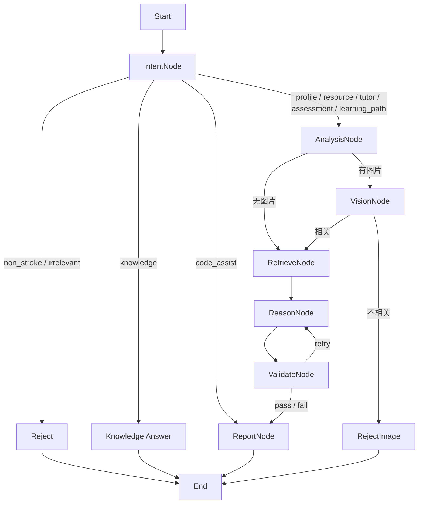
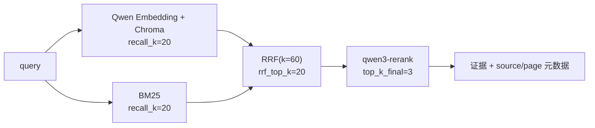
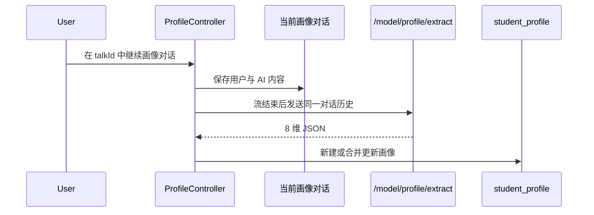

# LearnAgent 核心算法设计文档

> 版本：V2.0
> 核对日期：2026-07-29
> 本文描述当前代码路径，不包含无法从仓库复现的性能结论。

## 1. 算法总览

| 能力 | 核心文件 | 当前实现 |
|:---|:---|:---|
| LangGraph 编排 | `model/app/agents/orchestrators/clinical_graph.py` | 条件路由、影像分支、校验重试 |
| 输入守卫 | `nodes/intent_node.py` | 业务模式规则、领域证据、LLM 辅助判断 |
| 多专家推理 | `nodes/reason_node.py` | 动态专家选择、并行调用、辩论与仲裁 |
| 质量校验 | `nodes/validate_node.py` | 规则检查、LLM 反思、驳回分类和权重衰减 |
| Hybrid RAG | `model/app/rag/retrievers.py` | Qwen 向量 + BM25 + RRF + Qwen Rerank |
| 文档分块 | `model/app/rag/data_loader.py` | 规则边界保护、递归切分、小块合并、可选语义分块 |
| 画像抽取 | `model/app/services/profile_extractor.py` | 对话历史到 8 维 JSON |
| 共享记忆 | `model/app/agents/core/shared_memory.py` | 熵过滤、ChromaDB、共识和信誉 |
| 流式结果 | `model/app/services/agent_runner.py`、`frontend/src/utils/sseStream.js` | 节点事件、增量 Token、完整报告替换 |

## 2. LangGraph 状态机

### 2.1 状态

`LearningState` 包含以下信息组：

- 请求：`case_text`、`all_info`、`report_mode`、`images`。
- 意图：`intent_type`、`input_rejection_message`、`difficulty_score`。
- 检索：`evidence`、`retrieval_sources`、`shared_memory_hits`。
- 推理：`expert_advices`、`proposal`、`critique`、`debate_history`、`active_experts`。
- 校验：`validation_passed`、`validation_feedback`、`reflection_count`、`agent_weights`、`rejection_categories`。
- 影像：`vision_findings`、`vision_evidence`、`has_medical_images`。
- 输出：`report`。

### 2.2 图路由



`code_assist` 不进入脑卒中检索与多专家临床分析链，直接由代码专用报告模板处理。

## 3. 输入守卫

### 3.1 目标

输入守卫同时防止两类问题：

1. 用户输入与当前页面功能无关。
2. 后端包装文本中的固定标签掩盖真实用户输入。

### 3.2 算法

```python
def guard(report_mode, wrapped_text, images):
    user_input = extract_user_fields(report_mode, wrapped_text)

    if mode_requires_stroke(report_mode) and not images:
        if not has_stroke_keyword(user_input):
            return reject_domain()

    if not has_mode_evidence(report_mode, user_input):
        return reject_function()

    if report_mode == "code_assist":
        return allow()  # 结构化功能选择和编程证据已经确定

    verdict = llm_guard(user_input, report_mode)
    return allow() if verdict.is_related else reject_function()
```

代码辅助的功能选择由 `【辅助功能代码】complete|diagnose|optimize|explain` 传递，不再依赖模型猜测。守卫会提取诉求、现有代码和运行报错；含代码语法或明确编程证据即可放行，明显无关内容仍拒绝。

## 4. 多专家动态编排

### 4.1 专家集合

系统从 `expert_config.yaml` 加载 9 位专家。每位专家声明适用意图、最低难度和优先级。`ReasonNode` 先按意图映射筛选，再根据难度和配置决定活跃集合。

### 4.2 主流程

```python
async def reason(state):
    active_roles = resolve_active_experts(state)
    case_info = build_case_info(state)

    opinions = await gather(*[
        ask_expert(role, case_info, state.agent_weights.get(role, 1.0))
        for role in active_roles
    ])

    if debate_enabled and len(active_roles) > 1:
        debate_history = await run_debate(active_roles, opinions, max_rounds=1)
        arbitration = await run_arbitration(debate_history, state.evidence)

    proposal, critique = await synthesize(opinions, debate_history, arbitration)
    return proposal, critique
```

当前最大辩论轮数为 1。仲裁基于辩论记录和检索证据，综合阶段按意图附加模式约束，避免资源、画像、辅导、评估和路径输出混型。

## 5. 质量校验与反思

### 5.1 两层校验

1. 规则引擎：按资源生成、画像构建和学习路径三类禁忌规则检查提案文本。
2. LLM 反思：只检查严重事实、逻辑、教学或医学问题，返回 `PASS` 或 `REJECT`。

### 5.2 驳回分类

当前分类：

- `factual_error`
- `logical_contradiction`
- `personalization_insufficient`
- `medical_inaccuracy`
- `completeness_issue`

每类在 `rules_config.yaml` 中有专用修正提示。

### 5.3 权重衰减

```python
if current_weight > 0.2:
    new_weight = round(current_weight * 0.5, 2)
```

当前配置 `max_reflection_count=1`、`weight_decay_factor=0.5`。代码没有把衰减后的结果强制钳制到 0.2，因此文档不再声称存在 0.2 的硬下限。

校验调用异常或结果模糊时，当前实现默认放行。这是可用性优先策略，也是需要监控的质量风险。

## 6. Hybrid RAG

### 6.1 三阶漏斗



### 6.2 RRF

对向量列表与 BM25 列表中的同一文档累加倒数排名分：

```text
RRF_score(d) = sum(1 / (60 + rank_i(d)))
```

RRF 只依赖排名，不需要把向量相似度与 BM25 分值归一化。

### 6.3 降级

| 故障 | 行为 |
|:---|:---|
| Qwen 向量库初始化失败 | 保留原始文档并只初始化 BM25 |
| 向量查询失败 | 继续 BM25 |
| BM25 失败 | 继续向量结果 |
| 两路都为空 | 返回空证据 |
| Qwen Rerank 失败或返回空 | 使用 RRF 候选顺序 |

当前不存在旧稿描述的多供应商四级 Reranker 切换链。

### 6.4 缓存

查询结果以内存字典缓存，键为 `MD5(query + top_k_final)`，TTL 为 300 秒。缓存不跨进程，也不在服务重启后保留。

## 7. 文档分块

默认 `hybrid` 分块不是“向量+BM25”的检索含义，而是文档预处理策略：

1. 保护标题、条款等规则边界。
2. 递归切分，`chunk_size=512`、`chunk_overlap=128`。
3. 合并小于 100 字符的块，合并后不超过 800 字符。

可选 `semantic` 策略使用句子 Embedding、相似度断点和 25% 句子重叠，并对过小/过大块做后处理。评测脚本位于 `model/tests/compare_chunking.py`，结果 JSON 是特定知识库和模型配置下的快照，不应泛化成固定性能承诺。

## 8. 画像构建

### 8.1 维度

| 键 | 含义 |
|:---|:---|
| `knowledgeBase` | 知识基础、掌握与薄弱知识点 |
| `cognitiveStyle` | 视觉/听觉/动觉/阅读型偏好 |
| `learningGoal` | 短期、长期与当前课程目标 |
| `errorPattern` | 概念、粗心或程序性错误模式 |
| `learningPace` | 学习速度与每周投入 |
| `resourcePreference` | 资源类型偏好 |
| `clinicalExperience` | 临床经验水平 |
| `emotionState` | 积极、焦虑、自信或压力状态 |

### 8.2 更新流程



画像抽取过程只更新 `student_profile`，不会创建额外对话。无法可靠提取的描述使用空字符串或空列表，前端会过滤无信息占位文本。

## 9. 共享记忆

### 9.1 元记忆过滤

`MetaMemoryFilter` 综合关键词、信息密度、归一化 Shannon 熵和长度得分。当前逻辑在综合熵分低于 `0.85` 时允许持久化。

### 9.2 存储与检索

共享记忆使用独立 Qwen Chroma 集合，和医学指南向量库隔离。显式向量检索失败时会通过 Chroma 的 `query_texts` 接口调用同一 Qwen Embedding 再试一次；这不是 BM25 关键词检索。完全失败时跳过共享记忆，不阻断主流程。

### 9.3 共识与信誉

`ConsensusEngine` 使用 `conflict_threshold=0.4` 和 `min_agreement_ratio=0.6`。校验通过/失败后，`ValidateNode` 按活跃专家更新持久化信誉分。

详见 [共享记忆系统](共享记忆系统.md)。

## 10. 流式结果一致性

模型运行时可产生多个增量 `token`。图完成后，`agent_runner` 发送一次 `replace` 事件，其中是最终完整报告；前端必须替换旧内容，不能再次追加。

```python
if event.type in {"token", "chunk", "result"}:
    full_answer += event.content
elif event.type == "replace":
    full_answer = event.content
```

这条约定由模型和前端测试共同覆盖。

## 11. 验证边界

当前自动化测试覆盖算法配置、降级、路由和关键回归，但不证明医学内容在所有输入上正确，也不提供固定延迟或准确率承诺。量化评测必须记录提交、知识库、模型、参数、数据集和原始结果。

## 12. 关联文档

- [系统设计说明书](系统设计说明书.md)
- [接口文档](../api/LearnAgent系统接口文档.md)
- [共享记忆系统](共享记忆系统.md)
- [系统测试报告](系统测试报告.md)
