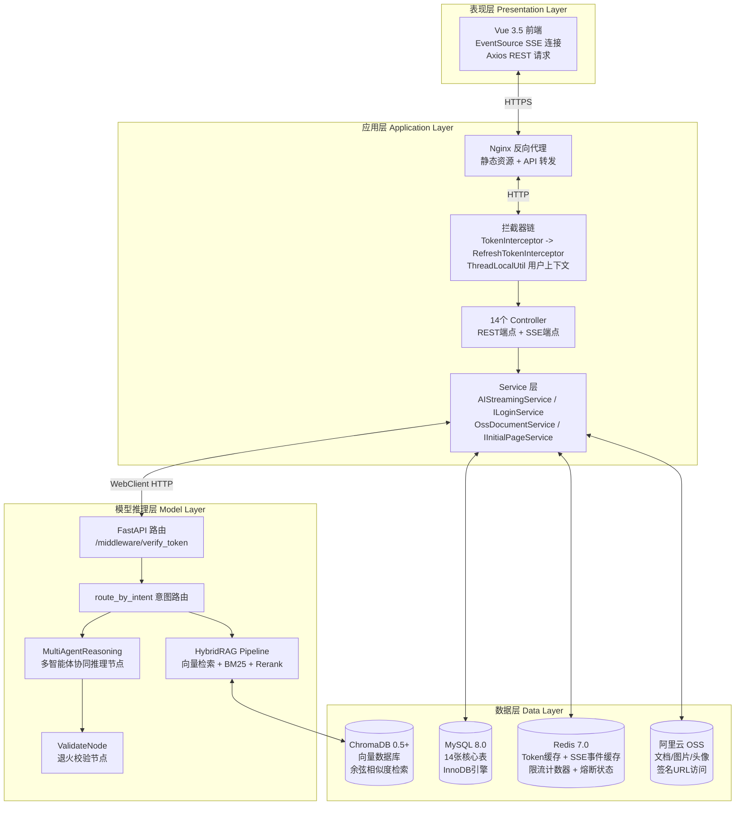
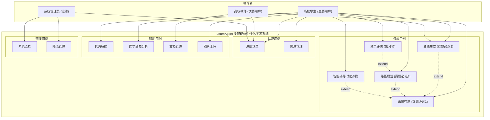
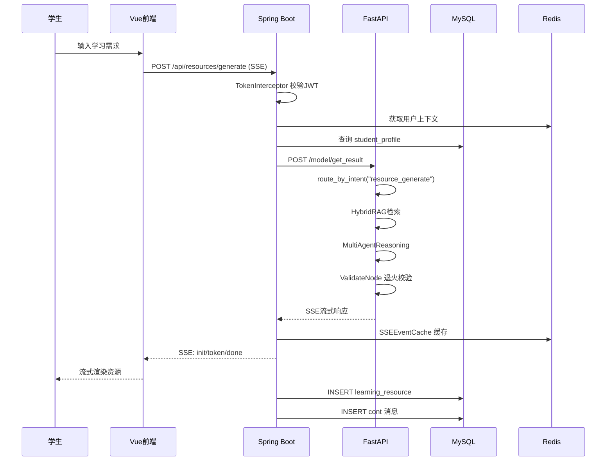
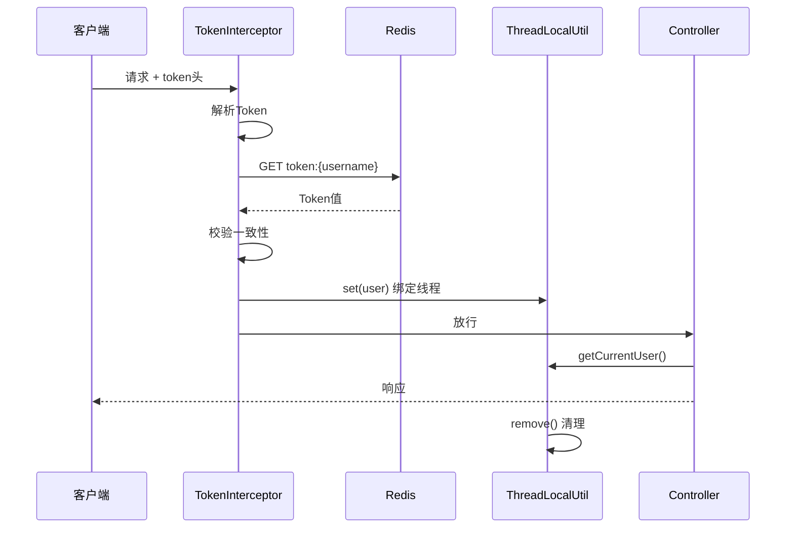
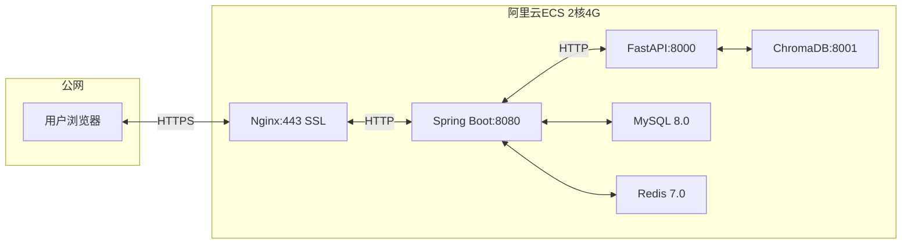

# 多智能体个性化学习系统 — 系统设计说明书 (SDD)

> **版本**：V1.0  
> **项目名称**：LearnAgent — 基于大模型的个性化资源生成与学习多智能体系统  
> **赛题**：第十五届"中国软件杯"A3赛题  
> **编制日期**：2026-07-17  
> **参考标准**：GB/T 8567-2006《计算机软件文档编制规范》  

---

## 1. 引言

### 1.1 编写目的

本文档对系统的整体架构设计、模块划分、组件交互、UML用例模型、接口规范、ER数据模型、部署架构及安全设计进行完整描述，作为系统开发、集成与维护的基准设计文档。

### 1.2 适用范围

本文档适用于系统架构师、后端开发工程师、前端开发工程师、测试工程师、运维工程师及项目管理人员。

### 1.3 术语与缩略语

| 术语 | 说明 |
|:---|:---|
| RAG | Retrieval-Augmented Generation，检索增强生成 |
| SSE | Server-Sent Events，服务器推送事件 |
| LLM | Large Language Model，大语言模型 |
| JWT | JSON Web Token，身份认证令牌 |
| LangGraph | 基于 LangChain 的状态图编排框架 |
| ChromaDB | 开源向量数据库 |
| BM25 | Best Matching 25，经典关键词检索算法 |
| Hybrid RAG | 向量检索 + BM25 混合检索策略 |
| 画像 | 学生学习特征的8维度结构化描述 |
| 退火策略 | 校验失败后权重衰减与针对性修正机制 |
| WebClient | Spring WebFlux 非阻塞 HTTP 客户端 |

---

## 2. 系统架构设计

### 2.1 四层架构总览



### 2.2 技术栈选型

| 层级 | 技术 | 版本 | 选型理由 |
|:---|:---|:---|:---|
| 前端 | Vue 3.5 + Vite | 3.5+ | 组件化开发，SSE原生支持 |
| 后端 | Spring Boot 3.3 | 3.3.13 | 成熟生态，WebFlux支持SSE |
| ORM | MyBatis-Plus | 3.5+ | Lambda查询，分页插件 |
| 响应式 | Spring WebFlux | 6.1+ | 非阻塞SSE，Flux/Mono |
| 模型层 | FastAPI | 0.128+ | 异步原生，Python AI生态 |
| LLM | 讯飞星火 | XF-Xinghuo-Max | 中文医疗领域优化 |
| 向量库 | ChromaDB | 0.5+ | 轻量，Python原生集成 |
| 缓存 | Redis | 7.0 | Lettuce连接池，滑动窗口 |
| 数据库 | MySQL | 8.0 | InnoDB事务，utf8mb4 |
| 存储 | 阿里云OSS | - | 签名URL，CDN加速 |
| 部署 | 宝塔面板 | - | Nginx反向代理，SSL |

### 2.3 模块划分

```
learning-multi-agent-system/
├── frontend/                    # Vue 3.5 前端
│   ├── src/
│   │   ├── views/               # 页面组件
│   │   ├── components/          # 通用组件
│   │   ├── stores/              # Pinia状态管理
│   │   ├── api/                 # Axios请求封装
│   │   └── utils/               # SSE客户端工具
├── backend/                     # Spring Boot 后端
│   └── server/
│       └── src/main/java/com/learnagent/
│           ├── controller/      # 14个Controller
│           ├── service/         # 业务逻辑层
│           ├── mapper/          # MyBatis-Plus映射
│           ├── entity/          # 数据实体
│           ├── param/           # 请求参数
│           ├── vo/              # 视图对象
│           ├── dto/             # 数据传输对象
│           ├── config/          # Spring配置
│           ├── cache/           # SSE事件缓存
│           ├── interceptor/     # 拦截器
│           └── utils/           # 工具类
├── model/                       # Python 模型推理层
│   ├── main.py                  # FastAPI入口
│   ├── agents/                  # 多智能体
│   ├── rag/                     # RAG检索
│   ├── middleware/              # 认证中间件
│   └── tests/                   # 模型测试
├── docs/                        # 文档
│   ├── architecture/            # 架构设计文档
│   ├── api/                     # 接口文档
│   └── competition/             # 比赛相关
└── tests/                       # 集成测试
```

---

## 3. UML 用例模型

### 3.1 系统用例图



### 3.2 核心用例描述

#### UC-01: 对话式学习画像自主构建

| 项目 | 说明 |
|:---|:---|
| **用例编号** | UC-01 |
| **优先级** | 高 (赛题必选核心功能1) |
| **参与者** | 高校学生 |
| **前置条件** | 用户已登录 |
| **后置条件** | 画像数据写入 student_profile 表 |
| **基本事件流** | 1. 学生发起画像对话 2. 画像对话智能体引导提问 3. 学生通过自然语言回答 4. 特征抽取智能体实时提取维度 5. 构建8维度动态画像 6. SSE流式返回 |
| **扩展事件流** | 3a. 对话过长->自动摘要压缩 4a. 维度不足6个->继续追问 |
| **业务规则** | 画像维度>=6个 (实际实现8个) |

#### UC-02: 多智能体协同资源生成

| 项目 | 说明 |
|:---|:---|
| **用例编号** | UC-02 |
| **优先级** | 高 (赛题必选核心功能2) |
| **参与者** | 高校学生、高校教师 |
| **前置条件** | 用户已登录 |
| **后置条件** | 资源记录写入 learning_resource 表 |
| **基本事件流** | 1. 用户描述资源需求 2. 意图识别分类 3. RAG检索相关知识 4. 多智能体协同推理 5. 退火校验质量把关 6. SSE流式返回 |
| **扩展事件流** | 4a. 难度>=0.6->自动加入仲裁智能体 5a. 校验失败->退火衰减->重新生成(最多3次) |
| **业务规则** | 支持7类资源类型: document/mindmap/quiz/reading/video_script/code_practice/code_example |

#### UC-03: 个性化学习路径规划

| 项目 | 说明 |
|:---|:---|
| **用例编号** | UC-03 |
| **优先级** | 高 (赛题必选核心功能3) |
| **参与者** | 高校学生 |
| **前置条件** | 用户已登录，已有学习画像 |
| **后置条件** | 路径及步骤写入 learning_path + learning_path_step 表 |
| **基本事件流** | 1. 学生设定学习目标与时间约束 2. 系统基于画像规划5-15步学习路径 3. 每步关联精准推荐资源 4. 学生按步骤学习并提交进度 5. 系统根据进度动态调整 |
| **业务规则** | 步数5-15步，支持插入/调整/推荐操作 |

---

## 4. ER 数据模型

### 4.1 完整 ER 关系图

```mermaid
erDiagram
    user ||--|| student_profile : "1:1"
    user ||--o{ talk : "1:N"
    user ||--o{ learning_resource : "1:N"
    user ||--o{ learning_path : "1:N"
    user ||--o{ learning_behavior : "1:N"
    user ||--o{ evaluation_report : "1:N"
    user ||--o{ patient : "1:N"

    talk ||--o{ cont : "1:N"
    learning_path ||--o{ learning_path_step : "1:N"
    learning_path_step }o--o{ learning_resource : "M:N"
    step_resource }|--|| learning_path_step : ""
    step_resource }|--|| learning_resource : ""
    patient ||--o{ health_data : "1:N"
    patient ||--o{ ai_opinion : "1:N"

    user {
        bigint id PK
        varchar name UK
        varchar password
        varchar image
        varchar major
        varchar grade
        varchar specialty
        datetime create_time
        datetime update_time
    }

    student_profile {
        bigint id PK
        bigint user_id FK_UK
        json dimensions
        text raw_summary
        int version
        datetime create_time
        datetime update_time
    }

    talk {
        bigint id PK
        bigint user_id FK
        text title
        longtext content
        datetime create_time
        datetime update_time
    }

    cont {
        bigint id PK
        bigint user_id
        bigint talk_id FK
        longtext content
        varchar role
        text images
        datetime create_time
    }

    learning_resource {
        bigint id PK
        bigint user_id FK
        varchar title
        varchar type
        varchar course_name
        json knowledge_points
        varchar difficulty
        longtext content
        varchar file_url
        json metadata
        bigint talk_id
        datetime create_time
        datetime update_time
    }

    learning_path {
        bigint id PK
        bigint user_id FK
        varchar course_name
        text goal_description
        int total_steps
        int completed_steps
        int estimated_days
        date deadline
        varchar status
        datetime create_time
        datetime update_time
    }

    learning_path_step {
        bigint id PK
        bigint path_id FK
        int order_index
        varchar title
        text description
        json knowledge_points
        decimal estimated_hours
        varchar difficulty
        varchar status
        decimal actual_hours
        text feedback
        tinyint self_rating
        json prerequisites
        datetime create_time
        datetime update_time
    }

    step_resource {
        bigint id PK
        bigint step_id FK
        bigint resource_id FK
        decimal relevance
        tinyint is_recommended
        datetime create_time
    }

    learning_behavior {
        bigint id PK
        bigint user_id FK
        bigint path_id FK
        bigint step_id
        bigint resource_id
        varchar behavior_type
        int duration
        decimal score
        json detail
        datetime create_time
    }

    evaluation_report {
        bigint id PK
        bigint user_id FK
        bigint path_id
        varchar period
        int overall_score
        varchar level
        json dimensions
        json strengths
        json weaknesses
        json suggestions
        datetime create_time
    }

    patient {
        bigint id PK
        varchar name
        text history
        text notes
        bigint doctor_id FK
        datetime create_time
        datetime update_time
    }

    health_data {
        bigint id PK
        bigint patient_id FK
        varchar data_type
        json data_value
        datetime record_time
    }

    ai_opinion {
        bigint id PK
        bigint patient_id FK
        text content
        varchar model_name
        datetime create_time
    }

    learning_material {
        bigint id PK
        varchar title
        text content
        varchar type
    }
```

### 4.2 核心业务数据流



---

## 5. 接口规范

### 5.1 RESTful API 设计原则

| 原则 | 说明 |
|:---|:---|
| 资源导向 | URL以名词表示资源: /api/resources /api/profile |
| HTTP方法 | GET查询 / POST创建 / PUT更新 / DELETE删除 |
| 统一响应 | 所有非流式接口返回 {code, msg, data} |
| 认证 | JWT Token: token或Authorization头 |
| 分页 | page + size -> {total, records} |
| 流式 | SSE协议, X-Accel-Buffering: no |

### 5.2 接口总览

| 模块 | Controller | 端点数 | SSE | REST |
|:---|:---|:---:|:---:|:---:|
| 用户认证 | LoginController/ChangeKeyController/InitialPageController | 7 | 0 | 7 |
| 学习画像 | ProfileController | 6 | 1 | 5 |
| 资源生成 | ResourceController | 17 | 10 | 7 |
| 学习路径 | LearningPathController | 6 | 1 | 5 |
| 智能辅导 | TutorController | 5 | 2 | 3 |
| 效果评估 | AssessmentController | 4 | 1 | 3 |
| 代码辅助 | CodeController | 2 | 1 | 1 |
| 医学影像 | MedicalController | 7 | 1 | 6 |
| 对话管理 | QuesController | 2 | 1 | 1 |
| 课程管理 | CourseController | 2 | 0 | 2 |
| 图片上传 | UploadController | 1 | 0 | 1 |
| 系统监控 | MonitorController | 2 | 0 | 2 |
| 文档管理 | DocumentController(预留) | 3 | 0 | 3 |
| **合计** | **14** | **64** | **18** | **46** |

### 5.3 完整接口清单

| 方法 | 端点 | 流式 | 说明 |
|:---|:---|:---:|:---|
| POST | `/api/user/register` | | 用户注册 |
| POST | `/api/user/login` | | 用户登录 |
| POST | `/api/user/logOut` | | 退出登录 |
| GET | `/api/user/showInfo` | | 获取用户信息 |
| PUT | `/api/user/showInfo/changeKey` | | 修改用户信息 |
| GET | `/api/user/title` | | 对话列表 |
| DELETE | `/api/user/deleteTalk/{talkId}` | | 删除对话 |
| POST | `/api/profile/conversation` | SSE | 画像对话 |
| GET | `/api/profile` | | 查询画像 |
| PUT | `/api/profile/dimensions` | | 编辑维度 |
| GET | `/api/profile/conversation/{talkId}` | | 画像对话历史 |
| GET | `/api/profile/conversations` | | 画像对话列表 |
| DELETE | `/api/profile/conversation/{talkId}` | | 删除画像对话 |
| POST | `/api/resources/generate` | SSE | 资源生成(通用) |
| POST | `/api/resources/generate/document` | SSE | 课程讲解文档 |
| POST | `/api/resources/generate/mindmap` | SSE | 思维导图 |
| POST | `/api/resources/generate/quiz` | SSE | 练习题目 |
| POST | `/api/resources/generate/reading` | SSE | 拓展阅读 |
| POST | `/api/resources/generate/case-study` | SSE | 临床案例 |
| POST | `/api/resources/generate/plan` | SSE | 资源方案 |
| POST | `/api/resources/generate/code-practice` | SSE | 代码实操 |
| POST | `/api/resources/generate/assessment` | SSE | 评估报告 |
| GET | `/api/resources` | | 资源列表 |
| GET | `/api/resources/{id}` | | 资源详情 |
| GET | `/api/resources/{id}/download` | | 资源下载 |
| DELETE | `/api/resources/{id}` | | 删除资源 |
| POST | `/api/learning-path/generate` | SSE | 路径生成 |
| GET | `/api/learning-path` | | 路径列表 |
| GET | `/api/learning-path/{pathId}` | | 路径详情 |
| PUT | `/api/learning-path/{pathId}/steps/{stepId}/progress` | | 步骤进度 |
| POST | `/api/learning-path/recommend` | | 资源推荐 |
| POST | `/api/learning-path/{pathId}/adjust` | | 路径调整 |
| POST | `/api/tutor/chat` | SSE | 辅导问答 |
| POST | `/api/tutor/ask` | SSE | 简版问答 |
| GET | `/api/tutor/conversation/{talkId}` | | 辅导历史 |
| GET | `/api/tutor/conversations` | | 辅导列表 |
| DELETE | `/api/tutor/conversation/{talkId}` | | 删除辅导 |
| POST | `/api/evaluation/generate` | SSE | 评估生成 |
| GET | `/api/evaluation/report` | | 评估报告 |
| POST | `/api/evaluation/behavior` | | 行为提交 |
| POST | `/api/evaluation/optimize` | | 评估优化 |
| POST | `/api/code/execute` | | 代码执行 |
| POST | `/api/code/assist` | SSE | 代码辅助 |
| POST | `/api/medical/analyze-image` | | 影像分析 |
| POST | `/api/medical/analyze-case` | SSE | 病例分析 |
| POST | `/api/medical/compare-images` | | 多图对比 |
| POST | `/api/medical/dicom-metadata` | | DICOM元数据 |
| POST | `/api/medical/ocr/lab-report` | | 检验OCR |
| POST | `/api/medical/ocr/prescription` | | 处方OCR |
| POST | `/api/medical/dicom-to-png` | | DICOM转PNG |
| POST | `/api/user/ques/streamingQues` | SSE | 通用流式对话 |
| GET | `/api/user/ques/getQues/{talkId}` | | 对话内容 |
| GET | `/api/courses` | | 课程列表 |
| GET | `/api/courses/{courseId}/knowledge-tree` | | 知识点树 |
| POST | `/api/user/upload` | | 图片上传 |
| GET | `/api/monitor/rate-limit/status` | | 限流状态 |
| GET | `/api/monitor/rate-limit/reset` | | 重置限流 |
| GET | `/api/documents` | | 文档列表 |
| GET | `/api/documents/{id}/url` | | 文档URL |
| GET | `/api/documents/match` | | 文献匹配 |

---

## 6. 安全设计

### 6.1 认证架构



### 6.2 安全措施清单

| 层级 | 措施 | 说明 |
|:---|:---|:---|
| 传输 | HTTPS | Nginx SSL终止 |
| 认证 | JWT + BCrypt | 密码哈希，Token Redis存储 |
| 续期 | RefreshTokenInterceptor | Token即将过期自动续期 |
| 限流 | Redis滑动窗口 | 登录失败5次/分钟触发熔断 |
| 熔断 | closed/half_open/open | 三级状态自动恢复 |
| 隔离 | ThreadLocal | 请求级用户上下文 |
| 上传 | 类型白名单 | jpg/png/webp/gif, <=5MB |
| 签名 | OSS签名URL | 30分钟有效 |
| 越权 | 资源归属校验 | 所有数据操作校验userId |
| 注入 | MyBatis-Plus Lambda | 防SQL注入 |
| 降级 | OSS->本地存储 | 上传失败自动降级 |

---

## 7. 部署架构

### 7.1 部署拓扑



### 7.2 Nginx SSE代理配置

```nginx
location /api/ {
    proxy_pass http://127.0.0.1:8080;
    proxy_buffering off;
    proxy_cache off;
    proxy_set_header X-Accel-Buffering no;
    proxy_read_timeout 3600s;
    proxy_set_header Connection '';
}
```

### 7.3 连接池配置

| 组件 | 配置项 | 值 |
|:---|:---|:---|
| Tomcat | max-threads | 200 |
| Tomcat | min-spare | 10 |
| HikariCP | maximum-pool-size | 15 |
| HikariCP | connection-timeout | 30000ms |
| Lettuce | max-active | 20 |
| Lettuce | max-idle | 10 |

---

> **关联文档**: [需求规格说明书](需求规格说明书.md) | [接口文档 V2](../api/LearnAgent系统接口文档V2.md) | [数据库设计文档](数据库设计文档.md) | [测试文档](测试文档.md)