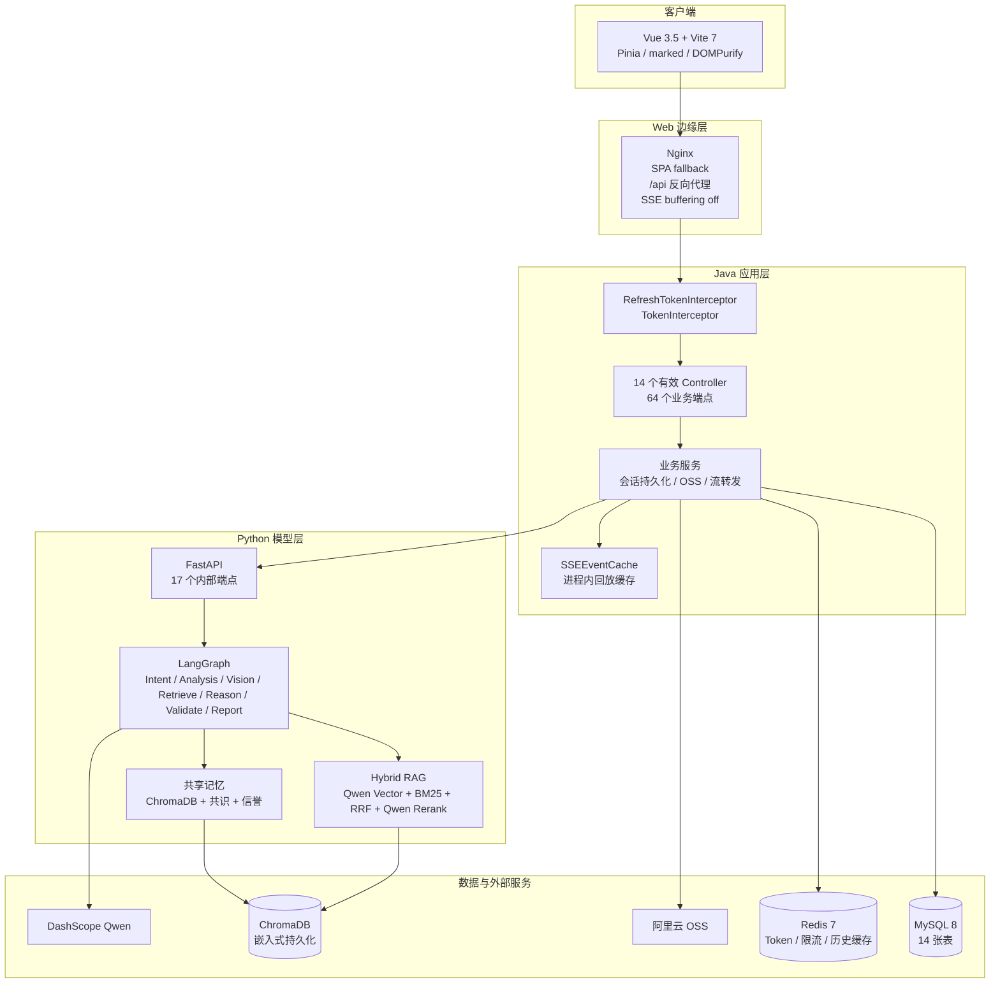
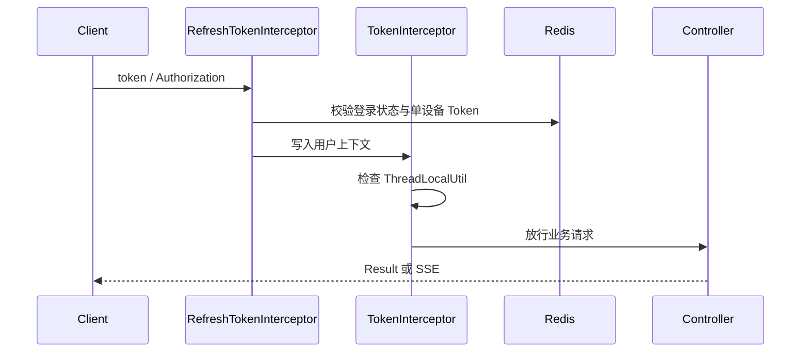
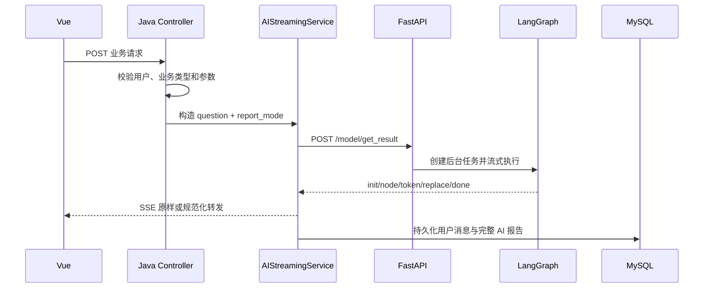
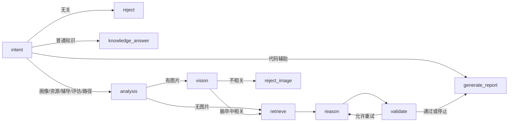
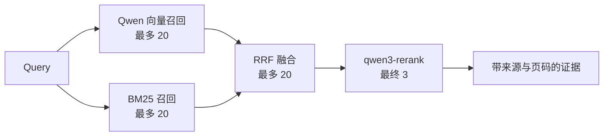
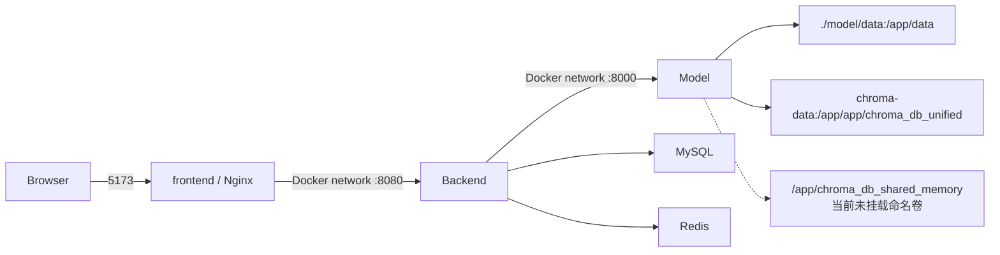

# LearnAgent 系统设计说明书

> 版本：V2.0
> 核对日期：2026-07-29
> 适用范围：当前 `main` 分支实现

## 1. 设计目标

LearnAgent 面向脑卒中医学教育，将用户、会话和业务数据留在 Java 服务，将模型编排、检索和多模态能力放在 Python 服务，并由 Vue 前端统一呈现。设计重点是：

- 业务数据与模型推理解耦。
- AI 请求全链路流式传输，最终报告可以覆盖增量草稿。
- 各业务功能以结构化 `report_mode` 约束模型输出。
- 学习内容必须通过领域、功能、影像和质量校验。
- 外部模型失败时保留可解释的降级路径。

## 2. 分层架构



### 2.1 技术选型

| 层级 | 技术 | 当前版本来源 | 作用 |
|:---|:---|:---|:---|
| 前端 | Vue、Vite、Pinia | `frontend/package.json` | 页面、状态、流式渲染 |
| Java | Java 21、Spring Boot 3.3.13、WebFlux、MyBatis-Plus | `backend/server/pom.xml` | 鉴权、业务、持久化、SSE 转发 |
| Python | Python 3.11、FastAPI 0.128、LangGraph 1.2、LangChain 1.3 | `model/requirements.txt` | 多智能体编排、RAG、多模态 |
| 数据 | MySQL 8、Redis 7、ChromaDB 1.5 | Compose/requirements | 业务数据、状态、向量数据 |
| 模型 | Qwen Chat、Embedding、Rerank、VL | `model/app/config/qwen.py` | 推理、召回、重排、视觉 |

## 3. 前端设计

### 3.1 路由

受保护子路由：`/profile`、`/resources`、`/learning-path`、`/tutor`、`/assessment`、`/code-assist`。未登录访问会跳转 `/login`。

### 3.2 API 层

`frontend/src/api/` 按业务拆分。普通请求经过 Axios 封装；画像、资源、路径、辅导、评估和代码辅助共享 `frontend/src/utils/sseStream.js`。

SSE 内容合并规则：

```text
token/chunk/result -> 追加 content
replace            -> 用完整报告替换累计内容
done               -> 结束并返回 talkId、content、可选画像维度
error              -> 抛出可展示错误
```

Markdown 经 `marked` 渲染后必须通过 `DOMPurify` 清洗。

## 4. Java 应用层设计

### 4.1 控制器边界

当前有 14 个非空控制器，提供 64 个端点。完整清单见 [接口文档](../api/LearnAgent系统接口文档.md)。`DocumentController.java` 是空文件，不属于当前接口面。

### 4.2 鉴权链



Spring Security 负责无状态会话、CSRF 关闭和 CORS；实际 JWT 认证由 MVC 拦截器完成。登录、注册、上传和静态上传文件路径被排除。

### 4.3 AI 流转发



`AIStreamingServiceImpl` 将历史上下文限制为最近 8000 字符，单条上游 SSE 行限制为 1 MiB，读取超时 300 秒，持久化失败最多重试 3 次。

### 4.4 对话隔离

画像、资源和代码辅助对话在 `talk.content` 首行写入 `[[conversation-type:<type>]]` 标记。控制器在复用 `talkId` 前校验用户归属和业务类型，避免不同功能错误串话。

画像更新流程：画像对话完成后，后端读取同一个 `talkId` 的历史并调用 `/model/profile/extract`，再更新 `student_profile`。抽取过程不创建额外对话。

### 4.5 SSE 回放

`SSEEventCache` 当前是基于 `ConcurrentHashMap`、Reactor `Sinks.Many` 和序号计数器的进程内缓存，不是 Redis 事件流。流完成后默认保留 5 分钟；客户端以 `<talkId>:<seq>` 形式发送 `Last-Event-ID`。

这意味着单实例内可回放，进程重启或请求切换到其他实例后无法保证恢复。水平扩展前应将事件缓存迁移到共享存储或使用粘性会话。

## 5. Python 模型层设计

### 5.1 LangGraph 路由



代码辅助拥有结构化功能代码，绕过通用临床分析链并直接进入专用报告模板。

### 5.2 配置驱动

| 配置 | 内容 |
|:---|:---|
| `expert_config.yaml` | 9 位专家、动态编排、辩论和仲裁 |
| `report_templates.yaml` | 各业务报告模式与硬约束 |
| `prompts.yaml` | 节点 Prompt |
| `rules_config.yaml` | 校验与反思规则 |
| `limits_config.yaml` | 子问题、证据长度和关键词限制 |
| `shared_memory_config.yaml` | 共享记忆、共识和持久化参数 |

### 5.3 任务管理

`AsyncTaskManager` 保存运行中任务、事件、最终结果和元数据。`/model/tasks/{task_id}` 支持状态查询，`/model/tasks/{task_id}/stream` 支持按事件索引继续接收。任务状态属于模型进程内存，重启后不保留。

### 5.4 网络安全边界

`/model/get_result` 显式校验内部 JWT。其他专用模型路由目前依赖 Docker/内网隔离，因此模型端口不应映射公网。若需要独立暴露，应先统一添加鉴权依赖。

## 6. Hybrid RAG



向量检索失败时继续使用 BM25；Rerank 失败时返回 RRF 排序结果。查询结果按 `MD5(query + top_k)` 缓存 300 秒。

默认分块采用规则边界保护、512/128 递归切分和小块合并；语义分块用于评测和可选构建流程。

## 7. 数据设计

业务数据库包含 14 张表：`user`、`talk`、`cont`、`student_profile`、`learning_resource`、`learning_path`、`learning_path_step`、`step_resource`、`learning_behavior`、`evaluation_report`、`patient`、`health_data`、`ai_opinion`、`learning_material`。

完整字段、索引和外键见 [数据库设计手册](数据库设计手册.md)，实际建表以 `backend/server/learningo_agents.sql` 为准。

Redis 当前用于：

- 用户 Token 与单设备登录状态。
- 登录成功/失败计数和熔断状态。
- 对话历史的 1 小时缓存。
- 其他服务级限流状态。

SSE 回放事件当前不存 Redis。

## 8. 部署设计



Docker 镜像：

- 前端：Node 20 构建，Nginx 1.27 运行。
- 后端：Maven 3.9 + Java 21 构建，Java 21 JRE 运行。
- 模型：Python 3.11 slim，健康检查 `/admin/report_modes`。

只有前端端口 `5173` 对宿主机开放。生产环境应在最外层配置 TLS、明确 CORS 来源并保护监控和管理接口。

## 9. 已知设计债务

| 项目 | 当前状态 | 后续方向 |
|:---|:---|:---|
| 模型专用路由鉴权 | 仅统一入口显式鉴权 | 为所有内部路由添加统一依赖或网关认证 |
| SSE 回放 | Java 进程内缓存 | 迁移 Redis Stream 或使用粘性会话 |
| 模型任务状态 | Python 进程内存 | 持久化任务元数据和事件 |
| 共享记忆持久化 | 目录未挂载 Compose 命名卷 | 挂载独立卷或改为已挂载路径 |
| 文档 REST API | `DocumentController` 为空 | 实现后再加入接口文档 |
| 数据库初始化脚本 | 结构与演示数据混合 | 拆分 schema、seed 和 migration |
| 监控权限 | 普通登录即可重置限流 | 增加管理员角色和审计日志 |

## 10. 关联文档

- [接口文档](../api/LearnAgent系统接口文档.md)
- [需求规格说明书](需求规格说明书.md)
- [核心算法设计文档](核心算法设计文档.md)
- [数据库设计手册](数据库设计手册.md)
- [系统测试报告](系统测试报告.md)
