# 多智能体个性化学习系统 — 需求规格说明书 (SRS)

> **版本**：V1.0  
> **项目名称**：LearnAgent — 基于大模型的个性化资源生成与学习多智能体系统  
> **赛题**：第十五届"中国软件杯"A3赛题  
> **编制日期**：2026-06-29  

---

## 1. 引言

### 1.1 编写目的

本需求规格说明书对"多智能体个性化学习系统"的功能需求、非功能需求、约束条件与接口要求进行完整定义，作为系统设计、开发、测试与验收的基准文档。

### 1.2 项目背景

在高等教育学习过程中，医学生普遍面临学习资源繁杂无序、难以精准匹配自身需求且缺乏智能化、个性化学习指导的核心问题。本系统以**神经病学**课程为切入点，构建多智能体协同的个性化学习智能体系统，融合多模态生成与代码辅助开发技术，依据学生个体情况提供定制化、多模态的学习内容，实现"因材施教"的数字化落地。

### 1.3 术语与缩略语

| 术语 | 说明 |
|:---|:---|
| RAG | Retrieval-Augmented Generation，检索增强生成 |
| SSE | Server-Sent Events，服务器推送事件 |
| LLM | Large Language Model，大语言模型 |
| JWT | JSON Web Token，身份认证令牌 |
| LangGraph | 基于 LangChain 的状态图编排框架 |
| ChromaDB | 开源向量数据库 |
| BM25 | Best Matching 25，经典关键词检索算法 |
| Hybrid RAG | 向量检索 + BM25 混合检索策略 |
| 画像 | 学生学习特征的8维度结构化描述 |
| 退火策略 | 校验失败后权重衰减与针对性修正机制 |

### 1.4 参考资料

- 第十五届"中国软件杯"A3赛题说明
- GB/T 8567-2006《计算机软件文档编制规范》
- IEEE Std 830-1998《软件需求规格说明推荐实践》

---

## 2. 总体描述

### 2.1 系统概述

本系统是一个面向高等教育个性化学习场景（以脑卒中医学教育为示范领域）的智能多智能体系统，通过大语言模型与多智能体协同技术，实现从学生画像构建、个性化资源生成、智能辅导问答、学习路径规划到学习效果评估的完整闭环。

### 2.2 用户角色与特征

| 角色 | 描述 | 核心诉求 |
|:---|:---|:---|
| **高校学生** | 医学院校在读学生，专业与年级各异 | 通过对话构建学习画像，获得个性化学习资源、辅导答疑与路径规划 |
| **高校教师** | 医学课程授课教师 | 快速生成适配不同学生水平的教学资源，减轻备课负担 |
| **系统管理员** | 负责系统运维与监控 | 监控系统运行状态，管理限流与熔断策略 |

### 2.3 运行环境

| 层级 | 运行环境 |
|:---|:---|
| 前端 | 现代浏览器（Chrome 90+、Edge 90+、Firefox 88+、Safari 14+） |
| 后端 | Java 21+、Spring Boot 3.3、MySQL 8.0、Redis 7.0 |
| 模型层 | Python 3.11+、FastAPI 0.128+、ChromaDB 0.5+ |
| 部署 | Linux 服务器（宝塔面板）、Nginx 反向代理 |

### 2.4 系统约束

1. 系统以神经病学课程为示范领域，架构设计支持跨学科迁移
2. 大模型服务依赖阿里云 DashScope API（Qwen-Max/Plus/Turbo）
3. 多模态能力依赖 qwen-vl-max 视觉大模型
4. 文献检索依赖 PubMed E-utilities API（需 API Key）
5. 文件存储依赖阿里云 OSS
6. 向量数据库使用 ChromaDB 本地部署

---

## 3. 功能需求

### 3.1 用户认证模块 (AUTH)

#### FR-AUTH-01 用户注册

| 项目 | 说明 |
|:---|:---|
| **优先级** | 高 |
| **触发条件** | 新用户首次使用系统 |
| **前置条件** | 无 |
| **基本流程** | 1. 用户填写用户名和密码 2. 系统校验用户名唯一性 3. 密码 BCrypt 加密存储 4. 返回注册结果 |
| **后置条件** | 用户记录写入 user 表 |
| **异常流** | 用户名已存在 → 返回错误提示 |

#### FR-AUTH-02 用户登录

| 项目 | 说明 |
|:---|:---|
| **优先级** | 高 |
| **触发条件** | 已注册用户访问系统 |
| **前置条件** | 用户已注册 |
| **基本流程** | 1. 用户输入用户名和密码 2. 系统校验凭证 3. 生成 JWT Token 4. 返回 Token 和用户信息 |
| **后置条件** | Token 写入 Redis，用户进入已认证状态 |
| **异常流** | 凭证错误 → 返回错误提示；连续失败触发限流 |

#### FR-AUTH-03 用户登出

| 项目 | 说明 |
|:---|:---|
| **优先级** | 中 |
| **触发条件** | 用户主动退出系统 |
| **前置条件** | 用户已登录 |
| **基本流程** | 1. 前端发送登出请求 2. 后端清除 Redis 中的 Token 3. 返回成功 |
| **后置条件** | Token 失效 |

#### FR-AUTH-04 Token 自动续期

| 项目 | 说明 |
|:---|:---|
| **优先级** | 中 |
| **触发条件** | 用户在 Token 有效期内发起请求 |
| **前置条件** | Token 未过期 |
| **基本流程** | 拦截器检测到 Token 即将过期时自动续期，通过 RefreshTokenInterceptor 实现 |

#### FR-AUTH-05 用户信息修改

| 项目 | 说明 |
|:---|:---|
| **优先级** | 中 |
| **触发条件** | 用户修改个人信息 |
| **基本流程** | 支持修改密码、专业(major)、年级(grade)、专长(specialty)等字段 |

---

### 3.2 对话式学习画像自主构建模块 (PROFILE)

#### FR-PROFILE-01 对话式画像构建

| 项目 | 说明 |
|:---|:---|
| **优先级** | 高（赛题必选核心功能1） |
| **触发条件** | 学生发起画像对话 |
| **前置条件** | 用户已登录 |
| **基本流程** | 1. 学生通过自然语言描述学习背景 2. 画像对话智能体引导对话 3. 特征抽取智能体从对话中提取结构化特征 4. 构建8维度动态画像 5. 流式返回画像构建过程 |
| **后置条件** | 画像数据写入 student_profile 表 |
| **业务规则** | 画像维度不少于6个（实际实现8个） |

#### FR-PROFILE-02 8维度动态画像

| 项目 | 说明 |
|:---|:---|
| **优先级** | 高 |
| **描述** | 画像包含以下8个维度：知识基础、认知风格、学习目标、易错模式、学习节奏、资源偏好、临床经验、情绪状态。每个维度包含枚举化等级和结构化描述。 |

#### FR-PROFILE-03 画像随学随新

| 项目 | 说明 |
|:---|:---|
| **优先级** | 高 |
| **描述** | 对话结束后自动提取画像维度更新；支持多轮对话上下文摘要，确保长对话场景下的上下文连贯性；版本号每次更新自增。 |

#### FR-PROFILE-04 画像手动编辑

| 项目 | 说明 |
|:---|:---|
| **优先级** | 中 |
| **描述** | 用户可对 AI 生成的画像维度进行手动编辑修正，支持维度级别的增删改。 |

#### FR-PROFILE-05 画像查询

| 项目 | 说明 |
|:---|:---|
| **优先级** | 高 |
| **描述** | 用户可查看当前画像数据，包括各维度详情、对话摘要、更新时间等。 |

---

### 3.3 多智能体协同资源生成模块 (RESOURCE)

#### FR-RESOURCE-01 个性化资源生成

| 项目 | 说明 |
|:---|:---|
| **优先级** | 高（赛题必选核心功能2） |
| **触发条件** | 学生请求生成学习资源 |
| **前置条件** | 用户已登录，建议已有学习画像 |
| **基本流程** | 1. 学生描述资源需求 2. 意图识别分类 3. 多智能体协同推理 4. 生成个性化资源 5. 流式返回生成过程 |
| **后置条件** | 资源记录写入 learning_resource 表 |

#### FR-RESOURCE-02 七类学习资源

| 项目 | 说明 |
|:---|:---|
| **优先级** | 高 |
| **描述** | 支持生成以下7类资源：课程讲解文档(document)、知识体系思维导图(mindmap)、练习题目(quiz)、临床指南与文献(reading)、教学视频脚本(video_script)、医学编程实操(code_practice)、代码实操案例。每类资源均有独立请求参数和专用生成策略。 |

#### FR-RESOURCE-03 八智能体协同生成

| 项目 | 说明 |
|:---|:---|
| **优先级** | 高 |
| **描述** | 画像对话、特征抽取、需求分析、文档撰写、题目生成、质量审核、学习激励、仲裁智能体协同工作。根据意图类型和难度评分动态编排参与智能体数量（3-6位+仲裁）。 |

#### FR-RESOURCE-04 辩论-仲裁模式

| 项目 | 说明 |
|:---|:---|
| **优先级** | 高 |
| **描述** | 不同智能体就争议知识点提出对立观点，经多轮辩论后由仲裁智能体依据证据链裁决，减少单一模型偏见。仲裁智能体在难度评分 ≥ 0.6 时自动加入。 |

#### FR-RESOURCE-05 动态退火策略

| 项目 | 说明 |
|:---|:---|
| **优先级** | 高 |
| **描述** | 质量校验失败后自动分类驳回原因（5类），生成针对性修正提示词，衰减不通过智能体的发言权重，避免无效重试。 |

#### FR-RESOURCE-06 难度自适应

| 项目 | 说明 |
|:---|:---|
| **优先级** | 高 |
| **描述** | 根据学生画像自动调整资源难度级别：入门(beginner)/中级(intermediate)/进阶(advanced)。 |

#### FR-RESOURCE-07 资源列表查询

| 项目 | 说明 |
|:---|:---|
| **优先级** | 中 |
| **描述** | 支持按用户、类型、课程名分页查询已生成的学习资源列表。 |

#### FR-RESOURCE-08 资源详情查询

| 项目 | 说明 |
|:---|:---|
| **优先级** | 中 |
| **描述** | 查询单个资源的完整内容、元数据、关联知识点等。 |

---

### 3.4 智能辅导模块 (TUTOR)

#### FR-TUTOR-01 多轮对话辅导

| 项目 | 说明 |
|:---|:---|
| **优先级** | 高（赛题可选加分项核心功能4） |
| **触发条件** | 学生发起辅导问答 |
| **前置条件** | 用户已登录 |
| **基本流程** | 1. 学生提出问题 2. 系统关联历史对话上下文 3. 多智能体协同推理 4. 流式返回辅导答案 |
| **业务规则** | 支持连续追问，自动关联历史对话；支持传入课程名、知识点、学习路径ID等上下文 |

#### FR-TUTOR-02 流式思考过程展示

| 项目 | 说明 |
|:---|:---|
| **优先级** | 高 |
| **描述** | 实时展示 AI 推理思考步骤（thinking事件），让学生不仅获得答案，更能理解推理过程。 |

#### FR-TUTOR-03 多模态辅导支持

| 项目 | 说明 |
|:---|:---|
| **优先级** | 高 |
| **描述** | 支持上传医学影像、检验报告、课件截图等，自动检测图片类型并匹配分析策略。支持多图联合分析。 |

#### FR-TUTOR-04 偏好回答形式

| 项目 | 说明 |
|:---|:---|
| **优先级** | 中 |
| **描述** | 可指定期望的回答形式：文本(text)、图解(diagram)、代码(code)、视频(video)。 |

---

### 3.5 个性化学习路径规划模块 (PATH)

#### FR-PATH-01 学习路径生成

| 项目 | 说明 |
|:---|:---|
| **优先级** | 高（赛题必选核心功能3） |
| **触发条件** | 学生请求规划学习路径 |
| **前置条件** | 用户已登录，建议已有学习画像 |
| **基本流程** | 1. 学生输入课程名、学习目标、截止日期等 2. 基于画像生成5-15步学习路径 3. 每步包含知识点、前置依赖、难度、预计耗时 4. 流式返回路径规划过程 |
| **后置条件** | 路径和步骤分别写入 learning_path 和 learning_path_step 表 |

#### FR-PATH-02 精准资源推送

| 项目 | 说明 |
|:---|:---|
| **优先级** | 高 |
| **描述** | 基于画像维度综合计算，为每个步骤推送匹配的学习资源，返回推荐理由和相关性评分。关联记录写入 step_resource 表。 |

#### FR-PATH-03 进度追踪

| 项目 | 说明 |
|:---|:---|
| **优先级** | 高 |
| **描述** | 支持标记步骤完成状态(not_started/in_progress/completed/skipped)，记录实际投入时长与自评反馈(1-5分)。 |

#### FR-PATH-04 动态路径调整

| 项目 | 说明 |
|:---|:---|
| **优先级** | 高 |
| **描述** | 支持三种调整类型：插入步骤(insert)、更新资源(update_resource)、调整难度(adjust_difficulty)。调整后自动更新路径元数据。 |

#### FR-PATH-05 路径列表查询

| 项目 | 说明 |
|:---|:---|
| **优先级** | 中 |
| **描述** | 按用户分页查询学习路径列表，支持按状态(active/completed/paused)筛选。 |

#### FR-PATH-06 路径详情查询

| 项目 | 说明 |
|:---|:---|
| **优先级** | 中 |
| **描述** | 查询单条路径的完整步骤列表、资源关联和进度信息。 |

---

### 3.6 学习效果评估模块 (ASSESSMENT)

#### FR-ASSESS-01 多维度量化评估

| 项目 | 说明 |
|:---|:---|
| **优先级** | 高（赛题可选加分项核心功能5） |
| **触发条件** | 学生请求学习效果评估 |
| **前置条件** | 用户已登录，存在学习行为数据 |
| **基本流程** | 1. 系统采集学习行为数据 2. 多智能体协同分析 3. 生成5维度量化评估 4. 流式返回评估报告 |
| **后置条件** | 评估报告写入 evaluation_report 表 |

#### FR-ASSESS-02 五维度评估指标

| 项目 | 说明 |
|:---|:---|
| **优先级** | 高 |
| **描述** | 知识掌握度、学习效率、技能应用、学习一致性、进度对齐度。综合评分0-100分，等级：excellent/good/moderate/weak。 |

#### FR-ASSESS-03 知识点掌握热力图

| 项目 | 说明 |
|:---|:---|
| **优先级** | 中 |
| **描述** | 按知识点树状结构展示掌握程度（0.0-1.0四档），直观呈现薄弱环节。 |

#### FR-ASSESS-04 学习行为记录

| 项目 | 说明 |
|:---|:---|
| **优先级** | 高 |
| **描述** | 记录5类学习行为：资源浏览(resource_view)、测验答题(quiz_attempt)、代码提交(code_submit)、笔记记录(note_taken)、学习时长(time_spent)。每条记录包含持续时长、得分、行为详情。 |

#### FR-ASSESS-05 评估驱动迭代

| 项目 | 说明 |
|:---|:---|
| **优先级** | 高 |
| **描述** | 评估结果自动触发学习路径调整和画像更新，形成"学习—评估—调整"闭环。 |

#### FR-ASSESS-06 评估报告查询

| 项目 | 说明 |
|:---|:---|
| **优先级** | 中 |
| **描述** | 按用户分页查询历史评估报告，支持按路径ID和时间范围筛选。 |

---

### 3.7 多模态影像识别模块 (VISION)

#### FR-VISION-01 图片类型自动识别

| 项目 | 说明 |
|:---|:---|
| **优先级** | 高 |
| **描述** | 自动判断图片类型：课件笔记、代码编程、通用医学影像，匹配差异化分析策略。 |

#### FR-VISION-02 流式影像分析

| 项目 | 说明 |
|:---|:---|
| **优先级** | 高 |
| **描述** | 基于 qwen-vl-max 多模态视觉大模型，流式输出分析结果，无缝融入主对话流式管道。 |

#### FR-VISION-03 多图联合分析

| 项目 | 说明 |
|:---|:---|
| **优先级** | 中 |
| **描述** | 支持单次请求上传多张图片进行联合分析。 |

---

### 3.8 PubMed 国际文献检索模块 (PUBMED)

#### FR-PUBMED-01 智能文献检索

| 项目 | 说明 |
|:---|:---|
| **优先级** | 高 |
| **描述** | 基于 PubMed E-utilities API，esearch + efetch 两步检索，支持关键词检索与摘要获取。 |

#### FR-PUBMED-02 8级证据等级排序

| 项目 | 说明 |
|:---|:---|
| **优先级** | 高 |
| **描述** | 自动按证据强度排序：Practice Guideline > Guideline > Meta-Analysis > Systematic Review > RCT > Clinical Trial > Review > Case Reports。 |

#### FR-PUBMED-03 异常容错

| 项目 | 说明 |
|:---|:---|
| **优先级** | 中 |
| **描述** | HTTP状态码异常、请求超时、XML解析失败等多层异常处理，检索失败时优雅降级，不影响主流程。 |

---

### 3.9 代码辅助开发模块 (CODE)

#### FR-CODE-01 代码执行沙箱

| 项目 | 说明 |
|:---|:---|
| **优先级** | 高 |
| **触发条件** | 学生提交代码执行请求 |
| **基本流程** | 1. 学生提交代码、语言和超时设置 2. 后端转发至模型层沙箱 3. 返回执行结果（输出/错误/状态码） |
| **业务规则** | 支持 Python 语言，超时默认30秒，最长2分钟 |

#### FR-CODE-02 代码辅助生成

| 项目 | 说明 |
|:---|:---|
| **优先级** | 高 |
| **描述** | 提供代码补全、错误诊断与优化建议。支持传入提示词、语言、上下文和已有代码。 |

---

### 3.10 对话管理模块 (CHAT)

#### FR-CHAT-01 对话历史查询

| 项目 | 说明 |
|:---|:---|
| **优先级** | 高 |
| **描述** | 查询用户的所有对话列表（标题、摘要、时间），支持删除对话。 |

#### FR-CHAT-02 对话内容查询

| 项目 | 说明 |
|:---|:---|
| **优先级** | 高 |
| **描述** | 查询单个对话的完整消息记录，按时间排序，区分 user/assistant 角色。 |

#### FR-CHAT-03 SSE 流式对话

| 项目 | 说明 |
|:---|:---|
| **优先级** | 高 |
| **描述** | 所有 AI 对话均通过 SSE 流式推送，支持断线续传（Last-Event-ID机制）。 |

#### FR-CHAT-04 SSE 断线续传

| 项目 | 说明 |
|:---|:---|
| **优先级** | 高 |
| **描述** | 浏览器通过 Last-Event-ID 头携带最后收到的事件ID，后端从滑动窗口缓存回放后续事件。缓存保留5分钟。 |

---

### 3.11 文档管理模块 (DOC)

#### FR-DOC-01 文档列表

| 项目 | 说明 |
|:---|:---|
| **优先级** | 中 |
| **描述** | 返回按分类分组的 OSS 文档列表（指南、教材等），包含文档ID、名称、分类、大小。 |

#### FR-DOC-02 文档预览/下载

| 项目 | 说明 |
|:---|:---|
| **优先级** | 中 |
| **描述** | 根据文档ID生成预览和下载签名URL（有效期30分钟）。 |

#### FR-DOC-03 文献名模糊匹配

| 项目 | 说明 |
|:---|:---|
| **优先级** | 中 |
| **描述** | 按文献名模糊匹配文档，匹配成功时返回签名URL。 |

---

### 3.12 课程管理模块 (COURSE)

#### FR-COURSE-01 课程列表

| 项目 | 说明 |
|:---|:---|
| **优先级** | 中 |
| **描述** | 分页查询课程列表，支持按分类筛选。返回课程名、分类、描述、知识点数、预计学时。 |

#### FR-COURSE-02 知识点树

| 项目 | 说明 |
|:---|:---|
| **优先级** | 中 |
| **描述** | 查询课程的树状知识点结构，包含章节、知识点名称和难度等级。 |

---

### 3.13 系统监控模块 (MONITOR)

#### FR-MONITOR-01 限流状态查询

| 项目 | 说明 |
|:---|:---|
| **优先级** | 低 |
| **描述** | 查询登录失败次数、成功次数、失败率、熔断器状态。 |

#### FR-MONITOR-02 限流状态重置

| 项目 | 说明 |
|:---|:---|
| **优先级** | 低 |
| **描述** | 重置限流计数器和熔断器状态。 |

---

### 3.14 图片上传模块 (UPLOAD)

#### FR-UPLOAD-01 图片上传

| 项目 | 说明 |
|:---|:---|
| **优先级** | 中 |
| **描述** | 支持上传 jpg/jpeg/png/webp/gif 格式图片，大小限制5MB。优先上传至阿里云 OSS，失败时降级为本地存储。 |

---

## 4. 非功能需求

### 4.1 性能需求

| 编号 | 需求描述 | 验收标准 |
|:---|:---|:---|
| NFR-PERF-01 | SSE 流式首 Token 延迟 | ≤ 3秒（不含 LLM 推理时间） |
| NFR-PERF-02 | 非流式 API 响应时间 | ≤ 500ms（不含 AI 调用） |
| NFR-PERF-03 | 并发用户支持 | ≥ 100 并发 SSE 连接 |
| NFR-PERF-04 | 数据库连接池 | HikariCP 最大15个连接 |
| NFR-PERF-05 | Redis 连接池 | Lettuce 最大20个活跃连接 |
| NFR-PERF-06 | Tomcat 线程池 | 最大200线程，最小10线程 |

### 4.2 可用性需求

| 编号 | 需求描述 | 验收标准 |
|:---|:---|:---|
| NFR-AVAIL-01 | 系统可用率 | ≥ 99%（月度） |
| NFR-AVAIL-02 | SSE 断线续传 | 网络断线5分钟内可恢复 |
| NFR-AVAIL-03 | Rerank 模型容灾 | 4个候选模型自动切换，全部失败时原始结果兜底 |
| NFR-AVAIL-04 | PubMed 检索降级 | 检索失败时优雅降级，不影响主流程 |
| NFR-AVAIL-05 | OSS 上传降级 | OSS 失败时自动切换本地存储 |

### 4.3 安全需求

| 编号 | 需求描述 | 验收标准 |
|:---|:---|:---|
| NFR-SEC-01 | 身份认证 | 所有接口（除登录/注册）需 JWT Token |
| NFR-SEC-02 | 密码存储 | BCrypt 哈希加密，不可逆 |
| NFR-SEC-03 | Token 续期 | 自动续期机制，无感刷新 |
| NFR-SEC-04 | 模型层认证 | 后端与模型层之间 JWT 共享密钥双向认证 |
| NFR-SEC-05 | 限流防护 | Redisson 分布式限流，防止暴力破解 |
| NFR-SEC-06 | 熔断保护 | 登录连续失败触发熔断 |
| NFR-SEC-07 | XSS 防护 | 前端 Markdown 渲染使用 DOMPurify 消毒 |
| NFR-SEC-08 | 文件上传安全 | 白名单扩展名校验 + 大小限制 |

### 4.4 可扩展性需求

| 编号 | 需求描述 |
|:---|:---|
| NFR-EXT-01 | 提示词、专家角色、报告模板、校验规则、参数限制完全配置化（YAML驱动） |
| NFR-EXT-02 | 辩论轮数、退火衰减因子、难度阈值、意图-专家映射等关键参数可通过配置文件调整 |
| NFR-EXT-03 | 更换知识库文档与专家配置即可迁移至其他学科领域 |
| NFR-EXT-04 | 三层解耦架构，各层可独立部署和水平扩展 |

### 4.5 可维护性需求

| 编号 | 需求描述 |
|:---|:---|
| NFR-MAINT-01 | 统一响应体格式（Result），code/msg/data 三字段 |
| NFR-MAINT-02 | 全局异常处理（GlobalExceptionHandler） |
| NFR-MAINT-03 | 结构化日志（Logback），按日期滚动 |
| NFR-MAINT-04 | SSE 事件格式标准化，便于前端解析和调试 |

### 4.6 兼容性需求

| 编号 | 需求描述 |
|:---|:---|
| NFR-COMP-01 | 前端兼容 Chrome 90+、Edge 90+、Firefox 88+、Safari 14+ |
| NFR-COMP-02 | 数据库兼容 MySQL 5.7+ / 8.0+ |
| NFR-COMP-03 | 字符编码统一 UTF-8（utf8mb4） |

---

## 5. 接口需求

### 5.1 外部接口

| 接口 | 提供方 | 协议 | 用途 |
|:---|:---|:---|:---|
| DashScope API | 阿里云 | HTTPS | Qwen-Max/Plus/Turbo LLM 调用 |
| qwen-vl-max API | 阿里云 | HTTPS | 多模态视觉理解 |
| gte-rerank API | 阿里云 | HTTPS | 语义重排序 |
| PubMed E-utilities | NCBI | HTTPS | 国际文献检索 |
| 阿里云 OSS | 阿里云 | HTTPS | 文件存储与访问 |

### 5.2 内部接口

| 接口 | 方向 | 协议 | 用途 |
|:---|:---|:---|:---|
| 后端 → 模型层 | Java → Python | HTTP + SSE | AI 推理请求与流式响应 |
| 前端 → 后端 | Vue → Java | HTTP + SSE | 业务请求与流式推送 |
| 后端 → MySQL | Java → MySQL | JDBC | 数据持久化 |
| 后端 → Redis | Java → Redis | Lettuce | 缓存、限流、Token 管理 |

---

## 6. 数据需求

### 6.1 数据实体

系统核心数据实体包括：用户(user)、对话(talk)、消息(cont)、学生画像(student_profile)、学习资源(learning_resource)、学习路径(learning_path)、学习路径步骤(learning_path_step)、步骤资源关联(step_resource)、学习行为记录(learning_behavior)、评估报告(evaluation_report)、患者(patient)、AI意见(ai_opinion)、健康数据(health_data)、学习资料(learning_material)。

### 6.2 数据保留策略

- 用户数据：永久保留，支持用户注销时级联删除
- 对话数据：永久保留，支持用户主动删除
- 画像数据：版本化保留，每次更新生成新版本
- 学习行为数据：永久保留，用于长期学习效果分析
- 评估报告：永久保留，支持历史对比

---

## 7. 用例图

### 7.1 系统总用例图

```
                          ┌─────────────────────────────────────────┐
                          │         多智能体个性化学习系统            │
                          ├─────────────────────────────────────────┤
                          │                                         │
    ┌──────────┐          │  ┌──────────────┐  ┌───────────────┐   │
    │          │──────────┼─►│ 用户注册/登录 │  │ 修改个人信息   │   │
    │          │          │  └──────────────┘  └───────────────┘   │
    │          │          │                                         │
    │          │          │  ┌──────────────────────────────────┐  │
    │          │──────────┼─►│ 对话式画像构建                    │  │
    │          │          │  │  ├─ 自然语言对话抽取特征           │  │
    │  高校    │          │  │  ├─ 8维度动态画像                  │  │
    │  学生    │          │  │  ├─ 画像随学随新                  │  │
    │          │          │  │  └─ 手动编辑画像                  │  │
    │          │          │  └──────────────────────────────────┘  │
    │          │          │                                         │
    │          │          │  ┌──────────────────────────────────┐  │
    │          │──────────┼─►│ 多智能体协同资源生成              │  │
    │          │          │  │  ├─ 7类资源生成                   │  │
    │          │          │  │  ├─ 难度自适应                    │  │
    │          │          │  │  └─ 资源查询与预览                │  │
    │          │          │  └──────────────────────────────────┘  │
    │          │          │                                         │
    │          │          │  ┌──────────────────────────────────┐  │
    │          │──────────┼─►│ 智能辅导问答                      │  │
    │          │          │  │  ├─ 多轮对话辅导                  │  │
    │          │          │  │  ├─ 多模态图片分析                │  │
    │          │          │  │  └─ 偏好回答形式                  │  │
    │          │          │  └──────────────────────────────────┘  │
    │          │          │                                         │
    │          │          │  ┌──────────────────────────────────┐  │
    │          │──────────┼─►│ 学习路径规划                      │  │
    │          │          │  │  ├─ 路径生成与资源推送            │  │
    │          │          │  │  ├─ 进度追踪                      │  │
    │          │          │  │  └─ 动态路径调整                  │  │
    │          │          │  └──────────────────────────────────┘  │
    │          │          │                                         │
    │          │          │  ┌──────────────────────────────────┐  │
    │          │──────────┼─►│ 学习效果评估                      │  │
    │          │          │  │  ├─ 5维度量化评估                 │  │
    │          │          │  │  ├─ 知识点掌握热力图              │  │
    │          │          │  │  └─ 评估驱动迭代                  │  │
    │          │          │  └──────────────────────────────────┘  │
    │          │          │                                         │
    │          │          │  ┌──────────────────────────────────┐  │
    │          │──────────┼─►│ 代码辅助开发                      │  │
    │          │          │  │  ├─ 代码执行沙箱                  │  │
    │          │          │  │  └─ 代码辅助生成                  │  │
    │          │          │  └──────────────────────────────────┘  │
    └──────────┘          │                                         │
                          │  ┌──────────────┐  ┌───────────────┐   │
    ┌──────────┐          │  │ 文档管理      │  │ 图片上传       │   │
    │  高校    │──────────┼─►│ 课程与知识点  │  │ 对话历史管理   │   │
    │  教师    │          │  └──────────────┘  └───────────────┘   │
    └──────────┘          │                                         │
                          │  ┌──────────────┐                      │
    ┌──────────┐          │  │ 限流状态监控  │                      │
    │  系统    │──────────┼─►│ 熔断器管理    │                      │
    │  管理员  │          │  └──────────────┘                      │
    └──────────┘          └─────────────────────────────────────────┘
```

---

## 8. 核心算法流程图与伪代码

### 8.1 多智能体协同推理算法

#### 8.1.1 LangGraph 状态图编排流程

系统采用 LangGraph 的 `StateGraph` 实现多智能体协同推理，基于 `LearningState` 有序状态字典在节点间传递。整体流程如下：

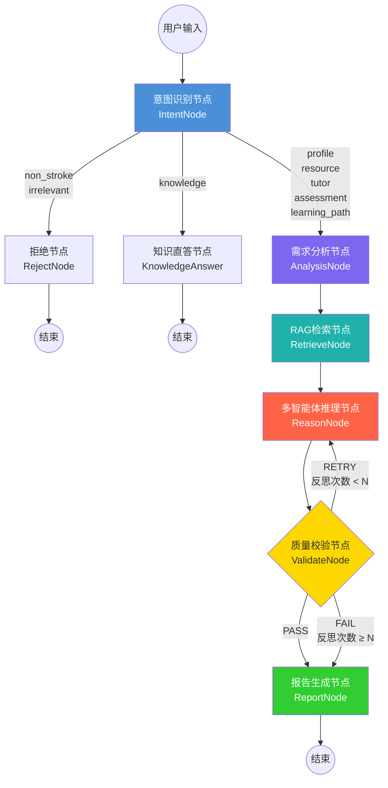

#### 8.1.2 多智能体推理节点伪代码

推理节点是系统核心，实现动态专家编排、并行推理、辩论-仲裁与意见综合：

```
算法: MultiAgentReasoning(state: LearningState) → Dict

输入:
  case_text      — 用户原始输入
  evidence       — RAG 检索结果
  difficulty     — 难度评分 [0, 1]
  intent_type    — 意图类型 (profile/resource/tutor/...)
  agent_weights  — 各智能体当前权重 (退火衰减后)
  validation_feedback — 上一轮校验驳回原因

输出:
  proposal       — 综合提案
  critique       — 风险批判
  debate_history — 辩论记录
  agent_weights  — 更新后的权重

步骤:
1.  动态编排 ← _resolve_active_experts(intent_type, difficulty)
    │ 根据 intent_type 和 difficulty_score 从专家池筛选活跃专家
    │ 若 difficulty ≥ 0.6 且辩论开启 → 自动加入仲裁智能体
    │ 例: resource + difficulty=0.8 → [需求分析, 文档撰写, 题目生成, 质量审核, 学习激励, 仲裁]

2.  构建案例信息 ← _build_case_info(state)
    │ 若 intent ≠ profile → 注入画像摘要供个性化适配
    │ 若 validation_feedback 非空 → 追加退火修正指引

3.  并行推理 ← asyncio.gather(*[_ask_expert(role, instruction, case_info, weight)
                                    for role in active_experts])
    │ 每个专家独立调用 LLM，权重 < 1.0 时追加"谨慎发言"提示
    │ 收集各专家建议 → expert_advices: Dict[role, advice]

4.  IF 辩论开启 AND 活跃专家数 > 1:
    │   FOR round = 1 TO debate_max_rounds:
    │     并行辩论 ← asyncio.gather(*[_ask_debater(role, debate_context, round)
    │                                   for role in debate_roles])
    │     更新辩论上下文 (含历史记录最近6条)
    │   仲裁裁决 ← _run_arbitration(debate_history, evidence)
    │   仲裁结果基于证据链对争议点做最终裁决

5.  意见综合 ← LLM_synthesis.invoke(
    │   mode_directive(intent_type) +     // 模式指令 (资源/辅导/评估/路径)
    │   加权专家意见文本 +                 // 权重 < 1.0 标注衰减值
    │   仲裁裁决 (若有)                    // 仲裁结果优先级最高
    │ )
    │ 输出按 "### PROPOSAL ###" / "### CRITIQUE ###" 分割

6.  RETURN {proposal, critique, active_experts, debate_history,
            agent_weights, motivational_feedback}
```

#### 8.1.3 动态退火校验算法

质量校验节点实现"驳回→分类→衰减→修正"的自愈式反思循环：

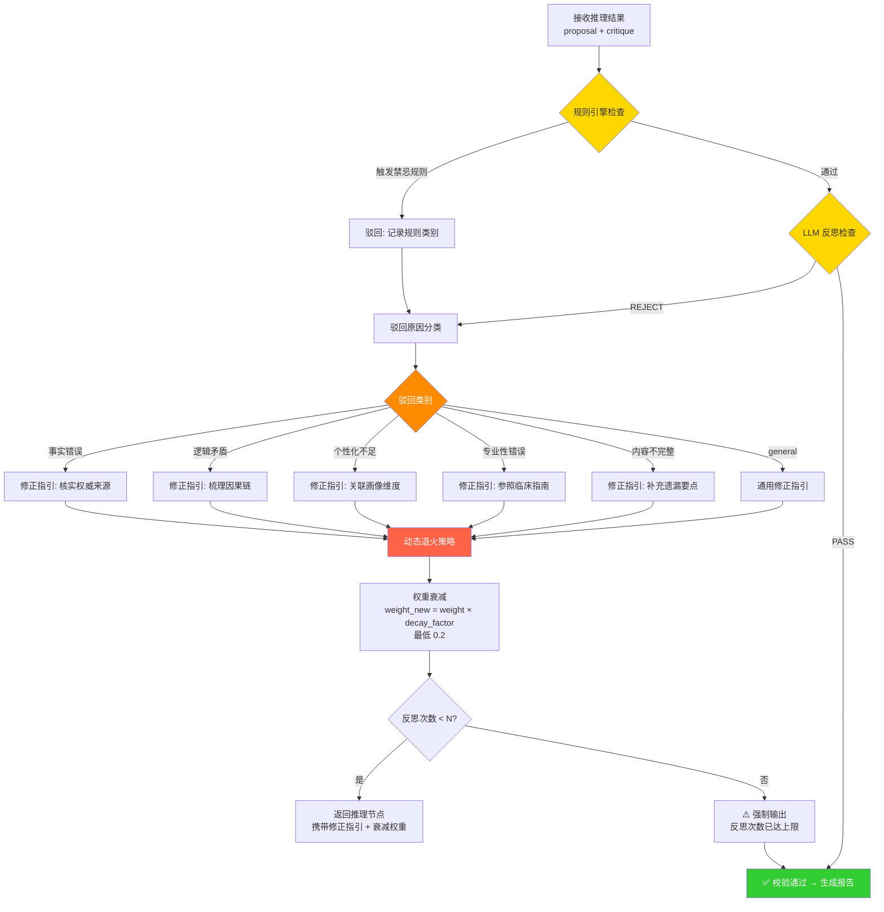

```
算法: ValidateWithAnnealing(state: LearningState) → Dict

输入:
  proposal           — 当前综合提案
  critique           — 当前风险批判
  reflection_count   — 已反思次数
  max_reflection     — 最大反思次数 (默认 3)
  agent_weights      — 各智能体当前权重
  decay_factor       — 衰减因子 (默认 0.7)

输出:
  validation_passed  — 是否通过
  validation_feedback — 驳回原因 + 修正指引
  agent_weights      — 更新后的权重
  reflection_count   — 更新后的反思次数

步骤:
1.  规则引擎检查:
    FOR each (category, rules) IN contraindication_rules:
      IF category ∈ proposal AND ∃ rule ∈ rules WHERE rule ∈ proposal:
        RETURN _fail("触发[{category}]质量规则拦截: {rule}")

2.  LLM 反思检查:
    verdict ← LLM.invoke("校验 proposal 是否存在严重错误...")
    IF verdict.startswith("REJECT"):
      reason ← verdict 中提取驳回理由
      GOTO 步骤3
    ELSE:
      RETURN {validation_passed: True}

3.  驳回原因分类:
    category ← classify_rejection(reason)
    │ 映射规则: "事实"→factual_error, "逻辑"→logical_contradiction,
    │           "个性化"→personalization_insufficient,
    │           "专业"→professional_error, "不完整"→incomplete_content
    │           其余 → general

4.  动态退火策略:
    correction_prompt ← get_correction_prompt(category)
    FOR each role IN active_experts:
      IF agent_weights[role] > 0.2:
        agent_weights[role] *= decay_factor  // 权重衰减
    enhanced_feedback ← reason + correction_prompt

5.  反思次数检查:
    reflection_count += 1
    IF reflection_count < max_reflection:
      RETURN {validation_passed: False, validation_feedback: enhanced_feedback,
              agent_weights, reflection_count}  → 回到推理节点
    ELSE:
      RETURN {validation_passed: True}  // 强制输出
```

### 8.2 Hybrid RAG 检索算法

#### 8.2.1 混合检索流程图

系统采用"向量检索 + BM25 关键词检索"双路召回 + Rerank 精排的混合 RAG 策略：

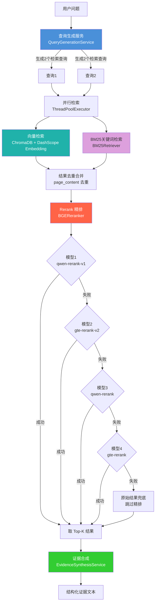

#### 8.2.2 Hybrid RAG 伪代码

```
算法: HybridRAG(question: str) → str

输入:
  question — 用户原始问题

输出:
  synthesized_evidence — 结构化循证总结

步骤:
1.  查询生成:
    queries ← LLM.invoke("根据问题生成2个精准中文检索关键词组合")
    │ 过滤含中文字符的行, 取前2个
    │ 若无有效行 → 退回 question[:50] 作为单查询

2.  并行检索 (对每个 query):
    2a. 向量检索:
        query_embedding ← DashScopeEmbedding.embed_query(query)
        v_docs ← ChromaDB.similarity_search(query_embedding, k=8)
        │ 每条结果含: page_content, metadata{source, page, relevance_score}
    
    2b. BM25 关键词检索:
        b_docs ← BM25Retriever.invoke(query, k=8)
        │ 基于词频-逆文档频率的经典稀疏检索
    
    2c. 去重合并:
        candidates ← Deduplicate(v_docs + b_docs, key=page_content)
        │ 向量检索捕获语义相似, BM25 捕获关键词精确匹配
        │ 两者互补, 去重后候选集显著扩大召回覆盖面

3.  Rerank 精排 (带容灾切换):
    FOR model IN [qwen-rerank-v1, gte-rerank-v2, qwen-rerank, gte-rerank]:
      TRY:
        result ← DashScope.TextReRank(model, query, candidates, top_n=3)
        IF result.status == OK:
          对原文档注入 relevance_score
          RETURN result[:top_k_final]  // 精排成功
      CATCH AccessDenied / Exception:
        CONTINUE  // 切换下一个候选模型
    
    RETURN candidates[:top_k_final]  // 全部失败 → 原始结果兜底

4.  证据合成:
    evidence_text ← Format(candidates)  // "### 检索维度N: query\n【文献M】...")
    synthesis ← LLM.invoke("循证教育总结", question, evidence_text)
    RETURN synthesis
```

#### 8.2.3 RAG 检索缓存策略

```
算法: CachedHybridSearch(query: str, top_k: int) → List[Document]

1.  cache_key ← MD5(query + str(top_k))
2.  IF cache_key ∈ cache AND (now - cache[cache_key].timestamp) < 300s:
      RETURN cache[cache_key].result  // 缓存命中, 跳过检索
3.  result ← HybridSearch(query, top_k)  // 执行完整混合检索
4.  cache[cache_key] ← (result, now)     // 写入缓存, TTL=5分钟
5.  RETURN result
```

### 8.3 画像构建算法

#### 8.3.1 对话式画像构建流程

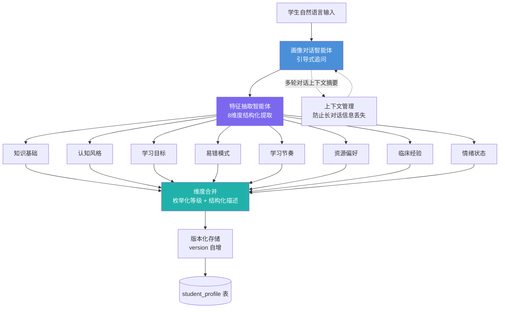

```
算法: ProfileConstruction(dialogue: List[Message]) → StudentProfile

输入:
  dialogue — 多轮对话消息列表

输出:
  profile — 8维度结构化画像

步骤:
1.  画像对话智能体引导对话:
    WHILE 未收集满6个维度 OR 用户未结束:
      response ← LLM.invoke(引导式追问 prompt + 历史对话摘要)
      收集用户回复 → 追加到 dialogue
    
    IF len(dialogue) > 阈值:
      dialogue_summary ← LLM.invoke("摘要以上对话")  // 长对话压缩

2.  特征抽取智能体提取维度:
    profile ← LLM.invoke("从对话中提取8个画像维度", dialogue)
    │ 每个维度输出: {dimension, level: 枚举值, description: 结构化描述}
    │ 例: {dimension: "knowledge_base", level: "intermediate",
    │      description: "已掌握脑卒中基础概念，对溶栓流程有初步了解"}

3.  版本化存储:
    current_version ← SELECT MAX(version) FROM student_profile WHERE user_id = ?
    INSERT INTO student_profile (user_id, version, dimensions_json, updated_at)
      VALUES (?, current_version + 1, profile_json, NOW())

4.  RETURN profile
```

### 8.4 学习路径规划算法

#### 8.4.1 路径生成与资源推送流程

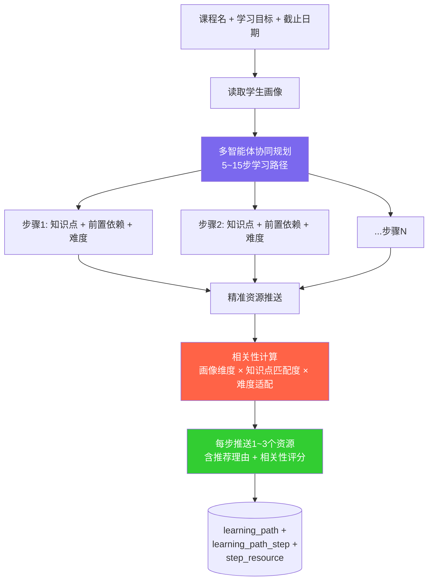

```
算法: LearningPathPlanning(profile, course, goal, deadline) → LearningPath

输入:
  profile  — 学生8维度画像
  course   — 课程名称
  goal     — 学习目标
  deadline — 截止日期

输出:
  path — 学习路径 (含步骤列表和资源推送)

步骤:
1.  基于画像生成路径骨架:
    steps ← LLM.invoke("基于画像规划5-15步学习路径", profile, course, goal, deadline)
    │ 每步包含: {title, knowledge_points, prerequisites, difficulty, estimated_hours}

2.  难度自适应:
    FOR step IN steps:
      step.difficulty ← MapToLevel(profile.knowledge_base, profile.learning_pace)
      │ beginner: 画像知识基础 ≤ 基础级
      │ intermediate: 画像知识基础 = 中级
      │ advanced: 画像知识基础 ≥ 进阶级

3.  精准资源推送:
    FOR step IN steps:
      relevance_scores ← []
      FOR resource IN available_resources:
        score ← 0
        score += 0.3 × KeywordMatch(step.knowledge_points, resource.tags)
        score += 0.3 × DifficultyMatch(step.difficulty, resource.difficulty)
        score += 0.2 × PreferenceMatch(profile.resource_preference, resource.type)
        score += 0.2 × WeaknessBoost(profile.weak_topics, resource.topics)
        relevance_scores.append((resource, score))
      
      step.resources ← TopN(relevance_scores, n=2)  // 每步推送2个资源
      step.recommendation_reason ← 生成推荐理由

4.  RETURN {steps, total_hours, metadata}
```

### 8.5 SSE 流式推送与断线续传

#### 8.5.1 SSE 事件流架构

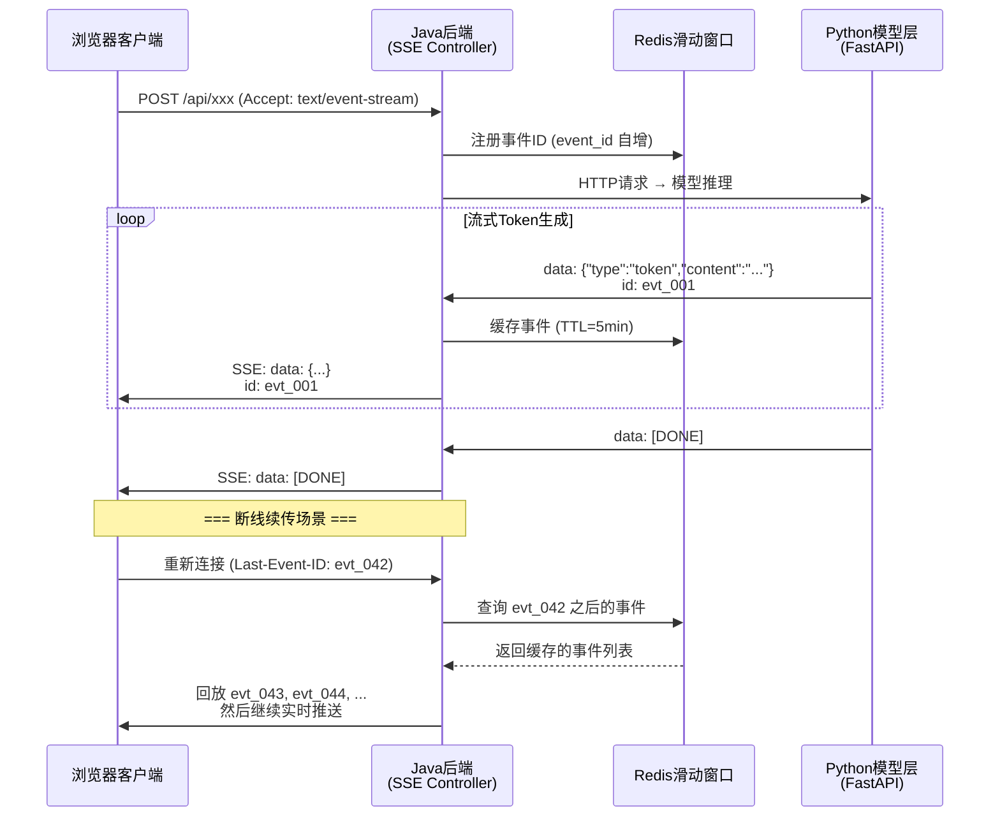

```
算法: SSE断线续传 (Last-Event-ID 机制)

服务端逻辑:
1.  每个SSE事件分配唯一递增ID: event_id = "evt_{talk_id}_{seq++}"
2.  事件写入Redis滑动窗口: RPUSH sse:events:{talk_id} {event_json}
    设置 TTL = 300s (5分钟)
3.  正常推送: SSE writer.flush(event)

客户端重连逻辑:
4.  浏览器自动携带 Header: Last-Event-ID: evt_{talk_id}_{last_seq}
5.  后端解析 last_seq ← parse(Last-Event-ID)
6.  cached_events ← Redis.LRANGE sse:events:{talk_id} last_seq+1 -1
7.  FOR event IN cached_events:
      SSE writer.flush(event)  // 回放缓存事件
8.  切换到实时推送模式, 继续接收新事件
```

---

## 9. UML 设计图

### 9.1 系统组件图

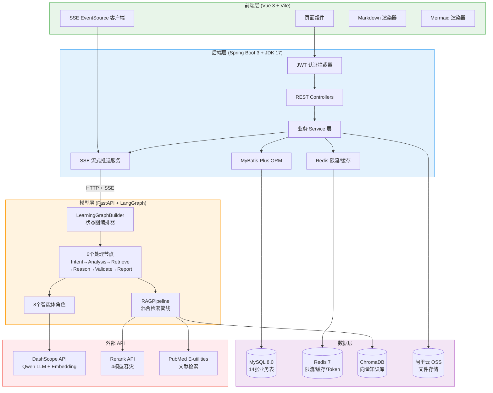

### 9.2 核心类图

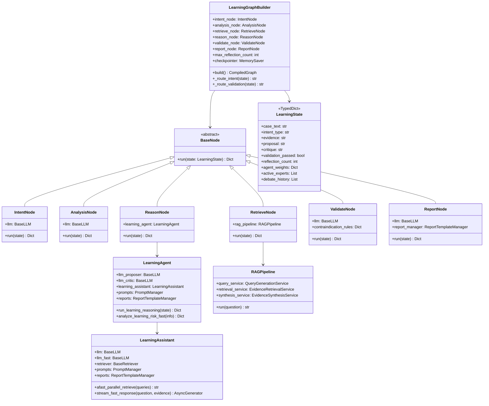

### 9.3 核心交互时序图

#### 9.3.1 SSE 流式对话完整时序

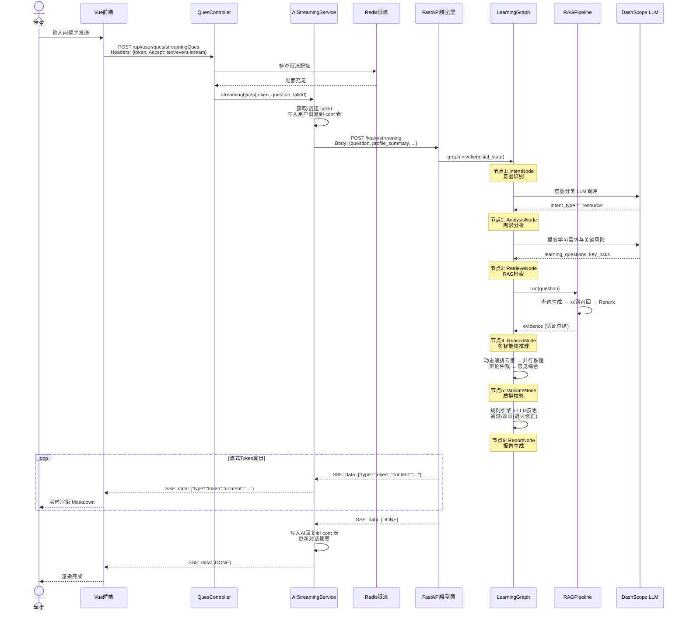

#### 9.3.2 画像构建时序

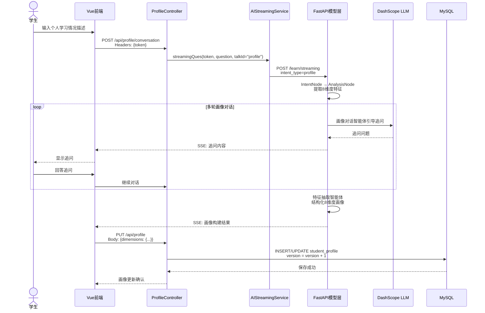

#### 9.3.3 学习路径生成时序

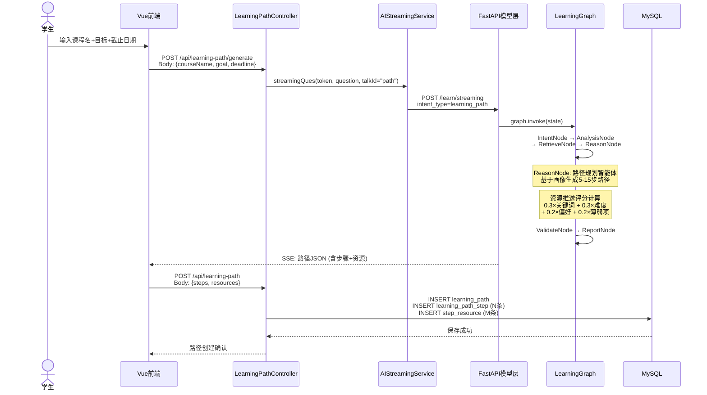

### 9.4 部署架构图

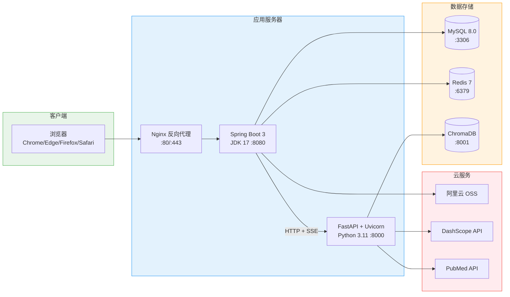

---

## 10. 需求追踪矩阵

### 赛题要求对应性

| 赛题要求 | 需求编号 | 实现状态 |
|:---|:---|:---|
| 对话式画像构建（必选） | FR-PROFILE-01~05 | ✅ 已实现 |
| 不少于6维度画像（必选） | FR-PROFILE-02 | ✅ 8维度 |
| 画像随学随新（必选） | FR-PROFILE-03 | ✅ 已实现 |
| 多智能体架构（必选） | FR-RESOURCE-03~05 | ✅ 8智能体 |
| 个性化资源生成（必选） | FR-RESOURCE-01~02 | ✅ 7类资源 |
| 学习激励与情感陪伴（必选） | FR-RESOURCE-03 | ✅ 学习激励智能体 |
| 学习路径规划（必选） | FR-PATH-01~06 | ✅ 已实现 |
| 动态调整能力（必选） | FR-PATH-04 | ✅ 3种调整类型 |
| 智能辅导（可选加分） | FR-TUTOR-01~04 | ✅ 已实现 |
| 学习效果评估（可选加分） | FR-ASSESS-01~06 | ✅ 5维度评估 |
| 多模态生成 | FR-VISION-01~03 | ✅ qwen-vl-max |
| 代码辅助开发 | FR-CODE-01~02 | ✅ 已实现 |