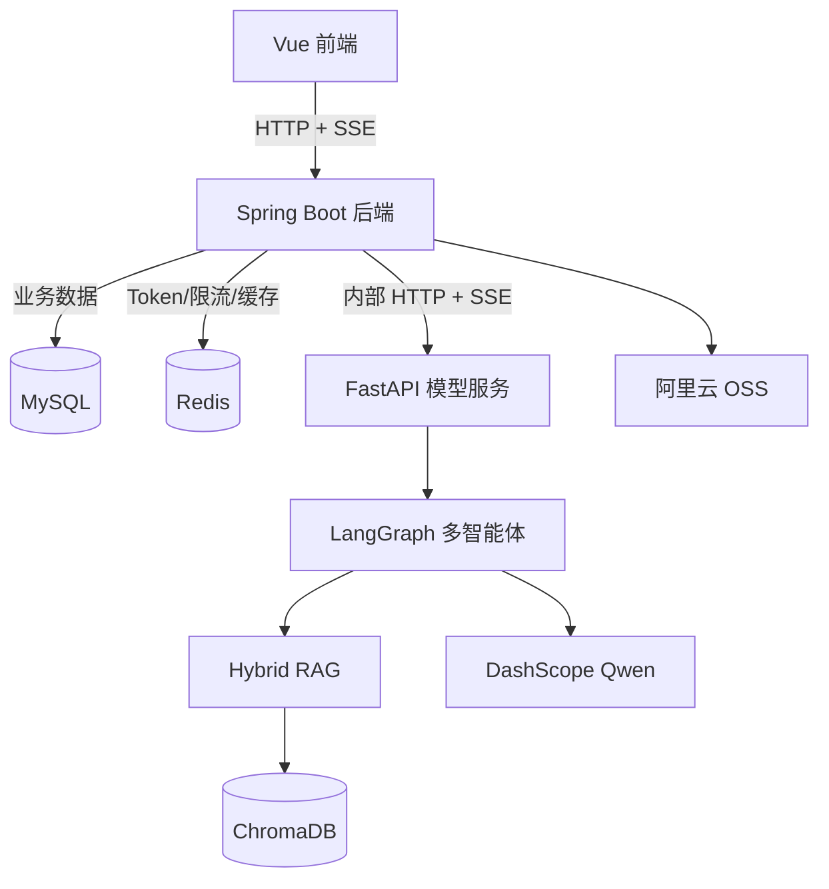
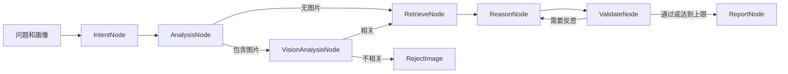

# 中国软件杯 A3 参赛作品技术说明

> **作品名称**：LearnAgent 多智能体个性化学习系统
> **文档版本**：V2.0
> **代码核对日期**：2026-07-29
> **说明**：本文只陈述当前仓库可验证能力；历史压测数字不作为本版本结论

## 1. 作品概述

LearnAgent 以脑卒中医学教育为示范领域，通过学生画像、多智能体协同、Hybrid RAG、
学习路径和效果评估形成个性化学习闭环，同时提供代码辅助与医学多模态能力。

核心用户流程：

```text
注册/登录
  -> 画像对话与八维画像
  -> 个性化资源或智能辅导
  -> 学习路径和步骤进度
  -> 学习行为与效果评估
  -> 画像持续更新
```

## 2. 赛题能力对应

| 赛题方向 | 当前实现 |
|:---|:---|
| 对话式画像构建 | 画像专属 SSE 对话，结束后从同一对话提取八维画像 |
| 不少于六维画像 | 当前实现八维结构化画像，并支持版本递增和手动合并更新 |
| 多智能体协同 | 九位专家按意图和难度动态参与，支持并行推理、辩论、仲裁和校验 |
| 个性化资源 | 支持八种互斥资源类型，结合画像、主题、课程和难度生成 |
| 学习激励 | 推理状态包含学习激励反馈，由前端随流式结果展示 |
| 学习路径 | 生成并持久化路径及步骤，支持进度、推荐和历史查询 |
| 智能辅导 | 多轮对话、SSE 过程事件、图片输入和历史管理 |
| 学习评估 | 五维评估、行为记录、报告详情和路径优化建议 |
| 多模态 | Qwen VL 医学影像、病例、多图比较、OCR 和 DICOM |
| 代码辅助 | Python 沙箱和补全、诊断、优化、讲解四种模式 |

当前限制：学习路径“调整”接口尚未执行真实重排；独立文档管理 REST 接口尚未实现。

## 3. 技术架构

### 3.1 技术栈

| 层级 | 技术与版本 |
|:---|:---|
| 前端 | Vue 3.5、Vite 7、Pinia、Vue Router、Axios |
| 后端 | Java 21、Spring Boot 3.3.13、MyBatis-Plus、Reactor/WebFlux |
| 模型 | Python 3.11、FastAPI 0.128、LangGraph、LangChain |
| 数据 | MySQL 8.0、Redis 7、ChromaDB 1.5 |
| 模型服务 | Qwen Max/Plus/Turbo、Qwen Embedding、Qwen Rerank、Qwen VL |
| 文件服务 | 阿里云 OSS |
| 部署 | Docker Compose、Nginx |

### 3.2 分层结构



前端不直接访问模型层。Compose 只暴露前端端口，Java、Python、MySQL 和 Redis 位于
内部网络，降低模型专用接口被绕过业务鉴权调用的风险。

### 3.3 接口规模

当前代码包含：

- 14 个非空 Java Controller，64 个业务端点；
- 17 个 Python 模型端点；
- 登录、画像、资源、辅导、路径、评估、代码和医学等业务域；
- 多条 SSE 链路及基于 `Last-Event-ID` 的短时回放。

完整清单见[系统接口文档](../api/LearnAgent系统接口文档.md)。

## 4. 多智能体推理

### 4.1 LangGraph 工作流



默认校验配置最多反思 1 次，失败后会按 `0.5` 衰减相关专家会话权重。
报告节点支持普通辅导、资源、路径、评估、画像和代码辅助等输出模式。

### 4.2 专家协同

专家配置由 YAML 管理。系统根据意图和难度选择参与者，并行获取建议后执行：

1. 提案与批判意见提取；
2. 可配置的辩论与仲裁；
3. 共享记忆冲突检测和信誉加权；
4. 规则引擎与 LLM 反思；
5. 最终报告生成。

共享记忆的冲突检测是基于分词重叠度的启发式算法，当前不应描述为成熟的语义共识协议。

## 5. Hybrid RAG

```text
向量召回（最多20） + BM25召回（最多20）
  -> RRF 融合（k=60，保留20）
  -> qwen3-rerank（最终3）
  -> 证据合成与专家推理
```

工程特性：

- 默认规则切分保护 Markdown 边界，递归窗口为 512，重叠 128；
- 小于 100 字符的片段会尝试向不超过 800 字符的相邻块合并；
- 向量召回失败时保留 BM25；
- Rerank 失败时使用 RRF 顺序；
- 查询和 `top_k` 的 MD5 作为进程内缓存键，TTL 为 300 秒；
- 语义切分是可选能力，不是默认启动路径。

系统已统一使用 Qwen Embedding 和 Qwen Rerank，不再依赖旧稿中的多供应商模型轮换方案。

## 6. 关键实现特点

### 6.1 画像生成不污染对话列表

画像聊天和画像提取是两个不同阶段：

```text
画像对话 -> 保存当前 talk/cont -> 读取同一对话历史 -> /model/profile/extract
```

画像提取不会调用创建对话逻辑。只有用户主动发起画像聊天且没有有效的画像 `talkId`
时，系统才创建新画像对话。

### 6.2 代码模式显式传递

代码辅助要求显式选择：

- `complete`：代码补全；
- `diagnose`：错误诊断；
- `optimize`：优化建议；
- `explain`：代码讲解。

Java 后端把模式代码、中文标签和执行约束写入结构化标记。模型层优先读取标记，避免
长代码或空提示让模式丢失，也避免通用输入门控误拦只提交代码的请求。

### 6.3 SSE 一致性

Java 层统一输出命名事件，并支持：

- `init`：返回 `talkId` 和是否新建；
- `thinking`：推理阶段；
- `chunk`：增量文本；
- `replace`：替换已有累计文本；
- `error`：结构化错误；
- `done`：流结束。

事件回放缓存位于 Java 进程内，默认保存 5 分钟。该方案适合单实例演示；多实例需要
会话粘滞或共享事件存储。

### 6.4 医学影像安全门控

统一多智能体链中的图片依次经过：输入预校验、对抗性 Prompt 检测、Qwen VL 二分类、
影像类型和医学术语阈值。缺少 API Key、分析异常或证据不足时默认拒绝。

医学专用结构化分析、比较、OCR 和 DICOM 接口是独立工具入口，不自动经过同一门控；
此边界已在专题文档中明确。

## 7. 数据与状态

MySQL 当前包含 14 张表，覆盖用户、画像、对话、资源、路径、行为、评估、患者和医学资料。
Redis 用于 Token、登录限流和部分缓存；SSE 回放并未存入 Redis。

对话按业务类型隔离。服务端复用 `talkId` 前同时校验：

1. 对话存在；
2. 对话属于当前用户；
3. 对话类型与当前功能一致。

任一条件不满足时，只为当前用户创建当前业务类型的新对话。

## 8. 安全设计

- 新密码使用 BCrypt；
- Java 业务接口使用 JWT 拦截器；
- 模型统一入口 `/model/get_result` 校验共享 JWT；
- 其他模型专用路由依赖 Docker 内网隔离；
- Markdown 使用 DOMPurify 清理；
- 图片上传使用扩展名白名单和 5 MB 上限；
- 密钥由 `.env` 注入，示例文件不包含真实凭据；
- 登录失败统计与熔断状态保存在 Redis。

当前上传接口属于公开路径，生产部署应结合业务需求补充鉴权、内容检测和对象生命周期策略。

## 9. 测试与质量

2026-07-29 在当前代码上重新执行：

| 层级 | 命令 | 结果 |
|:---|:---|:---|
| Python 模型层 | `python -m pytest -q` | 93 通过 |
| Vue 前端 | `npm test` | 16 通过 |
| Java 后端 | `mvn test` | 9 通过，1 跳过 |
| 合计 | 三层自动化测试 | 118 通过，1 跳过 |

模型测试有 10 条 ChromaDB/Pydantic 弃用警告；后端编译有 AssessmentController
未检查泛型警告。二者当前不导致测试失败，但应纳入后续依赖升级和类型治理。

本轮没有执行正式并发压测，因此不在本说明中给出并发数、首 Token 延迟、吞吐量或
月度可用率结论。历史文档中的相关数字不能直接作为当前版本验收依据。

详见[系统测试报告](../architecture/系统测试报告.md)。

## 10. 部署

### 10.1 环境准备

1. Docker Desktop 或兼容的 Docker Engine；
2. 有效的 DashScope API Key；
3. 阿里云 OSS 配置；
4. 独立且足够强的数据库密码与共享 JWT 密钥。

### 10.2 一键启动

```powershell
Copy-Item .env.example .env
# 填写 .env 后
docker compose up -d --build
```

访问地址：`http://127.0.0.1:5173`。

Compose 启动 MySQL、Redis、模型、后端和前端。只对宿主机映射前端端口，后端和模型
由 Nginx 在容器网络内代理。

### 10.3 部署注意事项

- MySQL 初始化脚本只在数据卷首次创建时执行；
- 初始化 SQL 同时包含结构和演示数据，生产环境应拆分；
- 普通 RAG ChromaDB 使用命名卷；共享记忆目录当前需额外挂载才能跨容器重建保留；
- SSE 事件和模型任务均在进程内存中，多实例前应改为共享状态；
- 不得把模型服务端口直接映射到公网。

## 11. 项目结构

```text
learning-multi-agent-system/
├── frontend/                  Vue 前端
├── backend/server/            Spring Boot 后端与数据库 SQL
├── model/                     FastAPI、LangGraph、RAG 与模型测试
├── docs/
│   ├── README.md              文档总索引
│   ├── api/                   唯一接口正文
│   ├── architecture/          需求、设计、算法、数据库和测试
│   └── competition/           竞赛说明与交付材料
├── .env.example               环境变量模板
└── docker-compose.yml         容器编排
```

## 12. 演示建议

建议按一条完整学习闭环演示：

1. 注册并登录；
2. 完成多轮画像对话并查看八维画像；
3. 确认画像生成后没有出现额外对话；
4. 生成学习资源并观察多智能体过程事件；
5. 生成学习路径并更新一个步骤进度；
6. 生成学习评估；
7. 分别演示代码错误诊断与代码讲解；
8. 上传合规医学影像和非医学图片，对比放行与拒绝行为；
9. 短暂断开 SSE 后恢复同一任务。

## 13. 文档入口

- [项目 README](../../README.md)
- [文档总索引](../README.md)
- [答辩演示稿（2026-06-19 快照）](LearnAgent答辩稿-2026-06-19.pptx)
- [演示视频](LearnAgent演示视频.mp4)
- [需求规格说明书](../architecture/需求规格说明书.md)
- [系统设计说明书](../architecture/系统设计说明书.md)
- [核心算法设计文档](../architecture/核心算法设计文档.md)
- [数据库设计手册](../architecture/数据库设计手册.md)
- [系统接口文档](../api/LearnAgent系统接口文档.md)
- [系统测试报告](../architecture/系统测试报告.md)
